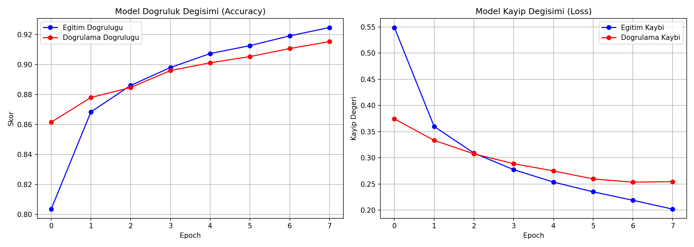
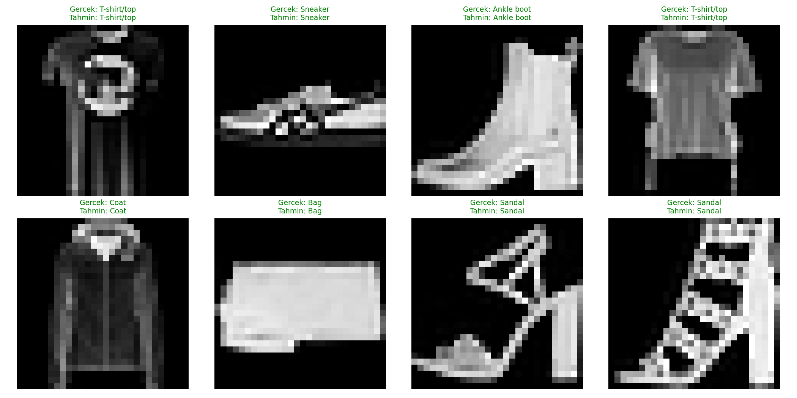

# Fashion-MNIST CNN Görüntü Sınıflandırma

## 🎯 Projenin Amacı

Ham kıyafet görsellerini (T-shirt, pantolon, ayakkabı, çanta vb. 10 kategori) bir **Evrişimli Sinir Ağı (CNN)** ile sınıflandırmak. Bu proje, bilgisayarlı görü (Computer Vision) alanının klasik giriş problemlerinden biri olan Fashion-MNIST üzerinde uçtan uca bir derin öğrenme iş akışı kurar: veri ön işleme → CNN mimarisi tasarımı → eğitim → değerlendirme → hata analizi.

## 📊 Veri Seti

**Fashion-MNIST** — Zalando Research tarafından yayınlanan, 70.000 adet 28×28 piksel gri tonlamalı kıyafet görseli içeren, MNIST'in modern bir alternatifi olan standart bir bilgisayarlı görü veri seti. 10 sınıf: T-shirt/top, Trouser, Pullover, Dress, Coat, Sandal, Shirt, Sneaker, Bag, Ankle boot.

**Veri nereden geliyor, ekstra dosya eklemen gerekiyor mu?**
Hayır — script veri setini **otomatik olarak** Fashion-MNIST'in resmi GitHub deposundan (`zalandoresearch/fashion-mnist`) indirir ve yerel `data/` klasörüne önbelleğe alır. Hiçbir manuel indirme, Kaggle hesabı veya API anahtarı gerekmez; `python fashion_mnist_cnn.py` çalıştırdığın an veri de iner, model de eğitilir.

*(Not: Orijinal not defterinde Keras'ın gömülü `fashion_mnist.load_data()` fonksiyonu kullanılıyordu; bu proje aynı veriye GitHub üzerinden ulaşacak şekilde uyarlanmıştır — bazı ağ ortamlarında Keras'ın varsayılan indirme sunucusuna erişim kısıtlı olabildiği için bu daha taşınabilir bir çözümdür.)*

## 🧠 Model Mimarisi

```
Conv2D(32, 3x3, relu) → MaxPooling2D(2x2)
Conv2D(64, 3x3, relu) → MaxPooling2D(2x2)
Flatten → Dense(128, relu) → Dropout(0.3) → Dense(10, softmax)
```

Optimizer: Adam · Loss: Sparse Categorical Crossentropy · 8 epoch · batch size 64

## 🚀 Çalıştırma

```bash
pip install -r requirements.txt
python fashion_mnist_cnn.py
```

İlk çalıştırmada veri seti indirilir (~30MB), sonraki çalıştırmalarda `data/` klasöründen okunur.

## 📈 Sonuçlar

| Metrik | Değer |
|---|---|
| Test Accuracy | **%90.46** |
| Test Loss | 0.277 |

### Eğitim Grafikleri (Accuracy / Loss)


Eğitim ve doğrulama eğrileri birbirine yakın seyrediyor — belirgin bir overfitting yok, `Dropout` katmanı bunu dengeliyor.

### Confusion Matrix (10 Sınıf)


**Dikkat çeken bulgu:** Model en çok **Shirt** sınıfında zorlanıyor (precision/recall ~%70-80) — bunun sebebi Shirt'ün görsel olarak Pullover, Coat ve T-shirt ile çok benzer olması. Bu, Fashion-MNIST literatüründe bilinen, beklenen bir zorluktur; modelin bir hatası değil, veri setinin doğasından kaynaklanan bir sınırdır.

### Örnek Tahminler


Yeşil başlık = doğru tahmin, kırmızı başlık = yanlış tahmin.

## 🛠️ Kullanılan Teknolojiler

`Python` · `TensorFlow/Keras` · `scikit-learn` · `matplotlib` · `seaborn`

<p align="center"><i>Bilgisayarlı görü ve CNN pratiği amaçlı bir portföy projesidir.</i></p>
