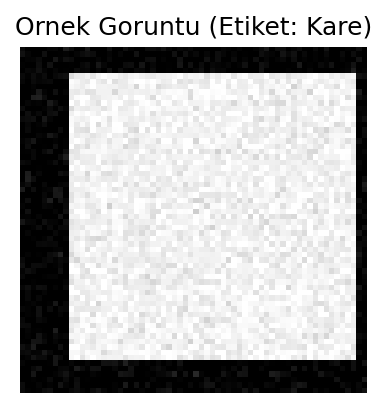
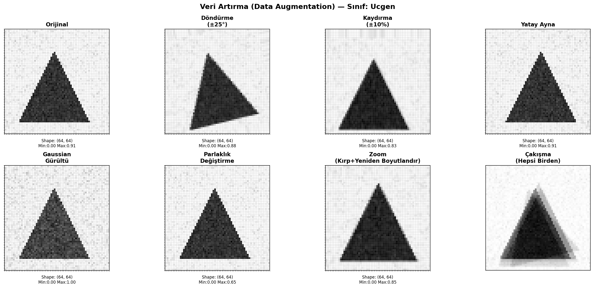
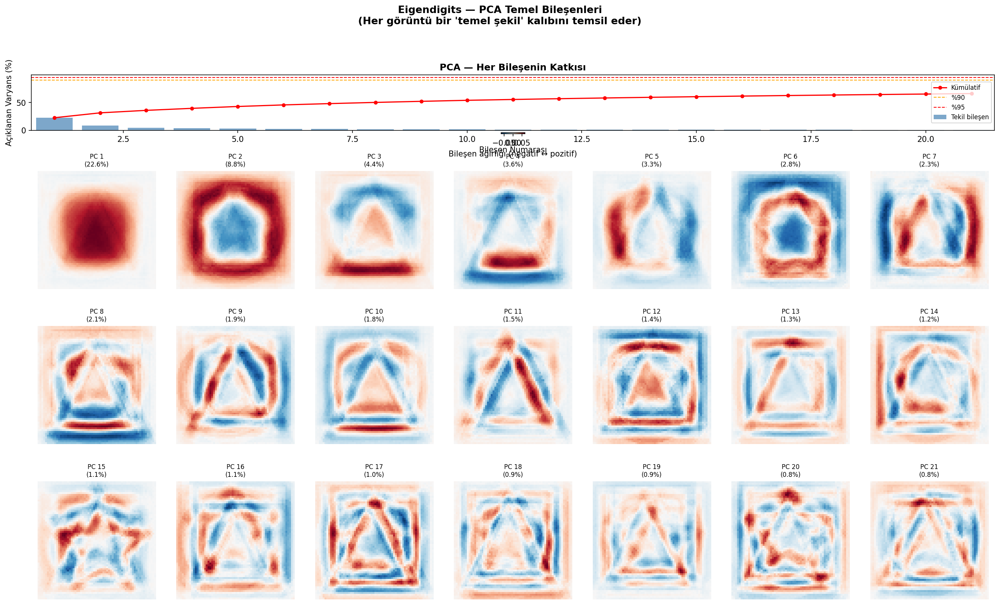
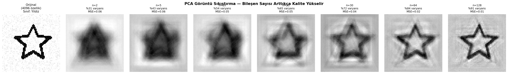

# Görüntü Ön İşleme — Veri Artırma, PCA ve t-SNE

## 🎯 Projenin Amacı

Bir görüntü sınıflandırma probleminde **CNN'e geçmeden önce** uygulanan klasik özellik mühendisliği adımlarını uçtan uca göstermek: **veri artırma (augmentation)** ile az veriyi çoğaltmak, **PCA** ile boyutu azaltıp verinin özünü sıkıştırmak, ve **t-SNE** ile modelin "gördüğü" özellik uzayını insan gözüyle anlaşılır hale getirmek.

Bu proje, derin öğrenmenin "büyük veri ve karmaşık mimari her şeyi çözer" algısına karşı önemli bir noktayı gösteriyor: **CNN'e geçmeden önceki bu klasik adımlar, gerçek üretim sistemlerinde modelin başarısını doğrudan etkileyen kritik bir ön hazırlıktır** — kötü hazırlanmış veri, en gelişmiş mimariyi bile başarısız kılabilir.

## 🏢 İş/Sektör Bağlamı: Bu Teknikler Gerçekte Neden Önemli?

**Veri Artırma (Augmentation):** Gerçek dünyada etiketli veri her zaman kısıtlıdır — bir hastane MR görüntüsü etiketletmek uzman doktor zamanı gerektirir, bir üretim hattında "kusurlu ürün" örnekleri doğası gereği azdır (kusur nadir olduğu için). Augmentation, mevcut sınırlı veriyi döndürme/kaydırma/gürültü gibi dönüşümlerle çoğaltarak modelin gerçek dünya varyasyonlarına karşı daha dayanıklı olmasını sağlar. Google, Tesla gibi şirketlerin otonom sürüş modelleri, bu tekniği yoğun biçimde kullanır — çünkü "yağmurlu bir günde, farklı bir açıdan görülen aynı tabela" örneklerini gerçek hayatta toplamak neredeyse imkansızdır, augmentation bunu simüle eder.

**PCA (Boyut İndirgeme):** Yüksek çözünürlüklü görüntüler binlerce, hatta milyonlarca pikselden oluşur — bunların hepsini işlemek hem yavaş hem de depolama açısından pahalıdır. PCA, bir görüntü veri tabanının **saklama maliyetini** ve bir modelin **eğitim süresini** ciddi ölçüde azaltabilir. Yüz tanıma sistemlerinin ilk nesilleri (Eigenfaces yöntemi) doğrudan bu tekniğe dayanıyordu — bu projedeki "eigenimages" görselleştirmesi o yöntemin temelini gösteriyor.

**t-SNE (Özellik Uzayı Görselleştirme):** Bir modelin "iyi öğrenip öğrenmediğini" anlamanın en pratik yollarından biri, modelin verideki sınıfları ne kadar net ayırabildiğini **gözle görmektir**. Üretim ortamındaki ML ekipleri, bir modeli devreye almadan önce genellikle t-SNE ile "bu sınıflar birbirinden yeterince ayrışıyor mu" diye görsel bir sağlık kontrolü yapar — sayısal metrikler (accuracy gibi) tek başına bazen yanıltıcı olabilirken, görsel ayrışma sezgisel bir doğrulama sağlar.


## 📊 Sentetik Veri Seti

4 sınıf × 150 örnek = 600 görüntü, 64×64 piksel, gri tonlamalı, düzleştirilmiş (4096 özellik/piksel): **Daire, Kare, Üçgen, Yıldız**. Her görüntüye rastgele boyut, konum ve Gaussian gürültü uygulanmıştır.



## 🚀 Çalıştırma

```bash
pip install -r requirements.txt
python cnn-goruntu-on-isleme.py
```

## 📈 Sonuçlar ve Derinlemesine Yorum

### 1) Veri Artırma (Augmentation)



6 farklı dönüşüm uygulanıyor: **döndürme** (±25°), **kaydırma** (±%10), **yatay ayna**, **Gaussian gürültü**, **parlaklık değiştirme**, **zoom** (kırp + yeniden boyutlandır). Her biri, gerçek dünyada bir kameranın/sensörün karşılaşabileceği farklı bir varyasyon türünü simüle ediyor.

| Metrik | Değer |
|---|---|
| Orijinal eğitim seti | 450 örnek |
| Augmentation sonrası | 900 örnek (2× büyüdü) |
| Test Accuracy — Orijinal veri | **%98.00** |
| Test Accuracy — Augmented veri | %96.67 |
| Augmentation kazancı | **-1.33 puan** |

**Augmentation Neden Bu Kez İşe Yaramadı — Önemli Bir Ders:** Beklenen senaryoda augmentation doğruluğu artırır, ama burada tam tersi oldu. Bunun mantıklı bir açıklaması var: Sentetik şekil veri seti (Daire/Kare/Üçgen/Yıldız) **zaten çok kolay ayrılabilir** bir problem — model ek veri görmeden bile %98 doğruluğa ulaşıyor, yani "tavana yakın" bir durumdayız. Böyle bir durumda, augmentation'ın eklediği rastgele varyasyonlar yeni bilgi katmak yerine sadece **gürültü katıyor**, bu da hafif bir performans kaybına yol açıyor.

**Bunun iş dünyasındaki karşılığı:** Augmentation'ı körü körüne her projeye uygulamak yanlış bir refleks olabilir. Gerçek fayda, sınıflar arası ayrımın **zor olduğu, az ve karmaşık veri içeren** problemlerde ortaya çıkar (örn. orijinal Kaggle meyve/sebze veri setinde muhtemelen belirgin fayda sağlardı, çünkü gerçek fotoğraflar ışık/açı/arka plan gibi çok daha fazla varyasyon içerir ve model bu varyasyonları görmeden genelleyemez). Bir ML mühendisinin ilk sorması gereken soru "augmentation eklemeli miyim" değil, **"modelim şu an nerede zorlanıyor, augmentation o zorluğu mu hedefliyor"** olmalıdır.

### 2) PCA — Boyut İndirgeme ve "Eigenimages"



| Varyans Hedefi | Gereken Bileşen Sayısı | Sıkıştırma Oranı |
|---|---|---|
| %90 | 110 / 4096 | **37.2×** |
| %95 | 197 / 4096 | ~20.8× |
| %99 | 403 / 4096 | ~10.2× |

4096 pikselin (64×64) sadece **110 "temel bileşeni"** ile verinin %90'ını koruyabilmek, görüntülerin aslında çok daha az sayıda **bağımsız bilgi kaynağı** içerdiğini gösteriyor — bu PCA'nın temel gücü ve "eigenimages" (görselde her biri bir temel şekil kalıbını temsil eden PC1, PC2... görüntüleri) bunu somut olarak gösteriyor. İlk birkaç bileşen genelde en kaba/genel şekil bilgisini taşırken, sonraki bileşenler gittikçe daha ince detayları (kenar pürüzlülüğü, gürültü) yakalıyor.

### 3) PCA — Sıkıştırma ve Yeniden Yapılandırma Kalitesi



Bu görsel, aynı görüntünün artan bileşen sayısıyla (2, 5, 10, 20, 30...) yeniden yapılandırılmış hallerini yan yana gösteriyor. Bileşen sayısı arttıkça görüntü orijinaline daha çok benziyor (MSE azalıyor) — ama pratik açıdan önemli olan nokta, **çok az bileşenle bile (örn. 20-30) görüntünün tanınabilir kalması**. Bu, gerçek bir üretim sisteminde "ne kadar sıkıştırma güvenli" sorusuna görsel bir cevap veriyor.

### 4) t-SNE — Özellik Uzayı Görselleştirmesi


Sol grafikte her nokta bir görüntüyü, her renk bir sınıfı temsil ediyor; sağ grafikte ise noktaların yerine gerçek küçük görüntüler yerleştirilmiş. **4 sınıfın büyük ölçüde ayrı bölgelerde kümelendiği görülüyor** — bu, modelin (ve dolaylı olarak PCA+t-SNE pipeline'ının) sınıflar arası farkı gerçekten yakaladığının görsel kanıtı. Kümeler arasında hafif örtüşme olması da gerçekçi ve beklenen bir durum — özellikle sınırlarda kalan, gürültü payı yüksek örnekler için.

## 🛠️ Kullanılan Teknolojiler

`Python` · `OpenCV` · `scikit-learn` (MLPClassifier, PCA, t-SNE) · `matplotlib` · `numpy`

<p align="center"><i>CNN öncesi klasik görüntü ön işleme ve özellik mühendisliği pratiği amaçlı bir portföy projesidir.</i></p>
