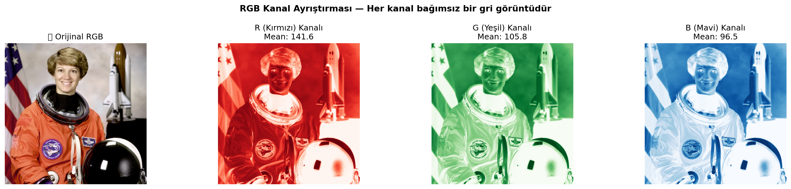
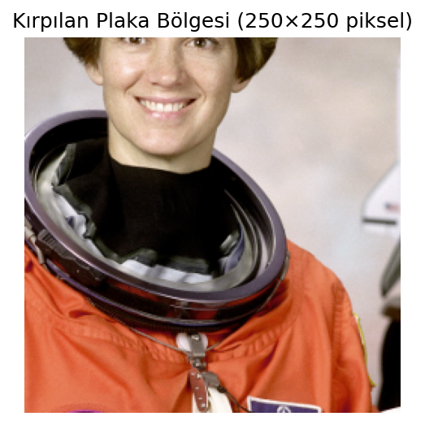
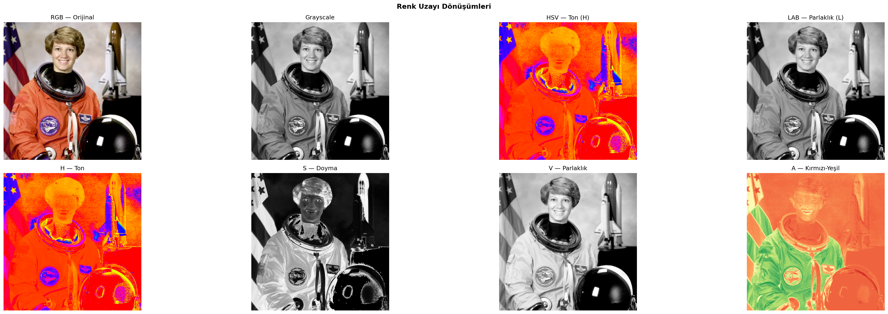
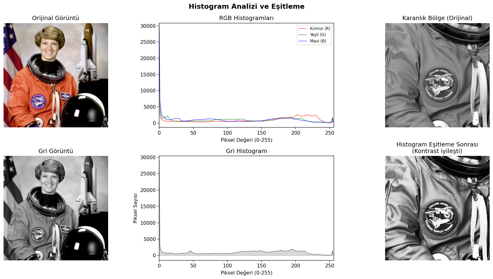
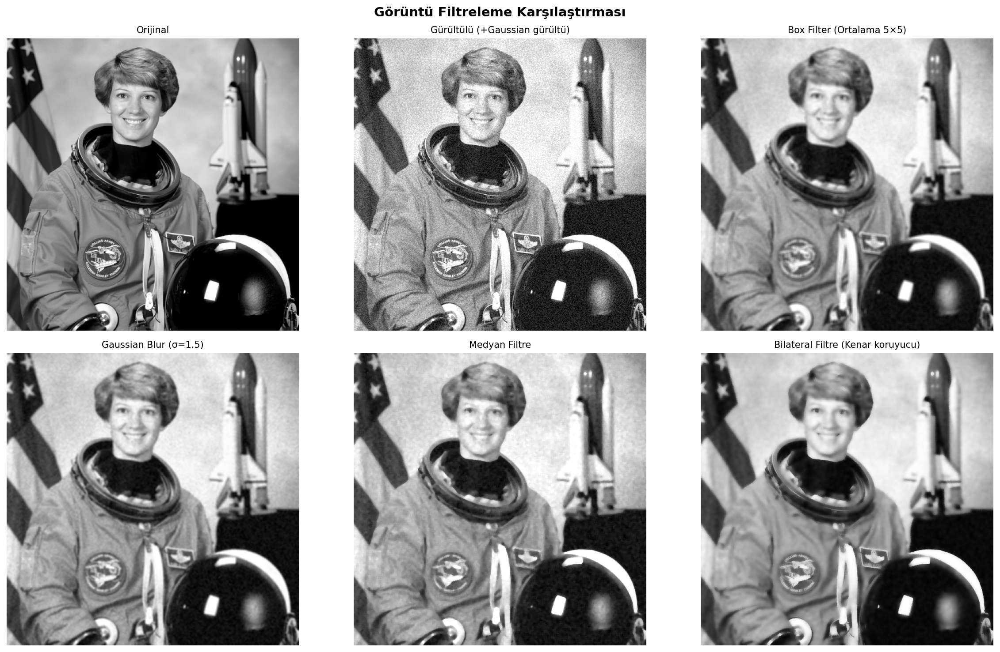
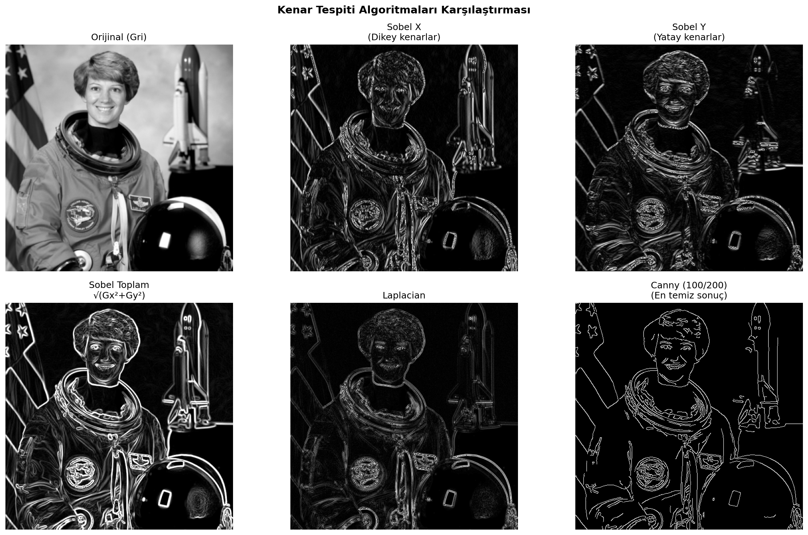

# OpenCV

## 🎯 Projenin Amacı

CNN gibi derin öğrenme mimarilerine geçmeden önce, görüntü işlemenin **temel yapı taşlarını** — bir görüntünün bilgisayar için aslında ne olduğunu, nasıl manipüle edildiğini ve klasik algoritmalarla ondan nasıl anlamlı bilgi çıkarıldığını — uygulamalı olarak göstermek. Bu proje 10 bölümlük bir tur boyunca RGB kanal ayrıştırmadan kontur/nesne analizine kadar, herhangi bir bilgisayarlı görü veya derin öğrenme projesine başlamadan önce bilinmesi gereken klasik araç setini kapsar.

Derin öğrenme "uçtan uca öğrenen" bir yaklaşım sunar, ama gerçek üretim sistemlerinde ham görüntü hiçbir zaman doğrudan bir modele verilmez — önce **klasik ön işleme** (gürültü temizleme, kontrast düzeltme, ilgi alanı çıkarma) uygulanır. Bu proje o ön işleme katmanının kendisidir.

## 🏢 İş/Sektör Bağlamı: Bu Teknikler Gerçekte Nerede Kullanılır?

Bu projede uygulanan her teknik, gerçek endüstriyel sistemlerde hâlâ aktif olarak kullanılıyor:

- **RGB/HSV/LAB renk uzayı dönüşümleri:** Ürün kalite kontrolünde (örn. bir meyve/sebze ayıklama hattında "olgunluk" tespiti renk uzayı analiziyle yapılır, RGB'den çok HSV tercih edilir çünkü ışık değişimine daha dayanıklıdır)
- **Histogram analizi ve eşitleme:** Tıbbi görüntülemede (röntgen, MR) kontrast düzeltme, güvenlik kameralarında düşük ışık koşullarını iyileştirme
- **Gaussian/Medyan/Bilateral filtreleme:** Kameradan gelen ham görüntüdeki sensör gürültüsünü, bir CNN'e vermeden önce temizlemek — kötü ön işleme, en iyi modelin bile performansını düşürür
- **Sobel/Canny kenar tespiti:** Otonom araçlarda şerit tespiti, endüstriyel ölçümde nesne sınırlarını belirleme
- **Morfolojik işlemler (erosion/dilation):** Optik karakter tanımada (OCR) harfleri birbirinden ayırma, tıbbi görüntülemede doku bölütleme
- **Otsu/adaptif eşikleme:** Belge tarama sistemlerinde metni arka plandan ayırma, üretim hattında kusur tespiti
- **Kontur tespiti ve nesne analizi:** Barkod/QR kod okuyucularda, otomatik plaka tanıma sistemlerinde (ALPR), sayım/envanter sistemlerinde nesne sayma

Bu proje özellikle **plaka tanıma (ALPR)** senaryosunu örnek alıyor (orijinal not defterinin motivasyonu buydu) — gerçek ALPR sistemleri de tam olarak bu sırayla ilerler: görüntüyü yükle → ilgi alanını kırp → gri tonlamaya çevir → gürültü temizle → kenar/kontur tespiti yap → dikdörtgen bölgeleri filtrele → OCR'a gönder.

## 🚀 Çalıştırma

```bash
pip install -r requirements.txt
python cnn-opencv.py
```

## 📈 Sonuçlar ve Derinlemesine Yorum — Bölüm Bölüm

### Bölüm 1-2: Kurulum ve RGB Kanal Ayrıştırması
Görüntü yüklenip R/G/B kanallarına ayrıştırılıyor. Her kanalın ortalama parlaklık değeri hesaplanıyor — bu, bir görüntünün "renk kişiliğini" sayısal olarak özetlemenin en basit yolu (örn. yüksek R ortalaması + düşük B ortalaması = sıcak tonlu bir görüntü).



### Bölüm 3: Plakayı Kırpma (Bölge Seçimi)
Bir görüntüden ilgi alanı (Region of Interest — ROI) seçme tekniği. Gerçek ALPR sistemlerinde bu adım genelde bir nesne tespit modeliyle (YOLO gibi) otomatikleştirilir, ama temel mantık aynıdır: önce "nerede bakacağını" bul, sonra sadece o bölgeyle çalış — bu, hem hesaplama maliyetini düşürür hem de gürültüyü (arka plan) elimine eder.



### Bölüm 4: Temel Manipülasyon
Döndürme, çevirme, yeniden boyutlandırma gibi geometrik dönüşümler — bunlar hem veri artırma (augmentation) için hem de görüntüyü bir modelin beklediği sabit boyuta getirmek için kullanılır.

### Bölüm 5: Renk Uzayları (RGB → HSV → LAB)


**Neden RGB yetmiyor:** RGB, ışık koşullarına çok duyarlıdır — aynı kırmızı elma, güneşli ve bulutlu havada çok farklı RGB değerleri verir. **HSV** (Hue-Saturation-Value), "rengin kendisini" (Hue) parlaklıktan (Value) ayırdığı için ışık değişimine karşı çok daha dayanıklıdır — bu yüzden nesne/renk tabanlı tespit sistemlerinde (örn. bir meyve ayıklama hattı) neredeyse her zaman HSV tercih edilir. **LAB** ise insan gözünün algısına daha yakın bir uzaydır, renk farkı ölçümlerinde (örn. baskı/tekstil endüstrisinde renk tutarlılığı kontrolü) kullanılır.

### Bölüm 6: Histogram Analizi


Bir görüntünün piksel yoğunluk dağılımı — histogram sola yığılmışsa görüntü karanlık, sağa yığılmışsa aydınlık demektir. Histogram eşitleme, bu dağılımı düzleştirerek düşük kontrastlı görüntülerin detayını ortaya çıkarır (tıbbi görüntülemede ve güvenlik kameralarında yaygın kullanılan bir teknik).

### Bölüm 7: Görüntü Filtreleme — PSNR Karşılaştırması

| Filtre | PSNR (dB) |
|---|---|
| **Bilateral Filtre** | **18.39** (en iyi) |
| Gaussian Blur | 18.31 |
| Medyan Filtre | 18.18 |
| Box Filter | 18.11 |



Dört filtre de birbirine oldukça yakın PSNR veriyor çünkü **PSNR sadece "orijinale ne kadar sayısal olarak yakın kaldın" ölçer, gürültü temizleme kalitesini (örn. kenarları koruma) ölçmez.** Burada Bilateral Filtre hem PSNR'da en iyi çıktı hem de kenarları bulanıklaştırmadan gürültü temizlediği için — bu yüzden pratikte de (örn. yüz güzelleştirme filtrelerinde, tıbbi görüntü ön işlemede) en çok tercih edilen filtre budur. Gerçek bir üretim sisteminde filtre seçimi asla sadece PSNR'a bakılarak yapılmaz; görsel inceleme ve görevle ilgili metrikler (örn. sonraki adımdaki kenar tespitinin doğruluğu) de değerlendirilir.

### Bölüm 8: Kenar Tespiti (Sobel / Laplacian / Canny)


Sobel X ve Y, sırasıyla dikey ve yatay kenarları ayrı ayrı yakalıyor; bunların karesel toplamı (Sobel Toplam) her iki yöndeki kenarları birleştiriyor. **Canny**, çok aşamalı bir algoritma olduğu için (gürültü azaltma → gradyan hesaplama → non-maximum suppression → çift eşikleme) en "temiz" ve en ince kenar çizgilerini üretiyor — bu yüzden endüstride kenar tabanlı segmentasyonun standart algoritmasıdır.

### Bölüm 9: Morfolojik İşlemler
Erosion (aşındırma) küçük gürültü noktalarını temizler, Dilation (genişletme) kopuk bölgeleri birleştirir. Opening (erosion+dilation) ve Closing (dilation+erosion) bu ikisinin farklı sıralı kombinasyonlarıdır — OCR'dan önce harfleri birbirinden ayırmak veya birleştirmek için kullanılır.

### Bölüm 10: Eşikleme (Thresholding)
**Otsu eşiği: 103** — bu değer, algoritmanın görüntünün histogramına bakarak **otomatik olarak** hesapladığı, "arka plan" ve "ön plan" pikselleri en iyi ayıran eşik noktasıdır. Global eşiklemenin aksine, Otsu her görüntü için kendi optimal eşiğini bulur — bu yüzden değişken aydınlatma koşullarında sabit bir eşik değerinden çok daha güvenilirdir.

### Bölüm 11: Kontur Tespiti ve Nesne Analizi


Otsu ile eşiklenen görüntüde **28 kontur** tespit edildi, bunlardan **6 tanesi** anlamlı boyut eşiğini (200px²) geçti — geri kalanı gürültü/küçük parçacıklardı. Her anlamlı kontur için alan, çevre uzunluğu, sınırlayıcı kutu (bounding box) ve merkez noktası (moment hesabıyla) çıkarıldı. Bu, bir görüntüdeki **"kaç farklı nesne var ve nerede"** sorusuna cevap veren temel algoritmadır — sayım sistemlerinden barkod okuyuculara kadar birçok uygulamanın temelini oluşturur.

## 🛠️ Kullanılan Teknolojiler

`Python` · `OpenCV` · `Pillow` · `scikit-image` · `matplotlib` · `numpy`

<p align="center"><i>Klasik görüntü işleme temelleri ve endüstriyel bilgisayarlı görü pratiği amaçlı bir portföy projesidir.</i></p>
