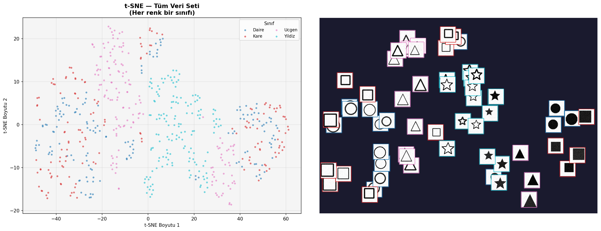
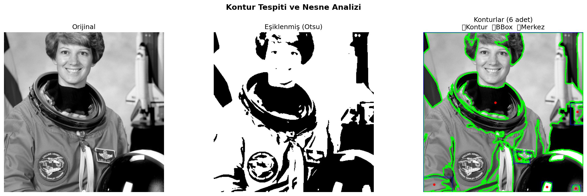

# CNN

Bilgisayarlı görü (Computer Vision) alanında, klasik görüntü işlemeden derin öğrenmeye
uzanan bir yolculuk gösteren 3 projeden oluşur. Sıralama kasıtlıdır: önce bir görüntünün
bilgisayar için ne olduğu ve klasik yöntemlerle nasıl işlendiği (03-opencv), sonra
CNN'e vermeden önceki özellik mühendisliği adımları (02-goruntu-on-isleme), son olarak
uçtan uca bir CNN ile gerçek sınıflandırma (01-fashion-mnist-cnn) anlatılır.

## Projeler

| # | Klasör | Konu | Öne Çıkan Bulgu |
|---|---|---|---|
| 01 | [`01-fashion-mnist-cnn`](01-fashion-mnist-cnn/) | Uçtan uca CNN ile görüntü sınıflandırma | Fashion-MNIST üzerinde %90.46 test doğruluğu; modelin en çok **Shirt** sınıfında zorlandığı (Pullover/Coat/T-shirt ile görsel benzerlik) tespit edildi |
| 02 | [`02-goruntu-on-isleme`](02-goruntu-on-isleme/) | Augmentation, PCA, t-SNE | Augmentation'ın **her zaman** doğruluğu artırmadığı, kolay ayrılabilir bir problemde performansı düşürebildiği (%98 → %96.67) gösterildi — sezgiye aykırı ama gerçek bir bulgu |
| 03 | [`03-opencv`](03-opencv/) | Klasik görüntü işleme (10 bölüm) | RGB/HSV/LAB, filtreleme (Bilateral en iyi PSNR: 18.39 dB), kenar tespiti (Canny), Otsu eşikleme (eşik: 103) ve kontur analizi (28 kontur → 6 anlamlı nesne) bir ALPR (plaka tanıma) senaryosu üzerinden uygulandı |

## Görsellerle Özet

**t-SNE ile özellik uzayı ayrışması** (02-goruntu-on-isleme) — 4 sentetik şeklin
(Daire/Kare/Üçgen/Yıldız) PCA sonrası özellik uzayında büyük ölçüde ayrı kümelendiği
görülüyor:



**Fashion-MNIST Confusion Matrix** (01-fashion-mnist-cnn) — modelin hangi sınıfları
birbirine karıştırdığını gösteriyor, en belirgin karışıklık Shirt/Pullover/Coat arasında:


**Kontur Tespiti ve Nesne Analizi** (03-opencv) — Otsu eşiklemesi sonrası tespit edilen
konturlardan anlamlı olanların (6 adet) sınırlayıcı kutularla işaretlenmesi:



## Ortak Tema

Üç proje birlikte şunu gösteriyor: derin öğrenme "ham veriyi ver, gerisini model
halletsin" gibi görünse de, gerçek üretim sistemlerinde **klasik ön işleme (OpenCV) ve
özellik mühendisliği (PCA/augmentation) hâlâ kritik bir rol oynar** — hem model
performansını hem de hesaplama maliyetini doğrudan etkiler. 02-goruntu-on-isleme'deki
augmentation bulgusu özellikle önemli bir ders: bir tekniği körü körüne uygulamak yerine,
modelin nerede zorlandığını anlayıp ona göre karar vermek gerekir.

## Kullanılan Teknolojiler

`Python` · `TensorFlow/Keras` · `OpenCV` · `scikit-learn` (PCA, t-SNE, MLPClassifier) ·
`scikit-image` · `matplotlib` · `seaborn` · `numpy`

## Çalıştırma

Her alt klasör bağımsızdır:

```bash
cd <klasör-adı>
pip install -r requirements.txt
python <script-adı>.py
```

Detaylı yöntem, sonuç ve iş/sektör bağlamı için her alt klasörün kendi `README.md`
dosyasına bakınız.
