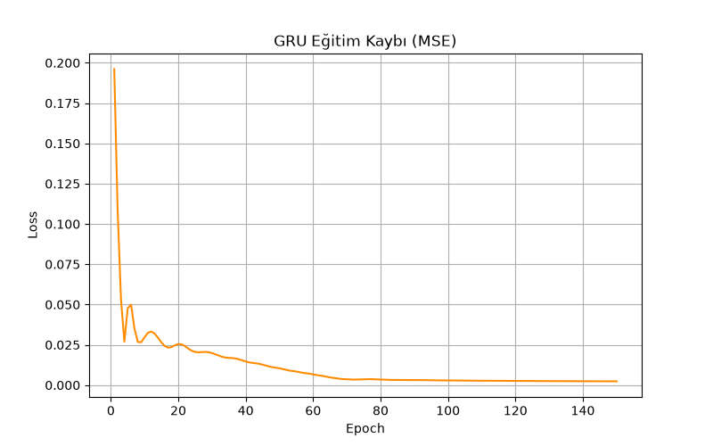
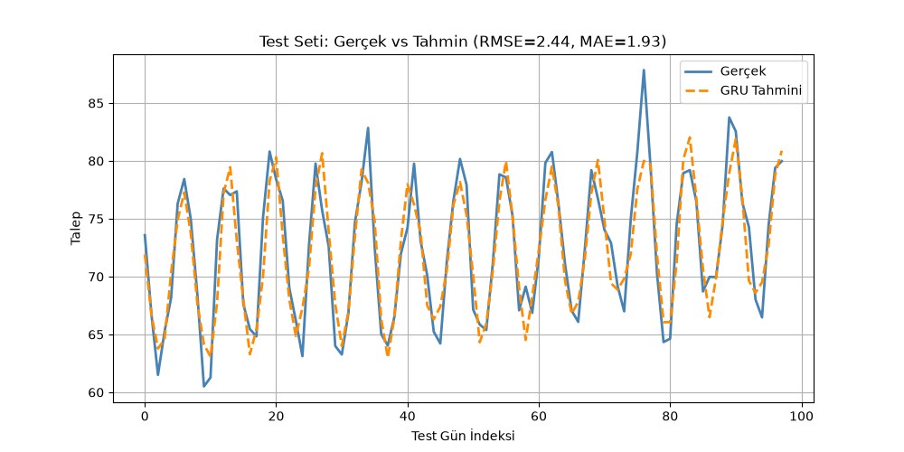

# GRU ile Zaman Serisi Tahmini

Bu proje, LLM ve CNN/NLP projelerinden farklı bir veri türü — **zaman serisi** — üzerinde
bir **GRU (Gated Recurrent Unit)** ağının nasıl kullanılabileceğini gösterir. Senaryo:
geçmiş 14 günlük ürün talebine bakarak bir sonraki günü tahmin etmek. Bu, finans, lojistik,
perakende ve enerji sektörlerinde yaygın kullanılan gerçek bir teknik (talep tahmini,
stok planlama, kapasite planlama).

## Neden GRU?

GRU, LSTM'e göre daha az parametreye (2 kapı vs. 3 kapı) sahiptir, bu yüzden daha hızlı
eğitilir ve küçük veri setlerinde LSTM'e çok yakın performans gösterir. Bu demo için
ideal bir denge sunar.

## Yöntem

1. **Sentetik veri:** 500 günlük bir "ürün talebi" serisi — doğrusal bir trend, haftalık
   mevsimsellik (`sin` dalgası) ve rastgele gürültü birleştirilerek üretildi. Gerçek bir
   veri kaynağına bağımlılık yok, tamamen kendi kendine yeterli.
2. **Normalizasyon:** Seri min-max ile 0-1 aralığına ölçeklendi.
3. **Pencereleme:** Geçmiş 14 gün bir girdi penceresi, 15. gün hedef değer olacak şekilde
   örnekler oluşturuldu.
4. **Eğitim/test ayrımı:** **Kronolojik** olarak bölündü (ilk %80 eğitim, son %20 test) —
   zaman serilerinde rastgele bölme, modele gelecekten bilgi sızdırır (data leakage);
   bu proje bunu kasıtlı olarak önlüyor.
5. **Model:** Tek katmanlı GRU (`hidden_size=32`) + doğrusal çıkış katmanı, 150 epoch
   boyunca MSE kaybıyla eğitildi.
6. Test setinde gerçek ve tahmin edilen değerler karşılaştırıldı, RMSE ve MAE hesaplandı.

## Sonuçlar

Eğitim kaybı düzgün bir yakınsama gösterdi (epoch 1: 0.196 → epoch 150: 0.0023),
epoch 5-10 arası küçük bir dalgalanma dışında istikrarlı bir düşüş var:



Test setinde model, gerçek talep eğrisinin haftalık mevsimsellik desenini büyük ölçüde
yakaladı:



| Metrik | Değer |
|---|---|
| RMSE | 2.44 |
| MAE | 1.93 |

**Değerlendirme:** Model, haftalık dalga örüntüsünü (tepe/dip noktalarının zamanlamasını)
doğru şekilde öğrenmiş — bu, GRU'nun periyodik bir yapıyı yakalayabildiğinin göstergesi.
Ortalama talep seviyesinin ~50-85 aralığında olduğu düşünüldüğünde, ~2 birimlik MAE
(yaklaşık %2-3 hata oranı) küçük bir sentetik veri seti için makul bir sonuç. Grafikte
tahminin bazı keskin tepe noktalarında gerçek değeri hafifçe kaçırdığı (özellikle ani
yükselen noktalarda bir adım geriden geldiği) görülüyor — bu, GRU'nun ani değişimlere
karşı hafif bir gecikmeyle tepki verdiğini gösteren, zaman serisi modellerinde sık
görülen tipik bir davranış.

Tam veri `figures/gercek_vs_tahmin.csv` ve `figures/egitim_loss.csv` dosyalarındadır.

## Notlar / Sınırlamalar

- Veri sentetik olduğu için gerçek dünya zaman serilerindeki (ör. ani rejim değişiklikleri,
  tatil etkileri, dış şoklar) karmaşıklığı yansıtmaz; amaç mimariyi ve doğru
  değerlendirme metodolojisini (kronolojik split, sızıntısız değerlendirme) göstermektir.
- Tek katmanlı, tek değişkenli (univariate) bir GRU kullanıldı; gerçek bir üretim sisteminde
  çoklu değişken (fiyat, hava durumu, kampanya bilgisi vb.) ve çok katmanlı mimariler
  tercih edilir.
- API key gerekmez, tamamen yerel çalışır.
- Tekrarlanabilirlik için `seed=42` sabitlenmiştir.

## Çalıştırma

```bash
pip install -r requirements.txt
python gru_zaman_serisi.py
```
