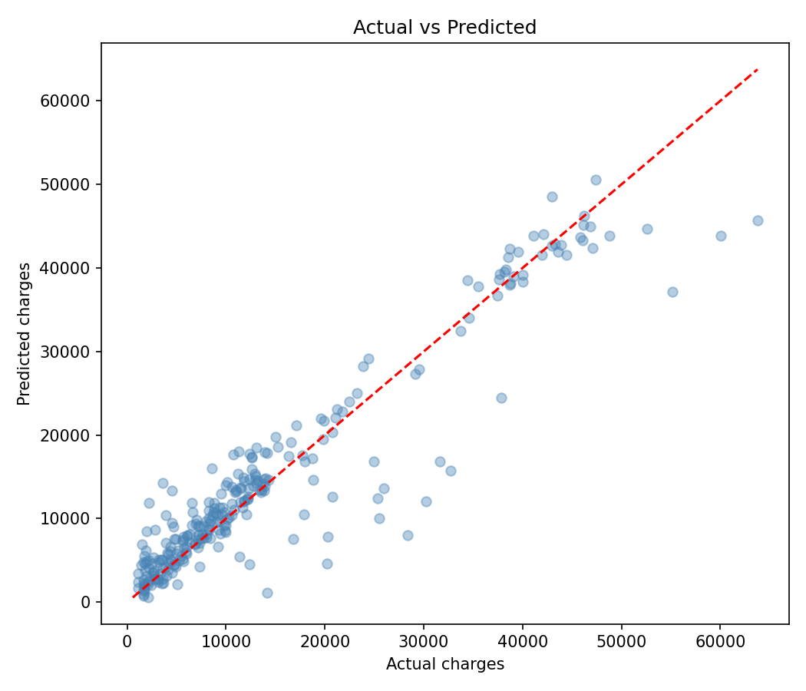
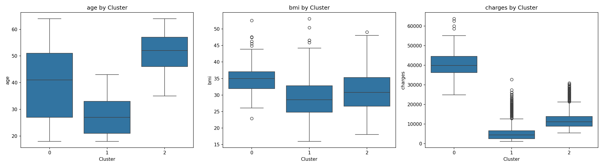

# insurance-ml-docker-compose

> Sağlık sigortası verisiyle **3 farklı ML görevini** (regresyon, sınıflandırma, kümeleme) tek bir Docker imajından, **Docker Compose** ile paralel çalıştıran bir proje.

---

## 📌 Proje Ne Yapıyor?

1338 kişilik sigorta verisi (`insurance.csv`: yaş, cinsiyet, BMI, çocuk sayısı, sigara kullanımı, bölge, sigorta ücreti) üzerinde **3 bağımsız ML görevi** çalıştırılıyor. Her görev kendi konteynerinde, aynı Docker imajından, farklı bir komutla ayağa kalkıyor.

| Servis | Script | Görev Türü | Ne Yapıyor |
|---|---|---|---|
| `ml_xgboost` | `ml_xgboost.py` | Regresyon | Sigorta ücretini (`charges`) sayısal olarak tahmin eder |
| `ml_logistic_regression` | `ml_logistic_regression.py` | Sınıflandırma | Ücreti medyana göre `High`/`Low` sınıflarına ayırıp tahmin eder |
| `ml_kmeans` | `ml_kmeans.py` | Kümeleme | Kişileri yaş/BMI/harcamaya göre segmentlere ayırır |

---

## 📂 Dizin Yapısı

```
.
├── Dockerfile
├── docker-compose.yml
├── requirements.txt
├── insurance.csv
├── ml_xgboost.py
├── ml_logistic_regression.py
├── ml_kmeans.py
├── .gitignore
└── output/
    └── figures/         # README'de gösterilen örnek görseller (repoya dahil)
        ├── reg_actual_vs_predicted.png
        └── clu_profiles.png
```

> Not: `output/` klasörünün geri kalanı (script çalıştırılınca üretilen ham CSV/PNG dosyaları) `.gitignore` ile hariç tutulur; sadece `output/figures/` içindeki gösterim amaçlı görseller repoya dahil edilir.

---

## 🐳 Neden Docker Compose (Dockerfile değil)?

Bu projede **3 ayrı görev aynı anda / birbirinden bağımsız** çalışması gerektiği için Compose kullanıldı:

- Tek bir `Dockerfile` → ortak imajı tanımlar (Python + kütüphaneler + veri + scriptler).
- `docker-compose.yml` → bu **aynı imajı 3 kez** `build: .` ile kullanıp, her seferinde farklı `command` ile farklı scripti çalıştırır.
- Üç servis de aynı **paylaşımlı volume**'a (`ml_output`) yazar, böylece tüm sonuçlar tek noktada toplanır.

Bu yüzden burada tek Dockerfile yeterli olmaz — 3 farklı komutu 3 farklı konteynerde yönetmek için Compose gerekir.

---

## 🚀 Nasıl Çalıştırılır?

```bash
# Üç servisi de build edip çalıştır
docker compose up --build

# Sadece birini çalıştırmak istersen:
docker compose up --build ml_xgboost

# Bitince temizle
docker compose down
```

Sonuçlar `output/` klasöründe (Docker volume üzerinden) birikir:
- `reg_*` → regresyon çıktıları
- `clf_*` → sınıflandırma çıktıları
- `clu_*` → kümeleme çıktıları

---

## 📊 Örnek Sonuçlar

**Regresyon (XGBoost):** Gerçek vs. tahmin edilen sigorta ücreti



**Kümeleme (K-Means):** Yaş / BMI / harcamaya göre müşteri profilleri



---

## 🛠️ Kullanılan Teknolojiler

`Python 3.13` · `Docker` · `Docker Compose` · `pandas` · `scikit-learn` · `XGBoost` · `matplotlib` · `seaborn`

---

<p align="center"><i>Docker Compose & ML öğrenme amaçlı bir portföy projesidir.</i></p>
