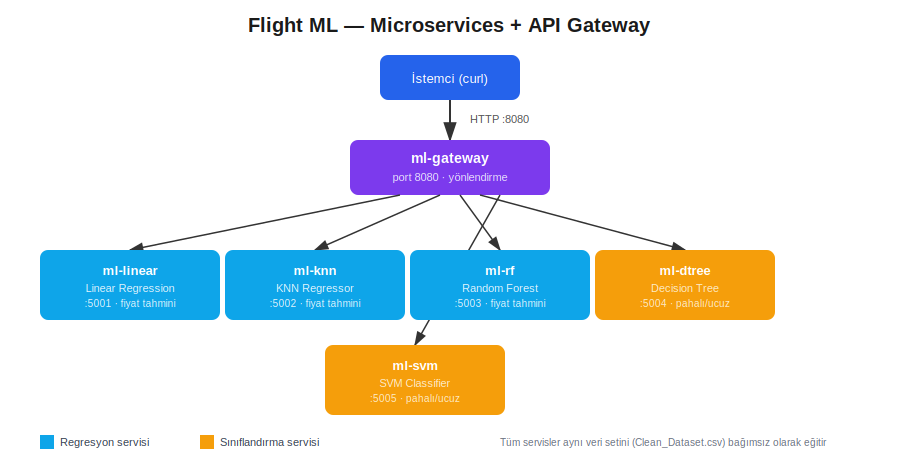

# 3-microservices-ml-gateway

> Uçuş fiyatı verisi üzerinde çalışan **5 bağımsız ML servisi** ve bunları tek noktadan yöneten bir **API Gateway** — Docker Compose ile ayağa kaldırılan bir mikroservis mimarisi.

Bu proje, mikroservis mimarisinin temel bileşenlerini (bağımsız servisler, API Gateway, servisler arası HTTP iletişimi) küçük ölçekte uygular. Service discovery, authentication, veritabanı-per-servis gibi production-seviyesi bileşenler kapsam dışıdır.

---

## 🖼️ Mimari



Her ML modeli kendi Flask servisinde, kendi portunda, bağımsız olarak çalışır. `ml-gateway`, dışarıdan gelen tek bir HTTP isteğini doğru servise yönlendirir.

---

## 📌 Servisler

| Servis | Port | Görev | Tür |
|---|---|---|---|
| `ml-linear` | 5001 | Fiyat tahmini | Regresyon |
| `ml-knn` | 5002 | Fiyat tahmini | Regresyon |
| `ml-rf` | 5003 | Fiyat tahmini | Regresyon |
| `ml-dtree` | 5004 | Pahalı / Ucuz | Sınıflandırma |
| `ml-svm` | 5005 | Pahalı / Ucuz | Sınıflandırma |
| `ml-gateway` | 8080 | Yönlendirme (tek giriş noktası) | — |

Hepsi aynı veri setini (`Clean_Dataset.csv`, 300k+ satır uçuş bileti verisi) kullanır, ancak her servis kendi modelini bağımsız olarak eğitir ve ayrı bir konteynerde çalışır.

---

## 📂 Dizin Yapısı

```
.
├── Dockerfile
├── docker-compose.yml
├── requirements.txt
├── Clean_Dataset.csv
├── 1_linear_regression.py
├── 2_knn_regressor.py
├── 3_random_forest_regressor.py
├── 4_decision_tree_classifier.py
├── 5_svm_classifier.py
├── .gitignore
├── assets/
│   └── architecture.svg
└── output/
```

---

## 🚀 Kurulum ve Çalıştırma

```bash
docker compose up --build
```

İlk açılış biraz sürer — her servis ayağa kalkarken kendi modelini eğitir.

---

## 🧪 Test

```bash
# Tüm servislerin durumu
curl http://localhost:8080/health

# Fiyat tahmini (regresyon: linear / knn / rf)
curl -X POST http://localhost:8080/linear/predict \
  -H "Content-Type: application/json" \
  -d '{"airline":"Indigo","source_city":"Delhi","departure_time":"Morning","stops":"zero","arrival_time":"Night","destination_city":"Mumbai","class":"Economy","duration":2.5,"days_left":30}'

# Pahalı/Ucuz sınıflandırma (dtree / svm)
curl -X POST http://localhost:8080/dtree/predict \
  -H "Content-Type: application/json" \
  -d '{"airline":"Vistara","source_city":"Delhi","departure_time":"Evening","stops":"one","arrival_time":"Morning","destination_city":"Bangalore","class":"Business","duration":8.0,"days_left":5}'
```

---

## ⚠️ Önemli Notlar

- `flight` kolonu (uçuş numarası) çok yüksek kardinaliteli olduğu için modele dahil edilmez.
- SVM ve Random Forest büyük veride yavaş çalıştığı için eğitim sırasında örneklenir (SVM 10k, RF 50k satır).
- `/predict` isteğindeki JSON alan adları veri setiyle birebir aynı olmalı. Bilinmeyen bir kategorik değer gelirse hata vermez, `0` değerine düşer.

---

## 🛠️ Kullanılan Teknolojiler

`Python 3.13` · `Flask` · `Docker` · `Docker Compose` · `scikit-learn` · `pandas`

---

<p align="center"><i>Docker Compose ile mikroservis mimarisi pratiği amaçlı bir portföy projesidir.</i></p>
