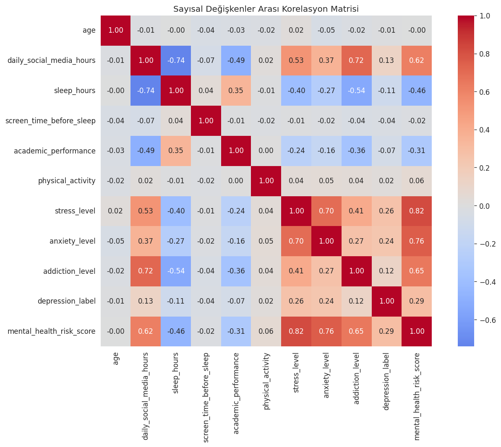
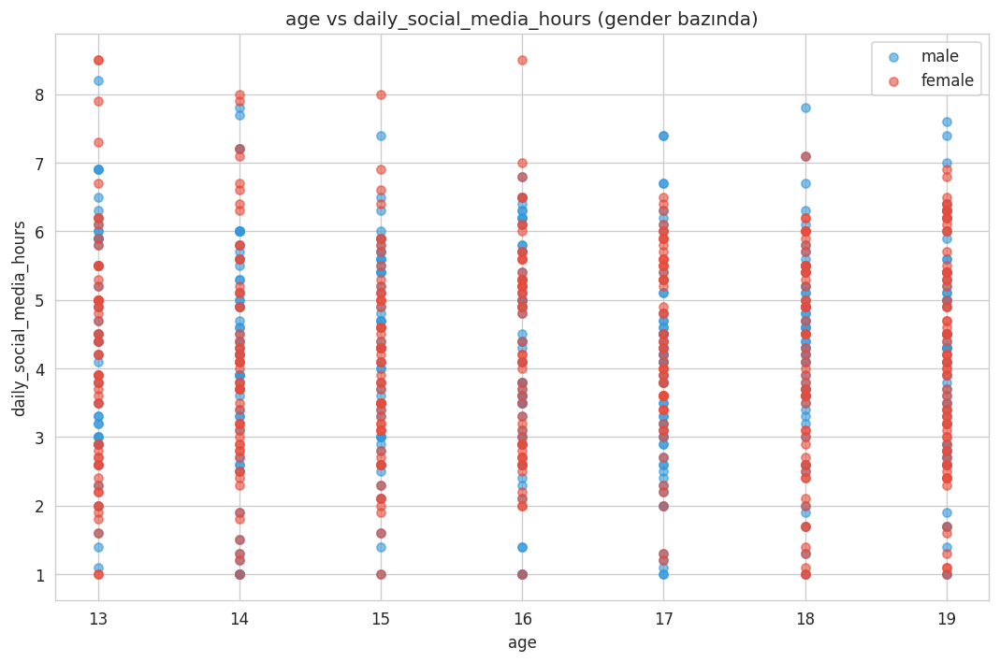
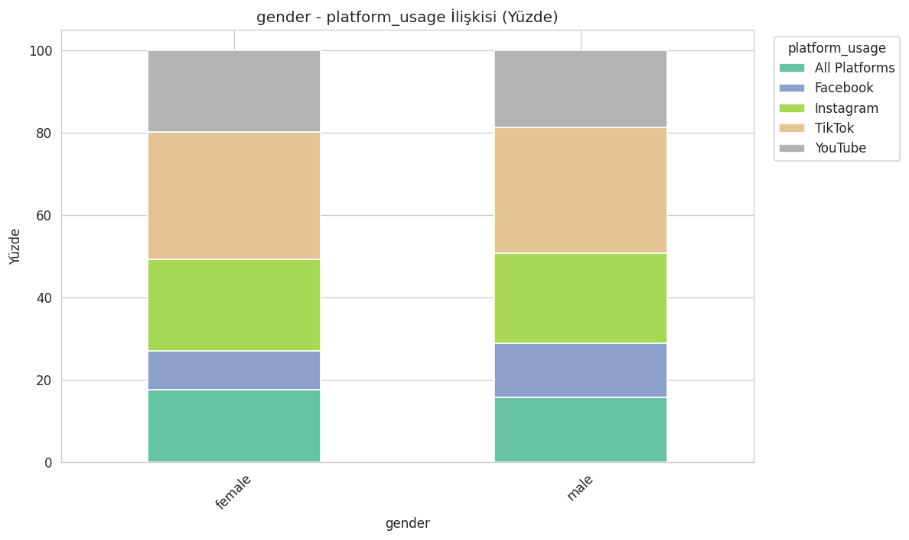
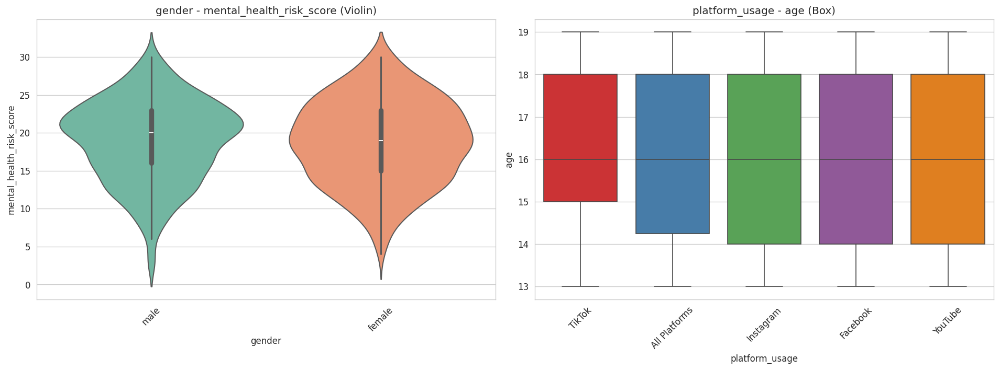

# 04 — Çift Değişkenli Analiz (Bivariate)

**Bağımsız klasör** — çalışması için başka hiçbir klasöre ihtiyaç duymaz. Veriyi kendisi indirir ve temizler.

## Yapılanlar
- Kaggle'dan otomatik indirme + temel temizlik (duplicate/eksik değer)
- Sayısal değişkenler arası korelasyon matrisi (heatmap)
- Cinsiyete göre kırılımlı scatter plot
- Kategorik × kategorik ilişki (crosstab, stacked bar, yüzdelik)
- Kategorik × sayısal ilişki (violin plot + box plot)

## Kurulum
```bash
pip install -r requirements.txt
```

## Çalıştırma
```bash
python cift_degiskenli_analiz.py
```

## Görseller





