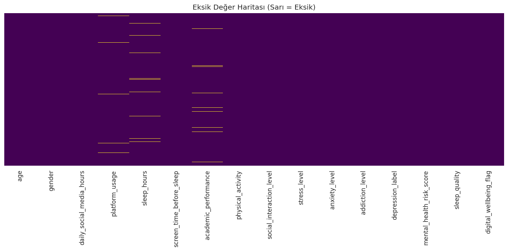
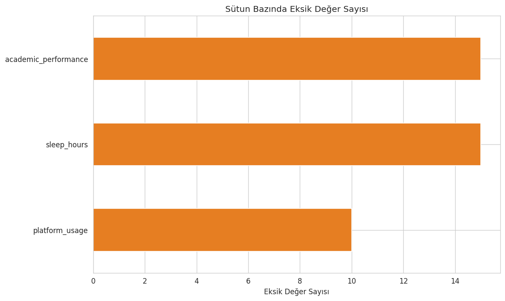
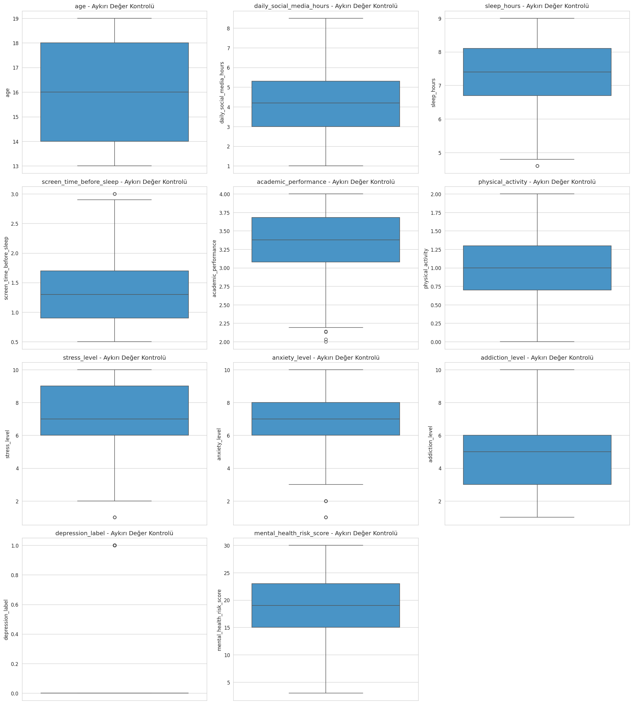
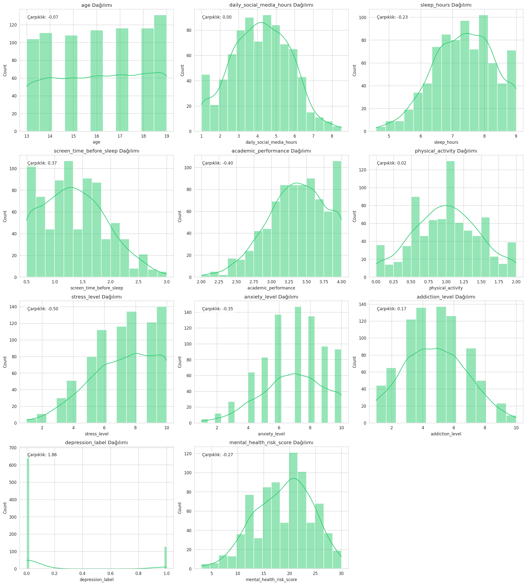
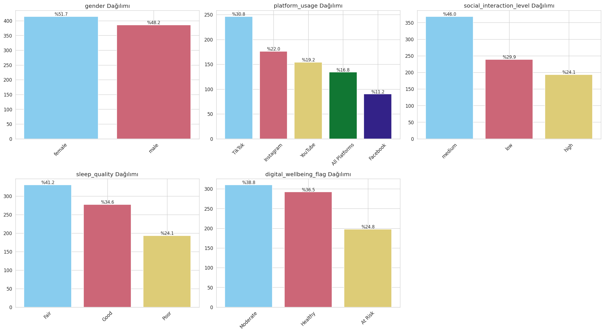
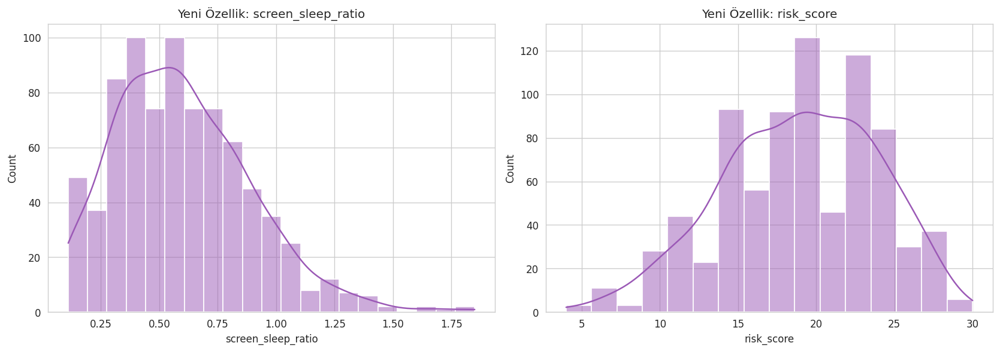
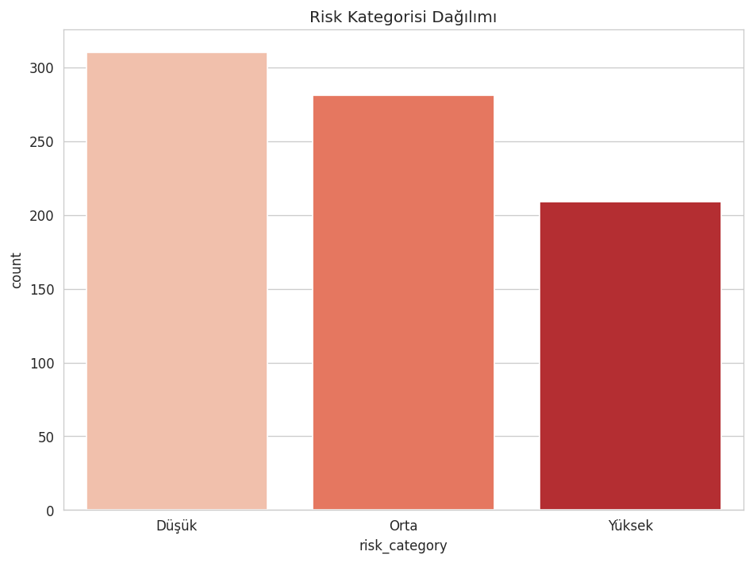

# Sosyal Medyanın Genç Ruh Sağlığına Etkisi — EDA Projesi

[Teen Mental Health Dataset](https://www.kaggle.com/datasets/argonnxx/teen-mental-health) kullanılarak hazırlanmış, gençlerin sosyal medya kullanımı ile ruh sağlığı göstergeleri arasındaki ilişkileri inceleyen EDA projesi.

## ÖNEMLİ: Klasörler tamamen BAĞIMSIZDIR

Her klasör kendi `.py` dosyasını, `requirements.txt`'ini, `README.md`'sini ve `figures/` klasörünü içerir. **Hiçbir klasör diğerine bağlı değildir** — her biri Kaggle'dan veriyi kendisi indirir ve kendi analizini yapar. İstediğin klasörü tek başına, diğerlerine dokunmadan çalıştırabilirsin.

```
.
├── 01_veri_yukleme_genel_bakis/
│   ├── veri_yukleme.py
│   ├── requirements.txt
│   ├── README.md
│   └── figures/
├── 02_veri_temizleme/
│   ├── veri_temizleme.py
│   ├── requirements.txt
│   ├── README.md
│   └── figures/
├── 03_tek_degiskenli_analiz/
│   ├── tek_degiskenli_analiz.py
│   ├── requirements.txt
│   ├── README.md
│   └── figures/
├── 04_cift_degiskenli_analiz/
│   ├── cift_degiskenli_analiz.py
│   ├── requirements.txt
│   ├── README.md
│   └── figures/
├── 05_feature_engineering/
│   ├── feature_engineering.py
│   ├── requirements.txt
│   ├── README.md
│   └── figures/
└── README.md   (bu dosya)
```

## Görseller hakkında not

Her klasörün `figures/` içine **gerçek, çalışan PNG dosyaları** koydum (sentetik/demo veriyle üretildi — çünkü Kaggle'a bu ortamdan erişimim/kimlik bilgim yok). Kod tamamen doğru ve senin bilgisayarında Kaggle kimlik bilgilerinle çalıştırdığında **gerçek veriyle aynı isimli dosyaların üzerine yazacak**, yapı/mantık hiç değişmeyecek — sadece grafiklerdeki sayılar gerçek veriye göre güncellenecek.

## Kurulum & Çalıştırma

Her klasöre ayrı ayrı girip kendi `requirements.txt`'ini kurup script'i çalıştırman yeterli, sıralamaya gerek yok:

```bash
cd 01_veri_yukleme_genel_bakis
pip install -r requirements.txt
python veri_yukleme.py
```

Kaggle API kimlik bilgilerinizin tanımlı olması gerekir (Kaggle hesabınızdan `kaggle.json` indirip `~/.kaggle/kaggle.json` konumuna yerleştirin, ya da `kagglehub.login()` ile giriş yapın).

---

## 01 — Veri Yükleme & Genel Bakış




## 02 — Veri Temizleme



## 03 — Tek Değişkenli Analiz (Univariate)




## 04 — Çift Değişkenli Analiz (Bivariate)


## 05 — Feature Engineering



