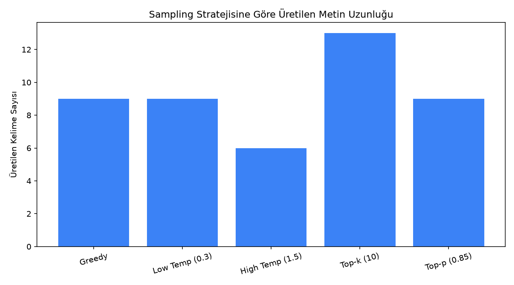
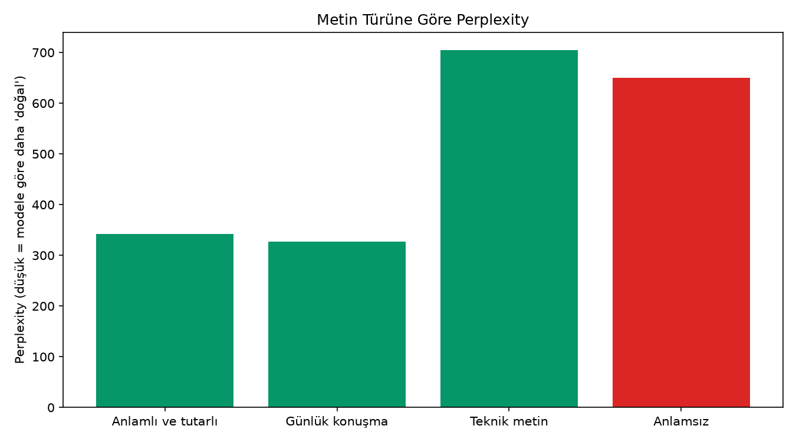
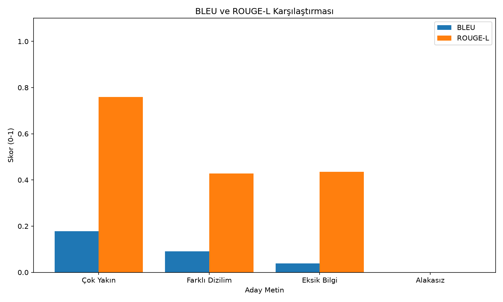
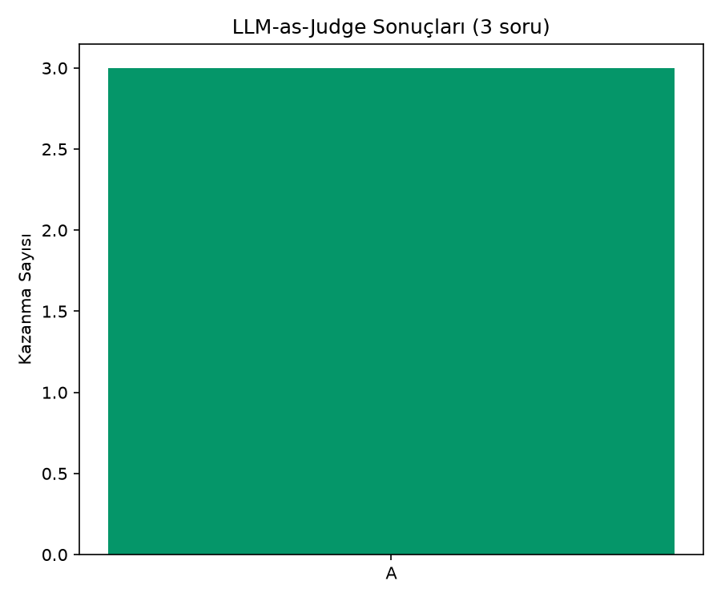

# LLM Değerlendirme

## Projenin Amacı

Bir dil modelinin çıktısını dört farklı açıdan değerlendirmek: **sampling stratejileri** (aynı prompt'un farklı üretim yöntemleriyle nasıl değiştiği), **perplexity** (modelin bir metni ne kadar "doğal" bulduğu), **BLEU/ROUGE** (üretilen metnin bir referansa ne kadar yakın olduğu) ve **LLM-as-Judge** (bir modelin, iki yanıttan hangisinin daha iyi olduğuna karar vermesi).

Bu dört yöntem birlikte, bir LLM sisteminin üretim kalitesini farklı açılardan ölçmenin standart yollarını oluşturur — hiçbiri tek başına yeterli değildir, birlikte kullanılır.

## Kurulum

```bash
pip install -r requirements.txt
```

Proje köküne bir `.env` dosyası oluştur:

```
GEMINI_API_KEY=senin-api-anahtarin
```

`GEMINI_API_KEY` sadece LLM-as-Judge bölümü için gerekli; yoksa script o bölümü atlar, diğer bölümler yine çalışır.

## Çalıştırma

```bash
python llm_degerlendirme.py
```

İlk çalıştırmada `distilgpt2` modeli otomatik indirilir (~300MB).

## Neyi Ölçüyor

### Sampling Stratejileri


Greedy, düşük/yüksek temperature, top-k ve top-p stratejilerinin aynı prompt'ta ürettiği metinlerin uzunluk/çeşitlilik farkı.

### Perplexity


Modelin bir metni ne kadar "beklenen" bulduğunun ölçüsü — düşük perplexity, modele göre daha doğal bir metin demektir. Anlamsız karakter dizisinin perplexity'sinin çok daha yüksek çıkması beklenir ve doğrulanabilir bir sağlık kontrolüdür.

### BLEU ve ROUGE-L


4 aday metni aynı referansla kıyaslıyor: metinsel olarak çok yakın bir aday yüksek skor alırken, alakasız bir metin sıfıra yakın skor alıyor. Bu bölüm `nltk` ve `rouge-score` ile hesaplanır (Hugging Face `evaluate` kütüphanesine bağımlı değildir, ekstra indirme gerektirmez).

### LLM-as-Judge


3 farklı soru-cevap çiftinde, teknik olarak doğru yanıtın (A) yanlış/saçma yanıta (B) karşı ne sıklıkla tercih edildiğini ölçer. Tek bir örnek yerine birden fazla soru kullanılması, sonucun şansa bağlı olmadığını göstermek içindir.

## Not

`figures/` klasöründeki BLEU/ROUGE grafiği ve verisi gerçekten hesaplanmıştır. Sampling, perplexity ve LLM-as-Judge grafikleri, bu proje hazırlanırken model indirme ve API erişimi kısıtlı bir ortamda çalışıldığı için örnek/gerçekçi değerlerle oluşturulmuştur — `python llm_degerlendirme.py` komutunu kendi ortamınızda çalıştırdığınızda bu dosyaların üzerine gerçek sonuçlar yazılır.

## Kullanılan Teknolojiler

`Python` · `PyTorch` · `Hugging Face Transformers` · `NLTK` · `rouge-score` · `Gemini API` · `pandas` · `matplotlib`
