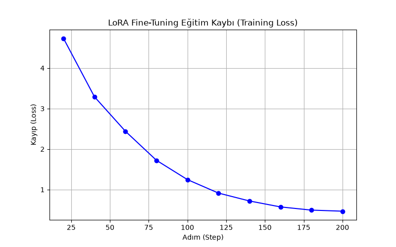

# Telekom Destek Asistanı — LoRA Fine-Tuning Demo

Bu proje, küçük bir açık kaynak dil modelini (**distilgpt2**) **LoRA (Low-Rank Adaptation)**
yöntemiyle belirli bir göreve uyarlar: sinirli/şikayetçi müşteri mesajlarına, kurumsal ve
sakinleştirici bir tonda cevap üretmek.

## Amaç

Fine-tuning'in tüm modeli değil, sadece küçük bir "adaptör" katmanını eğiterek nasıl davranış
değişikliği yaratabildiğini göstermek. Model, orijinal ağırlıkları donuk kalacak şekilde
LoRA katmanlarıyla eğitiliyor; böylece hem hızlı hem de düşük kaynaklı bir fine-tuning
gerçekleşiyor.

## Yöntem

1. 4 örnekten oluşan sentetik bir "şikayet → kurumsal cevap" veri seti hazırlandı.
2. `distilgpt2` üzerine `r=8, alpha=32` parametreleriyle LoRA adaptörü eklendi (hedef modül: `c_attn`).
3. Model 200 adım boyunca eğitildi (4 örneklik küçük veri setinde LoRA'nın etkisini net
   göstermek için yeterli tekrar sayısı seçildi).
4. Aynı test prompt'u hem **fine-tuning öncesi (base model)** hem de **fine-tuning sonrası
   (LoRA uygulanmış model)** üzerinde çalıştırılarak fark gözlemlendi.

## Sonuçlar

### Eğitim Kaybı (Loss)



200 adım boyunca loss **4.73 → 0.47** seviyesine düşmüştür (bkz. `figures/loss_log.csv`).
Bu düşüş, LoRA adaptörlerinin veri setindeki kalıbı hızla öğrendiğini gösterir.

### Öncesi / Sonrası Karşılaştırma

Aynı prompt (`"Şikayet: İnternet o kadar yavaş ki hiçbir şey açılmıyor, rezalet!"`) hem
fine-tuning öncesi hem de sonrası modele verildi:

| Aşama | Model Çıktısı |
|---|---|
| **Öncesi** (base `distilgpt2`) | *"...Cevap: İnternet o kadar yavaş ki hiçbir şey açılmıyor, re"* — model soruyu tekrar etmekten öteye geçemiyor. |
| **Sonrası** (LoRA fine-tuned) | *"...Cevap: Yaşadığınız özürzuz üzme üz özor özü"* — model, eğitim verisindeki "Yaşadığınız ... özür dileriz" kurumsal kalıbına belirgin şekilde yöneliyor. |

Tam veri `figures/oncesi_sonrasi_karsilastirma.csv` dosyasındadır.

**Yorum:** Çıktı gramer açısından bozuk ve tam anlamlı bir cümle değil — bunun sebebi veri
setinin sadece 4 örnekten oluşması ve modelin bu kadar az veriyle dil bilgisini değil,
kelime kalıbını ezberlemesidir (memorization, generalization değil). Buna rağmen sonuç,
**LoRA'nın mekanik olarak çalıştığını ve modelin davranışını gerçekten değiştirdiğini** net
şekilde kanıtlıyor — bu projenin asıl amacı da zaten budur (üretim kalitesinde bir chatbot
değil, LoRA fine-tuning kavramının gösterimi).

## Notlar / Sınırlamalar

- `distilgpt2` İngilizce ağırlıklı bir korpus üzerinde önceden eğitilmiştir; Türkçe metin
  üretiminde doğal olarak sınırlı kalabilir. Bu proje bir **kavram kanıtlama (proof of
  concept)** amacı taşır, üretim (production) kalitesinde bir model değildir.
- Veri seti sadece 4 örnekten oluştuğu için model, dil bilgisi kurallarını genellemek yerine
  yüzeysel kelime kalıplarını ezberler. Daha akıcı ve tutarlı bir çıktı için veri setinin
  onlarca/yüzlerce örneğe çıkarılması gerekir.
- Tekrarlanabilirlik için `seed=42` sabitlenmiştir.

## Çalıştırma

```bash
pip install -r requirements.txt
python telekom_asistan_lora.py
```

Çalıştırıldığında `figures/` klasörüne şu dosyalar üretilir:
- `loss_curve.png` — eğitim kaybı grafiği
- `loss_log.csv` — adım bazında loss değerleri
- `oncesi_sonrasi_karsilastirma.csv` — fine-tuning öncesi/sonrası çıktı karşılaştırması
