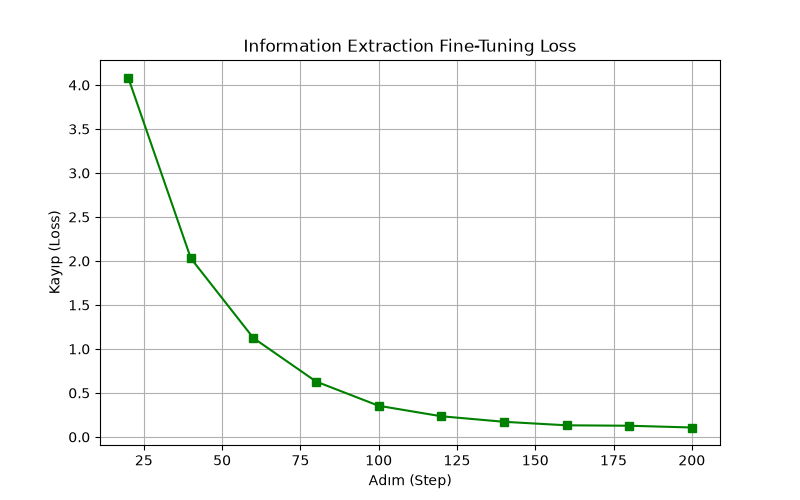

# Finans Log → JSON Çıkarımı — LoRA Fine-Tuning Demo

Bu proje, küçük bir açık kaynak dil modelini (**distilgpt2**) **LoRA (Low-Rank Adaptation)**
yöntemiyle belirli bir göreve uyarlar: serbest metin formatlı banka/POS işlem loglarını,
yapılandırılmış (structured) bir JSON çıktısına dönüştürmek.

## Amaç

01-telekom-asistan projesinden farklı olarak burada model, doğal dil üretmek yerine **katı bir
format öğrenmesi** için eğitiliyor. Bu, LoRA'nın sadece sohbet tarzı görevlerde değil,
bilgi çıkarımı (information extraction) gibi yapılandırılmış çıktı gerektiren görevlerde de
kullanılabildiğini gösteriyor.

## Yöntem

1. 4 örnekten oluşan sentetik bir "işlem logu → JSON" veri seti hazırlandı.
2. `distilgpt2` üzerine `r=16, alpha=32` parametreleriyle LoRA adaptörü eklendi
   (hedef modüller: `c_attn`, `c_proj`).
3. Model 200 adım boyunca eğitildi (4 örneklik küçük veri setinde LoRA'nın etkisini net
   göstermek için yeterli tekrar sayısı seçildi).
4. Aynı test prompt'u hem **fine-tuning öncesi (base model)** hem de **fine-tuning sonrası
   (LoRA uygulanmış model)** üzerinde çalıştırılarak fark gözlemlendi.

## Donanım Notu

Kod CUDA'ya özel bir çağrı içermez, `model.device` ile otomatik cihaz algılar. **AMD ekran
kartlarında (NVIDIA/CUDA olmadan) sorunsuz şekilde CPU üzerinde çalışır** — `distilgpt2` ve
200 adımlık bu demo boyutu CPU'da birkaç dakika içinde tamamlanacak kadar küçüktür.

## Sonuçlar

### Eğitim Kaybı (Loss)



200 adım boyunca loss **4.09 → 0.11** seviyesine düşmüştür (bkz. `figures/loss_log.csv`) —
telekom projesindeki düşüşten bile daha keskin, çünkü JSON gibi katı bir format öğrenmek
serbest metin üretmekten daha "kolay ezberlenebilir" bir örüntüdür.

### Öncesi / Sonrası Karşılaştırma

Aynı prompt (`"LOG: KOTON MAGAZACILIK KANYON AVM 899,99 TL"`) hem fine-tuning öncesi hem de
sonrası modele verildi:

| Aşama | Model Çıktısı |
|---|---|
| **Öncesi** (base `distilgpt2`) | `JSON: JSON` ardından anlamsız boş satırlar — model hiçbir yapı üretmiyor. |
| **Sonrası** (LoRA fine-tuned) | `JSON: {"sirket": "Oyun", "kategori": "Akary", "tutar": 8.99, "para_birimi": "EUR,` — **geçerli JSON söz dizimi ve doğru alan adları** (`sirket`, `kategori`, `tutar`, `para_birimi`). |

Tam veri `figures/oncesi_sonrasi_karsilastirma.csv` dosyasındadır.

**Yorum:** Model, JSON **formatını** (tırnak işaretleri, iki nokta, virgülle ayırma, doğru
alan adları) net şekilde öğrenmiş. Ancak **içerik değerleri hatalı**: "Koton" yerine "Oyun"
yazmış, tutar da yanlış (8.99 yerine 899,99 olmalıydı). Bunun sebebi veri setinin sadece
4 örnekten oluşması — model diğer örneklerdeki değerleri (Steam → "Oyun" kategorisi gibi)
ezberleyip yeni girdiye yanlış şekilde uygulamış. Bu, **format öğreniminin içerik
doğruluğundan bağımsız** ilerleyebileceğini gösteren iyi bir örnek: LoRA hızlıca "JSON gibi
konuş" davranışını öğretti, ama gerçek/doğru bilgi çıkarımı için çok daha fazla ve çeşitli
veri gerekir.

## Notlar / Sınırlamalar

- `distilgpt2` küçük ve genel amaçlı bir modeldir; bu proje bir **kavram kanıtlama (proof of
  concept)** amacı taşır, üretim (production) kalitesinde bir JSON extractor değildir.
- Veri seti sadece 4 örnekten oluştuğu için model, format kuralını doğru genellese de
  içerik değerlerini ezberleyip yanlış eşleştirir (memorization, generalization değil).
  Daha güvenilir ve doğru JSON üretimi için veri setinin onlarca/yüzlerce çeşitli örneğe
  çıkarılması gerekir.
- Tekrarlanabilirlik için `seed=42` sabitlenmiştir.

## Çalıştırma

```bash
pip install -r requirements.txt
python finans_lora.py
```

Çalıştırıldığında `figures/` klasörüne şu dosyalar üretilir:
- `extraction_loss.png` — eğitim kaybı grafiği
- `loss_log.csv` — adım bazında loss değerleri
- `oncesi_sonrasi_karsilastirma.csv` — fine-tuning öncesi/sonrası çıktı karşılaştırması
