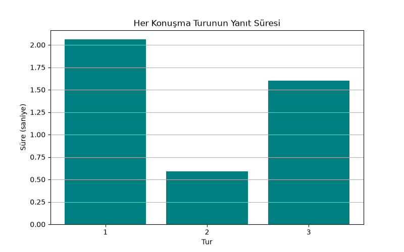

# Teknik Destek Triyaj Asistanı — LangChain Agent Demo

Bu proje, bir **destek hattı ön-triyaj botunun** nasıl çalışabileceğini gösterir: kullanıcı
şikayetini serbest metinle anlatır, agent aciliyetini değerlendirir, konuşma geçmişini
hatırlar ve sonunda toplanan bilgiyle otomatik bir destek bileti açar. SaaS/teknoloji
şirketlerinin destek hatlarında yaygın kullanılan bir otomasyon örüntüsüdür.

## Kullanılan LLM ve Mimari

- **LLM:** Google Gemini `gemini-2.5-flash` (`gemini-1.5-flash` Google tarafından
  kapatıldığı için kullanılmadı)
- **Agent:** LangChain'in güncel `create_agent` fonksiyonu (`langchain.agents`) — ReAct
  (Reasoning + Acting) mimarisi; model her turda "araç çağırmalı mıyım yoksa direkt cevap mı
  vermeliyim" kararını kendisi verir. (Not: `langgraph.prebuilt.create_react_agent`
  LangGraph v1.0'da deprecated edildi, işlevi `langchain.agents.create_agent`'a taşındı;
  proje bu güncel API'yi kullanır.)
- **Memory:** `InMemorySaver` (checkpointer) — eski `ConversationBufferMemory` LangChain
  v0.3.1'de deprecated edildiği için güncel LangGraph checkpoint sistemi kullanıldı

## Tool'lar

1. **`oncelik_belirle`** — mesajdaki anahtar kelimelere göre aciliyeti sınıflandırır
   (Düşük / Orta / Yüksek / Kritik)
2. **`bilet_ac`** — toplanan kategori, öncelik ve açıklama bilgisiyle bir destek bileti
   oluşturur (demo amaçlı bellek içi bir "veritabanı" kullanılır). Docstring'i ve agent'ın
   sistem promptu, bu aracın yalnızca kullanıcı açıkça talep ettiğinde çağrılmasını
   şart koşar; aksi halde model, aciliyeti yüksek gördüğü durumlarda bileti kendiliğinden
   açma eğilimi gösterebilir.

## Senaryo

3 turluk bir konuşma hem hafızayı hem tool-calling'i test eder:
1. Kullanıcı acil bir sorun bildirir → agent aciliyeti değerlendirmeli
2. Kullanıcı "az önce ne demiştim?" diye sorar → agent, memory sayesinde 1. turu
   hatırlamalı
3. Kullanıcı bilet açılmasını ister → agent, önceki turlardan topladığı bilgiyle
   `bilet_ac` aracını çağırmalı

## Sonuçlar

3 tur, 0.6–2.1 saniye yanıt süreleriyle tamamlandı:



| Tur | Kullanıcı Mesajı | Sonuç |
|---|---|---|
| 1 | Ödeme sisteminin çöktüğünü bildiriyor | Agent, `oncelik_belirle` aracıyla durumu **Kritik** olarak sınıflandırdı ve bilet açmadan önce onay istedi (bilet açmadı) |
| 2 | "Az önce ne bildirdiğimi hatırlıyor musun?" | Agent, 1. turdaki sorunu ve önceliği doğru şekilde hatırladı |
| 3 | "Bilet aç" talebi | Agent `bilet_ac` aracını çağırdı, tek bir bilet (`TCK-1000`) oluşturuldu |

Toplamda tek bilet açıldı, mükerrer kayıt oluşmadı — önceki çalıştırmada gözlemlenen erken/
mükerrer bilet açma davranışı, `system_prompt` ve tool docstring'ine eklenen "sadece kullanıcı
açıkça istediğinde çağır" talimatıyla giderildi.

Tam konuşma kaydı `figures/konusma_log.csv`, bilet detayı `figures/acilan_biletler.csv`
dosyasındadır.

## Notlar / Sınırlamalar

- Bilet deposu bellek içidir (`BILET_DEPOSU` listesi), script her çalıştığında sıfırlanır.
  Gerçek bir sistemde bu bir veritabanı olurdu.
- `oncelik_belirle` basit anahtar kelime eşleştirmesi kullanır; üretim ortamında bunun
  yerine ayrı bir sınıflandırma modeli veya daha kapsamlı bir kural seti tercih edilebilir.
- Memory (checkpointer) tüm oturum geçmişini biriktirir — konuşma uzadıkça her yeni turun
  token maliyeti de kümülatif olarak artar. Uzun oturumlar için mesaj özetleme veya
  `trim_messages` gibi bir kısaltma stratejisi eklenmesi önerilir.

## Çalıştırma

```bash
pip install -r requirements.txt
# .env dosyasına GEMINI_API_KEY=senin-api-key-in eklendiğinden emin olun
python langchain_pipeline.py
```
