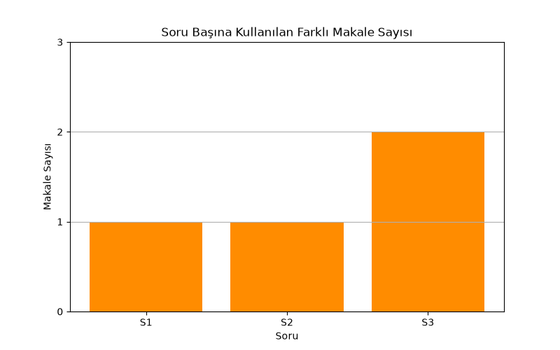

# Türkçe Wikipedia Tabanlı RAG Sistemi

Bu proje, Türkçe Wikipedia makalelerini vektör veritabanına gömüp, kullanıcı sorularını bu
makalelerdeki bilgiye dayanarak yanıtlayan ve **kaynak gösteren** bir RAG (Retrieval-Augmented
Generation) sistemi kurar.

## Kullanılan LLM ve Embedding

- **LLM:** Google Gemini `gemini-2.5-flash` — cevap üretimi için
- **Embedding:** Google `gemini-embedding-001` — makale parçalarını ve soruları vektöre
  çevirmek için
- **Vektör Veritabanı:** FAISS (yerel, ücretsiz, kurulum gerektirmeyen bir vektör index'i)
- **Veri Kaynağı:** Wikipedia'nın REST API'sine `requests` ile doğrudan bağlanılarak canlı
  çekilen Türkçe makaleler (statik/önceden indirilmiş veri değil). Bakımı zayıf ve API
  değişikliklerine karşı kırılgan olan `wikipedia` pip paketi kasıtlı olarak kullanılmadı.

**API key gereklidir.** Proje kök dizinine bir `.env` dosyası oluşturup içine ekleyin:

```dotenv
GEMINI_API_KEY=senin-api-key-in
```

## Yöntem

1. Wikipedia'nın REST API'sine `requests` ile doğrudan istek atılarak üç Türkçe makale
   canlı olarak çekilir: **Yapay zeka**, **Makine öğrenmesi**, **Derin öğrenme**.
2. Makaleler `RecursiveCharacterTextSplitter` ile 800 karakterlik, 100 karakter örtüşmeli
   parçalara (chunk) bölünür.
3. Her parça `gemini-embedding-001` ile vektöre çevrilip **FAISS** içine indexlenir.
4. Bir soru geldiğinde en alakalı 3 chunk (`k=3`) getirilir, bu chunk'lar kaynaklarıyla
   birlikte LLM'e bağlam olarak verilir, LLM de bu bağlama dayanarak cevap üretir.
5. `RetrievalQA` gibi hazır LangChain chain sınıfları yerine, retrieval ve üretim adımları
   elle (LCEL tarzı, `soru_cevapla()` fonksiyonu içinde) birleştirilmiştir — bu hem daha
   şeffaf hem de eski chain sınıflarının deprecation riskinden bağımsızdır.
6. 3 örnek soru ile sistem test edilir; her cevabın hangi makale(ler)den geldiği ayrıca
   loglanır.

## Sonuçlar

Üç Wikipedia makalesi de (**Yapay zeka**, **Makine öğrenimi**, **Derin öğrenme**) başarıyla
çekildi ve sistem 3 soruyu kaynağa dayalı şekilde yanıtladı:



| Soru | Kullanılan Kaynak(lar) | Değerlendirme |
|---|---|---|
| Yapay zeka ile makine öğrenmesi arasındaki fark nedir? | Makine öğrenimi | Cevap, bağlamdaki bilgiye dayanarak iki kavram arasındaki ilişkiyi ve farkı kapsamlı şekilde açıkladı |
| Derin öğrenme hangi tür problemlerde kullanılır? | Derin öğrenme | Cevap, makaledeki kullanım alanlarını (görüntü/ses tanıma, sağlık, öneri sistemleri vb.) doğru şekilde listeledi |
| Makine öğrenmesinin başlıca türleri nelerdir? | Makine öğrenimi, Derin öğrenme | Cevap iki farklı makaleden bilgi birleştirdi; bağlamda net bir liste olmadığını da dürüstçe belirtti |

Sistem, bağlamda yer almayan bilgiyi uydurmak yerine (3. soruda olduğu gibi) belirsizliği
açıkça ifade etti — bu, prompt'taki "bağlam yetersizse belirt" talimatının beklendiği gibi
çalıştığını gösteriyor.

Tam veri `figures/soru_cevap_log.csv` dosyasındadır.

## Notlar / Sınırlamalar

- FAISS için `langchain_community.vectorstores` kullanılıyor; bu paket "sunset" (bakımdan
  kaldırılma) uyarısı veriyor ama hâlâ çalışıyor. Ayrı bir `langchain-faiss` paketi mevcut
  ama bakımı durmuş durumda (son sürüm 2024), bu yüzden şu an için en güvenilir seçenek
  community paketi. İleride resmi bir standalone alternatif çıkarsa geçiş yapılmalı.
- Wikipedia içeriği zamanla değişebileceğinden, script her çalıştırıldığında güncel makale
  metni yeniden çekilir; sonuçlar bu nedenle tam olarak tekrarlanabilir olmayabilir.
- `k=3` (soru başına 3 chunk getirme) demo amaçlı seçilmiştir; daha kapsamlı bir bilgi
  tabanında bu değer ayarlanmalıdır.
- FAISS burada bellek içi (in-memory) çalışır, disk'e kalıcı kaydedilmez; her çalıştırmada
  yeniden indexlenir. Kalıcı bir sistem için `vectorstore.save_local()` eklenebilir.
- Gemini embedding ve chat API çağrıları ücretlidir (düşük maliyetli ama ücretsiz değil).
  **Ücretsiz katmanda `gemini-2.5-flash` için günlük/dakikalık istek kotası düşüktür**;
  script bu nedenle kota hatası (429) aldığında API'nin önerdiği süre kadar bekleyip
  otomatik olarak tekrar dener (`soru_cevapla` fonksiyonu, en fazla 3 deneme). Kota sık
  aşılıyorsa `gemini-2.5-flash-lite` gibi daha yüksek ücretsiz kotalı bir model denenebilir.
- Wikipedia REST API'sine art arda hızlı istek atmamak için makale çekme adımları arasına
  1 saniyelik bekleme eklendi; yine de bir makale çekilemezse artık gerçek HTTP durum kodu
  ve yanıt içeriği terminalde gösterilir (eskiden sadece genel bir hata mesajı basılıyordu).

## Çalıştırma

```bash
pip install -r requirements.txt
# .env dosyasına GEMINI_API_KEY=senin-api-key-in eklendiğinden emin olun
python rag_sistemi.py
```
