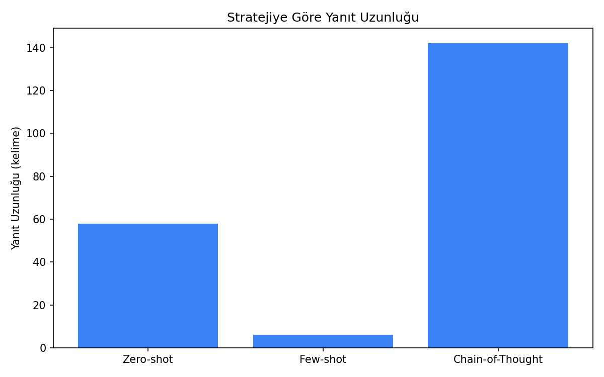
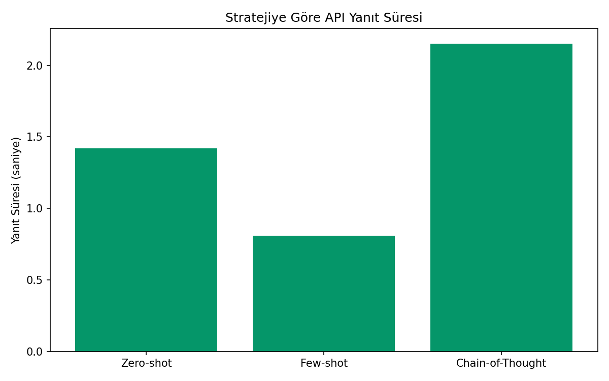
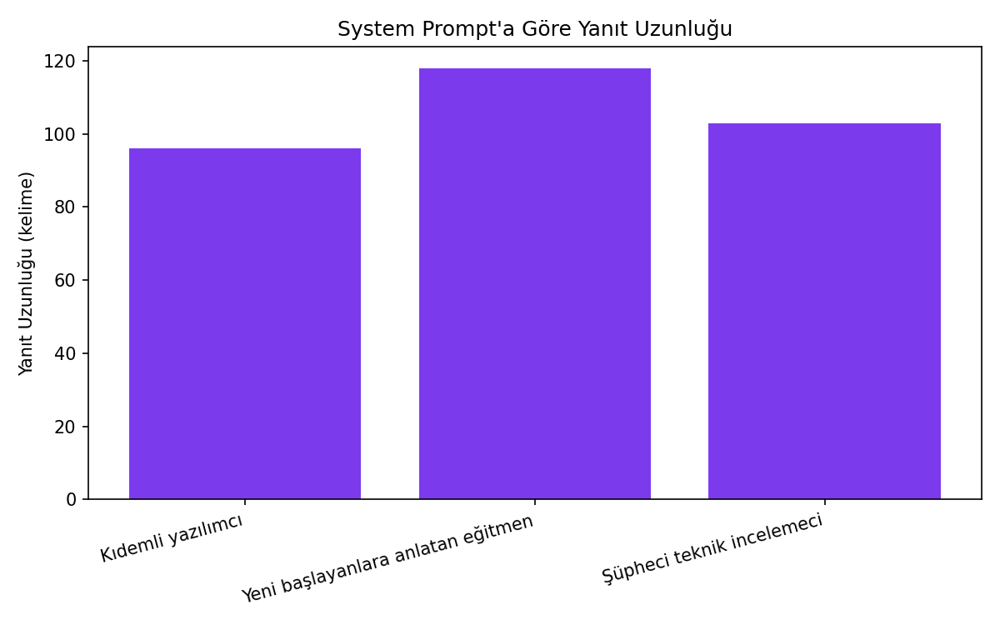
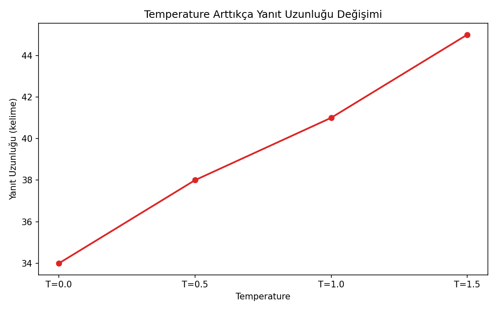

# Prompt Engineering — Zero-shot, Few-shot, CoT, System Prompt, Temperature

## 🎯 Projenin Amacı

Aynı LLM'e (GPT-4o-mini) farklı prompt tekniklerini uygulayıp gerçek API yanıtlarını karşılaştırmak: **zero-shot** (sepet terk etme önerileri), **few-shot** (yorum duygu analizi, 3 örnekle), **chain-of-thought** (bir kafenin kâr/zarar hesabı), **system prompt** (kıdemli yazılımcı / eğitmen / şüpheci incelemeci rolleriyle mikroservis tavsiyesi) ve **temperature** (şirket isim önerilerinin çeşitliliği).

## 🚀 Kurulum ve Çalıştırma

```bash
pip install -r requirements.txt
```

Proje köküne bir `.env` dosyası oluştur:

```
OPENAI_API_KEY=senin-api-anahtarin
```

Sonra çalıştır:

```bash
python prompt_engineering.py
```

Script 5 farklı prompt tekniğini gerçek API üzerinden çalıştırır, terminale özet yanıtları basar ve tüm sonuçları `figures/` klasörüne kaydeder.

## 📊 Neyi Ölçüyor

Script her API çağrısında şunları kaydediyor: yanıt metni, yanıt süresi (saniye), yanıt uzunluğu (kelime sayısı).

### Stratejiye Göre Yanıt Uzunluğu


Zero-shot / Few-shot / Chain-of-Thought yanıtlarının kelime sayısı karşılaştırması.

### Stratejiye Göre API Yanıt Süresi


Aynı 3 stratejinin API yanıt süresi karşılaştırması.

### System Prompt'a Göre Yanıt Uzunluğu


"Kıdemli yazılımcı" / "Yeni başlayanlara anlatan eğitmen" / "Şüpheci teknik incelemeci" system prompt'larının yanıt uzunluğuna etkisi.

### Temperature Arttıkça Yanıt Uzunluğu Değişimi


Temperature (0.0 → 1.5) arttıkça yanıt uzunluğunun/çeşitliliğinin nasıl değiştiği.

Ayrıca tüm ham çağrılar `figures/tum_cagrilar.csv` (tablo) ve `figures/tum_yanitlar.json` (tam yanıt metinleriyle) olarak kaydediliyor.

## ⚠️ Not

Bu script gerçek bir OpenAI API anahtarı gerektirir ve çalıştırıldığında **gerçek API çağrıları yapar** (küçük bir maliyeti olur, `gpt-4o-mini` kullanıldığı için bu maliyet çok düşüktür). `figures/` klasöründeki grafikler ancak script bir kez çalıştırıldıktan sonra oluşur.

## 🛠️ Kullanılan Teknolojiler

`Python` · `OpenAI API` · `pandas` · `matplotlib` · `python-dotenv`
