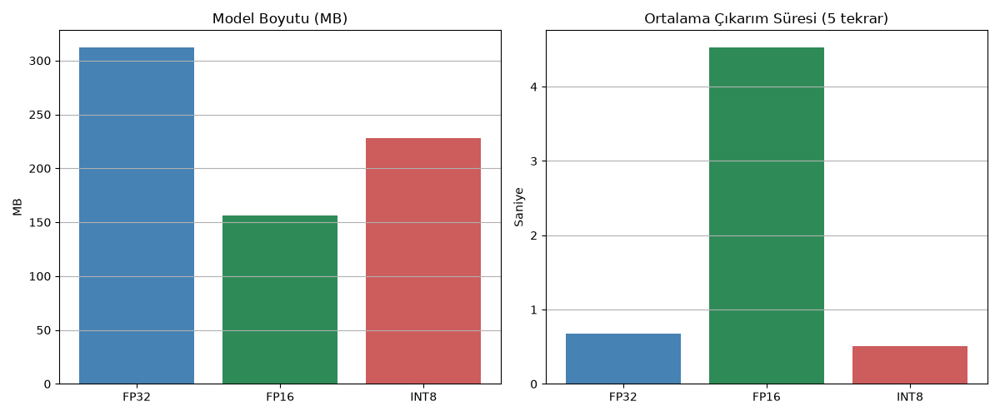

# FP32 / FP16 / INT8 Kuantizasyon Karşılaştırması

Bu proje, aynı modelin (`distilgpt2`) üç farklı sayısal hassasiyette (FP32, FP16, INT8)
çalıştırılmasını ve **boyut / hız / çıktı kalitesi** açısından karşılaştırılmasını gösterir.
Kuantizasyon, LLM'leri mobil ve edge cihazlarda çalıştırmanın temel tekniğidir.

## Yöntem

1. **FP32:** Modelin varsayılan (32-bit kayan noktalı) hali — referans (baseline).
2. **FP16:** `model.half()` ile 16-bit kayan noktalıya dönüştürülür — bellek kullanımını
   yarıya indirir.
3. **INT8:** PyTorch'un yerleşik **dinamik kuantizasyonu**
   (`torch.quantization.quantize_dynamic`) ile `Linear` katmanlar 8-bit tamsayıya
   dönüştürülür. `bitsandbytes` kasıtlı olarak kullanılmadı çünkü CUDA'ya bağımlıdır;
   PyTorch'un dinamik kuantizasyonu CPU'da (AMD ekran kartlarında dahil) native çalışır.

   **Önemli bir teknik detay:** `distilgpt2` (GPT-2 ailesi), attention/mlp
   projeksiyonlarında `torch.nn.Linear` yerine transformers'a özgü `Conv1D` katmanları
   kullanır. `quantize_dynamic` yalnızca `nn.Linear`'ı tanıdığı için, `Conv1D` katmanları
   önce matematiksel olarak eşdeğer `nn.Linear`'a dönüştürülür (ağırlık transpoze edilerek)
   — aksi halde kuantizasyon **sessizce hiçbir etki yapmadan geçer** ve INT8 modelin boyutu
   FP32 ile birebir aynı çıkar (bu proje geliştirilirken tam olarak bu hatayla karşılaşıldı
   ve düzeltildi).
4. Her sürüm için: model boyutu, aynı prompt üzerinde ortalama çıkarım süresi (5 tekrarın
   ortalaması) ve üretilen metin kaydedilir. Boyut, `.parameters()` toplamı yerine
   `state_dict()`'in serileştirilmiş halinin gerçek byte boyutu ölçülerek hesaplanır —
   kuantize edilmiş ağırlıklar normal `nn.Parameter` olarak saklanmadığı için ilk yöntem
   yanıltıcı sonuç verir.

## Sonuçlar

Conv1D→Linear düzeltmesinden sonra üç hassasiyet de beklenen yönde farklılaştı:



| Hassasiyet | Boyut (MB) | Ort. Süre (sn) |
|---|---|---|
| FP32 | 312.50 | 0.68 |
| FP16 | 156.26 | 4.53 |
| INT8 | 227.83 | **0.51** |

**Gözlemler:**
- **FP16**, beklendiği gibi boyutu tam olarak yarıya indirdi, ama CPU'da **~6.7 kat daha
  yavaş** çalıştı — FP16'nın CPU'da native hızlandırma desteği olmadığını doğruluyor;
  asıl faydası GPU'da (Tensor Core'larda) ortaya çıkar.
- **INT8**, boyutu %27 küçülttü (312.5 → 227.8 MB) ve üçü arasında **en hızlısı** oldu.
  Küçülme, teorik maksimum olan ~1/4'ten (yaklaşık 78 MB) daha az kaldı — bunun sebebi,
  dinamik kuantizasyonun yalnızca `Linear` katmanları etkilemesi; embedding tablosu (GPT-2
  ailesinde modelin önemli bir kısmını oluşturur) ve layer-norm katmanları FP32 olarak
  kalmaya devam eder.
- Çıktı kalitesi her üç hassasiyette de düşük çıktı (`distilgpt2` zaten küçük ve zayıf bir
  model, tekrarlayan/anlamsız token'lar üretiyor) — bu kuantizasyondan değil, modelin
  kendisinden kaynaklanıyor; üç sürüm de birbirine yakın (düşük) kalitede.

Tam veri `figures/kuantizasyon_karsilastirma.csv` dosyasındadır.

## Notlar / Sınırlamalar

- **FP16'nın CPU'da gerçek bir hız avantajı sağlamayabileceğini** unutmayın — asıl hız
  kazancı GPU'larda (özellikle Tensor Core destekli NVIDIA kartlarda) görülür. CPU'da FP16
  öncelikle bellek tasarrufu sağlar, hız konusunda FP32'den daha yavaş bile çıkabilir.
  Bu, kuantizasyonun donanıma bağlı bir teknik olduğunu gösteren dürüst bir bulgudur.
- INT8 dinamik kuantizasyon yalnızca `Linear` katmanları etkiler; embedding ve
  layer-norm katmanları FP32 kalır — bu yüzden boyut küçülmesi teorik maksimumun altında
  kalabilir.
- Kuantizasyon sonrası çıktı kalitesindeki değişim, `distilgpt2` gibi küçük bir modelde
  daha büyük modellere kıyasla daha belirgin olabilir; büyük modeller genellikle
  kuantizasyona karşı daha dayanıklıdır.
- API key gerekmez, tamamen yerel çalışır.
- Tekrarlanabilirlik için `seed=42` sabitlenmiştir.

## Çalıştırma

```bash
pip install -r requirements.txt
python kuantizasyon_karsilastirma.py
```
