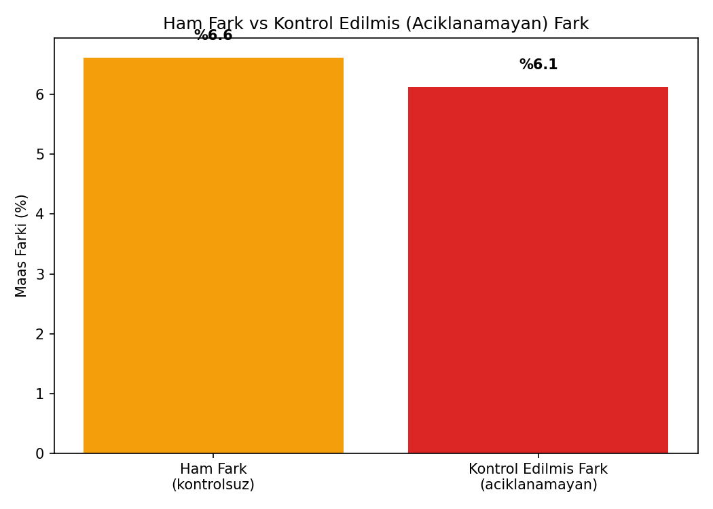
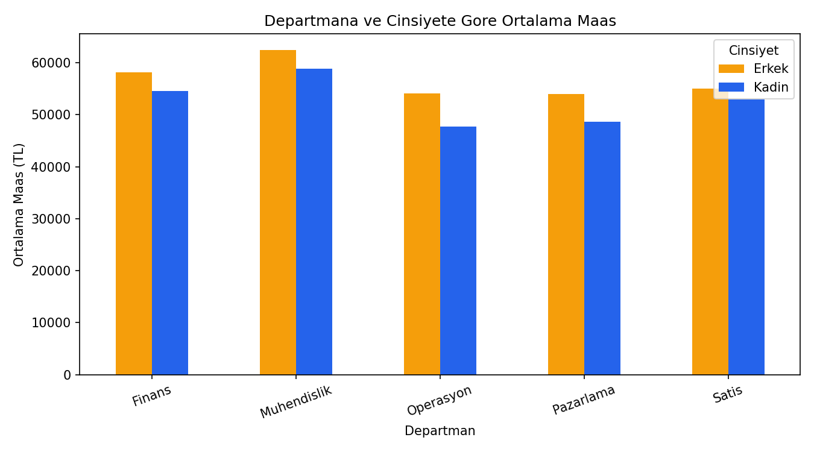
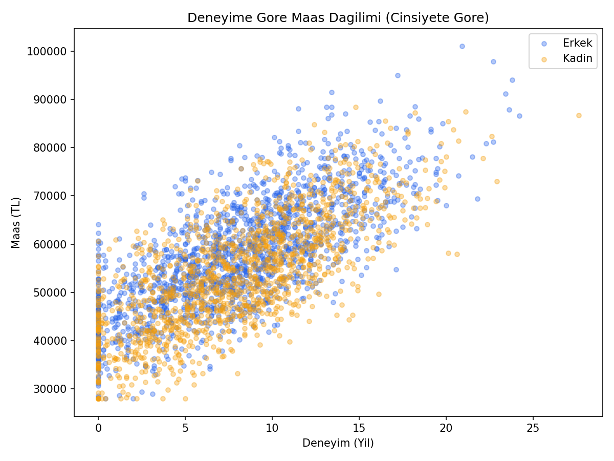
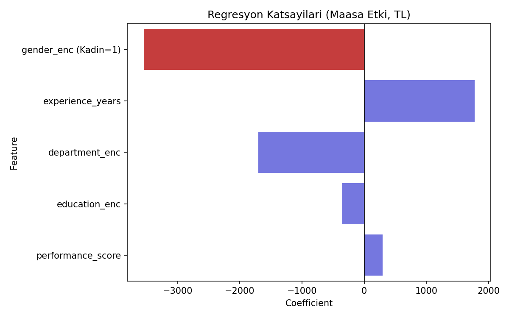

# Ücret Eşitliği Analizi (Pay Equity Analysis) — Linear Regression

## 🎯 Projenin Amacı

Bir şirkette çalışanların maaşlarına bakıp şu soruyu cevaplamak:

> **"Aynı işi, aynı deneyimle, aynı departmanda yapan bir kadın ile bir erkek arasında, sırf cinsiyetten kaynaklanan açıklanamayan bir maaş farkı var mı, varsa ne kadar?"**

Bunu yapmak için maaşı tahmin eden bir Linear Regression modeli kurulur. Modele deneyim yılı, departman, eğitim seviyesi, performans skoru gibi **meşru** faktörler dahil edilir. Bu faktörler kontrol edildikten sonra, modelde hâlâ "cinsiyet" değişkeninin kendi başına anlamlı bir katsayısı çıkıyorsa — işte bu **açıklanamayan fark**, yani potansiyel bir eşitsizlik sinyalidir.

### ⚖️ Etik Çerçeve — Önemli

Bu proje cinsiyet ayrımcılığını **savunmaz veya normalleştirmez** — tam tersine, **ona karşı bir denetim/şeffaflık aracıdır**. Amaç, olası bir eşitsizliği **gizlemek değil ortaya çıkarmaktır**. Bu tür analizler gerçek şirketlerde HR/compliance ekipleri tarafından kendi ücret yapılarını denetlemek için kullanılır — özellikle AB'nin **Pay Transparency Directive**'i gibi düzenlemelerin yürürlüğe girmesiyle bu analiz türünün önemi artmıştır.

---

## ⚠️ Veri Hakkında Önemli Not

Gerçek bir şirket verisi kullanılmamıştır. Bunun yerine, literatürde bilinen "ham fark var, kontrol edilince kısmen açıklanıyor ama tamamen kapanmıyor" örüntüsüne sadık **sentetik bir veri seti** script içinde otomatik olarak üretilir — bilinçli olarak küçük, açıklanamayan bir fark modele gömülüdür ki analiz bunu **tespit edebilsin**.

---

## 📊 Veri Seti (Sentetik)

3.000 çalışan kaydı:

| Değişken | Açıklama |
|---|---|
| `gender` | Cinsiyet (Kadın / Erkek) |
| `experience_years` | Deneyim (yıl) |
| `department` | Departman (Mühendislik, Satış, Pazarlama, Operasyon, Finans) |
| `education` | Eğitim seviyesi (Lisans, Yüksek Lisans, Doktora) |
| `performance_score` | Performans skoru (0-100) |
| `salary` | Hedef değişken — yıllık maaş |

---

## 🚀 Çalıştırma

```bash
pip install -r requirements.txt
python pay_equity_analysis.py
```

---

## 📈 Sonuçlar

| Metrik | Değer |
|---|---|
| Model R² | ~0.67 |
| Ham (kontrolsüz) maaş farkı | ~%6.6 |
| Kontrol edilmiş (açıklanamayan) fark | ~%6.1 |

### Ham Fark vs Kontrol Edilmiş Fark


Bu grafik analizin can alıcı noktası: deneyim, departman, eğitim ve performans kontrol edildikten sonra bile açıklanamayan fark **önemli ölçüde küçülmüyor** — bu, meşru faktörlerle açıklanamayan, araştırılması gereken bir örüntüye işaret eder.

### Departmana ve Cinsiyete Göre Ortalama Maaş


### Deneyime Göre Maaş Dağılımı


### Regresyon Katsayıları


`gender_enc` katsayısı, diğer tüm faktörler sabit tutulduğunda cinsiyetin maaşa olan **bağımsız etkisini** gösterir — bu, raporun HR/compliance ekibine sunulacak asıl bulgusudur.

---

## 🛠️ Kullanılan Teknolojiler

`Python` · `scikit-learn` · `pandas` · `matplotlib` · `seaborn`

---

<p align="center"><i>Açıklanabilir regresyon ve ücret şeffaflığı analizi pratiği amaçlı bir portföy projesidir.</i></p>
