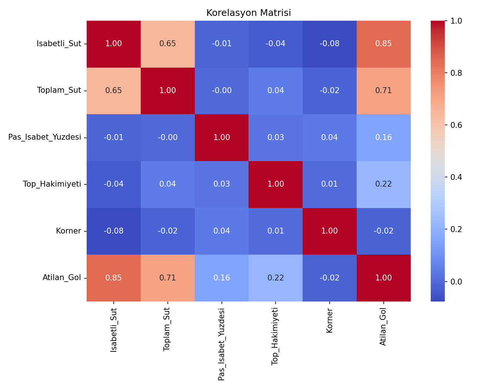
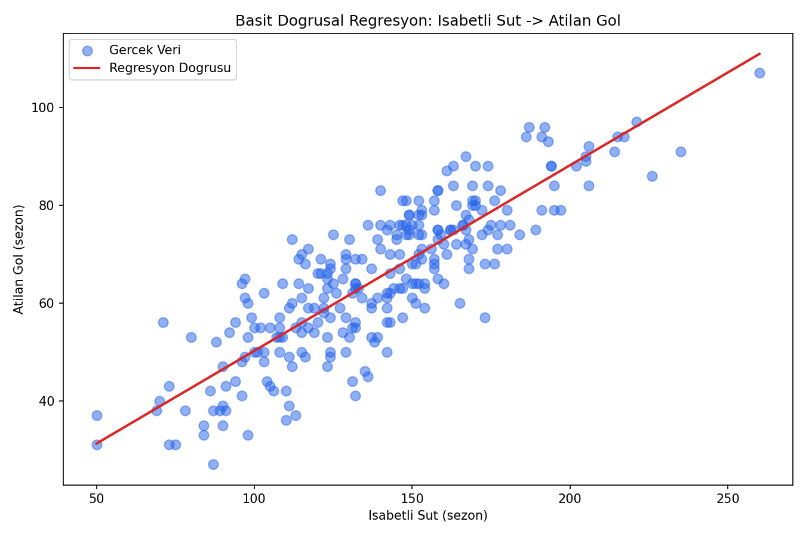
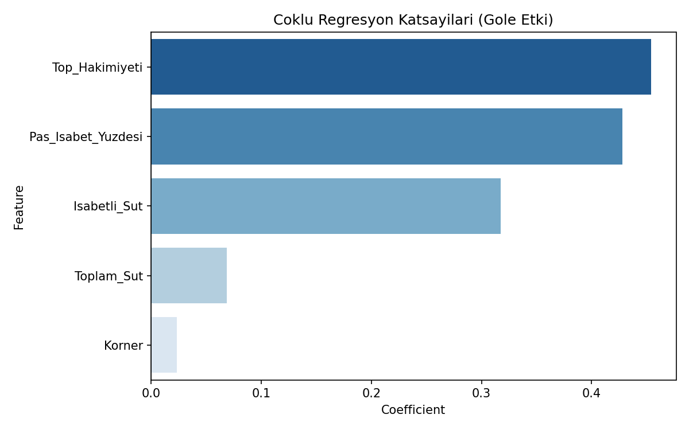
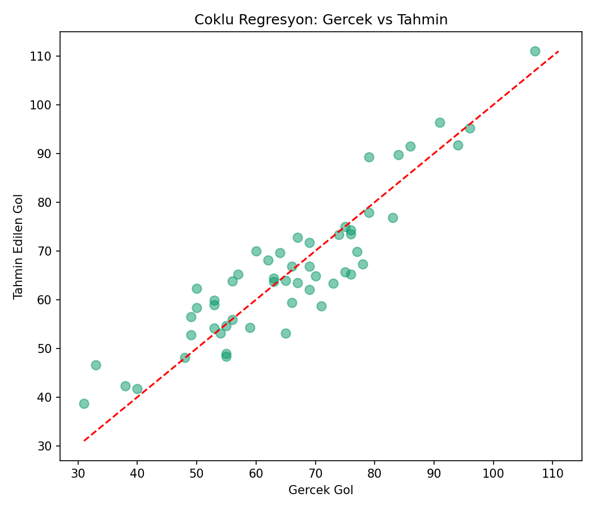

# Süper Lig Gol Tahmini — Basit ve Çoklu Doğrusal Regresyon

## 🎯 Projenin Amacı

Bir futbol takımının sezon istatistiklerinden (isabetli şut, top hakimiyeti, pas isabet yüzdesi vb.) **attığı gol sayısını tahmin etmek** — ve daha önemlisi, **tek bir değişkenin mi yoksa birden fazla değişkenin birlikte mi daha iyi tahmin verdiğini** göstermek.

Bu proje bilinçli olarak iki aşamalı kurulmuştur:
1. **Basit Doğrusal Regresyon** — sadece "isabetli şut" değişkeniyle gol tahmini
2. **Çoklu Doğrusal Regresyon** — isabetli şut + toplam şut + pas isabeti + top hakimiyeti + korner sayısı birlikte

Amaç, spor analitiğinde sıkça karşılaşılan bir soruyu somutlaştırmak: *"Tek bir istatistiğe mi bakmalıyız, yoksa oyunun bütününü mü değerlendirmeliyiz?"* Sonuçlar bu sorunun cevabını R² artışıyla doğrudan gösteriyor.

## ⚠️ Veri Hakkında Önemli Not

Gerçek Süper Lig verisi bu ortamda bulunmadığı için (orijinal not defterinde `/content/Superlig_Proje.xlsx` şeklinde Google Colab'a özel bir dosya yolu kullanılmıştı ve veri dosyası paylaşılmamıştı), gerçekçi futbol istatistik ilişkilerini yansıtan **sentetik bir veri seti** üretilir: 18 takım × 15 sezon = 270 takım-sezon kaydı.

## 📊 Veri Seti (Sentetik)

| Değişken | Açıklama |
|---|---|
| `Takim_Adi` | Takım kimliği |
| `Isabetli_Sut` | Sezonluk isabetli şut sayısı |
| `Toplam_Sut` | Sezonluk toplam şut sayısı |
| `Pas_Isabet_Yuzdesi` | Pas isabet yüzdesi |
| `Top_Hakimiyeti` | Ortalama top hakimiyeti (%) |
| `Korner` | Sezonluk korner sayısı |
| `Atilan_Gol` | Hedef değişken — sezonluk atılan gol |

## 🚀 Çalıştırma

```bash
pip install -r requirements.txt
python superlig_goal_regression.py
```

## 📈 Sonuçlar

| Model | R² | RMSE | MAE |
|---|---|---|---|
| Basit Regresyon (sadece İsabetli Şut) | 0.75 | 7.65 | 6.10 |
| Çoklu Regresyon (5 değişken) | 0.83 | 6.45 | 5.27 |

Çoklu regresyon, tek değişkenli modele göre R²'yi ~8 puan iyileştiriyor — yani oyunun bütününü (top hakimiyeti, pas isabeti gibi) değerlendirmek, sadece şut sayısına bakmaktan daha isabetli bir tahmin veriyor.

### Korelasyon Matrisi


### Basit Regresyon


### Çoklu Regresyon Katsayıları


### Gerçek vs Tahmin (Çoklu Regresyon)


## 🛠️ Kullanılan Teknolojiler

`Python` · `scikit-learn` · `pandas` · `matplotlib` · `seaborn`

<p align="center"><i>Spor analitiği ve regresyon karşılaştırması pratiği amaçlı bir portföy projesidir.</i></p>
