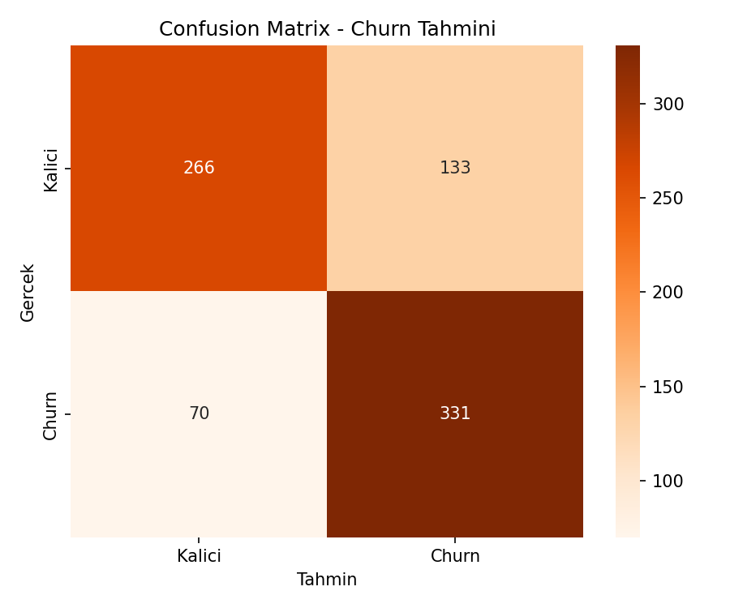
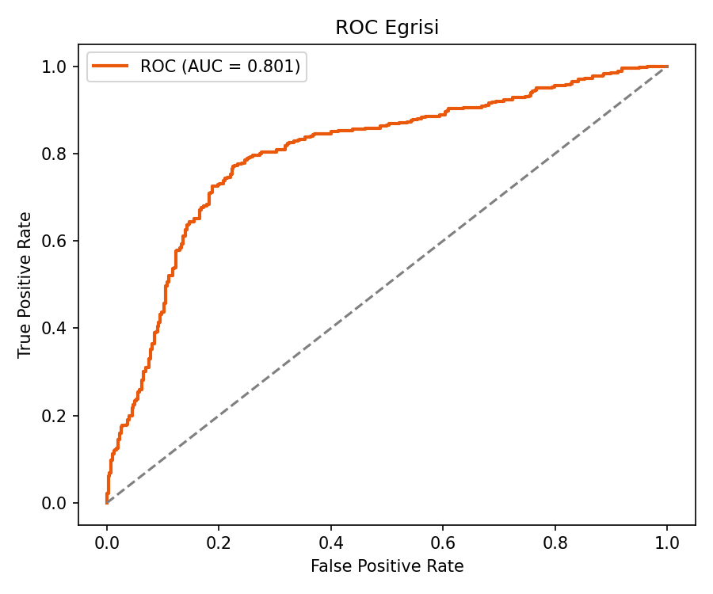
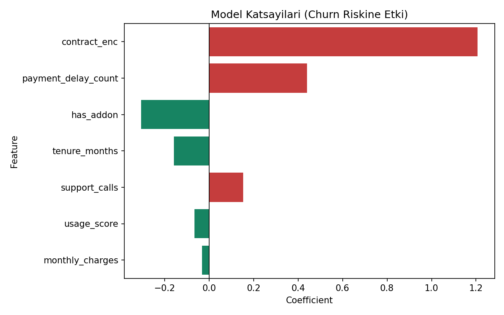
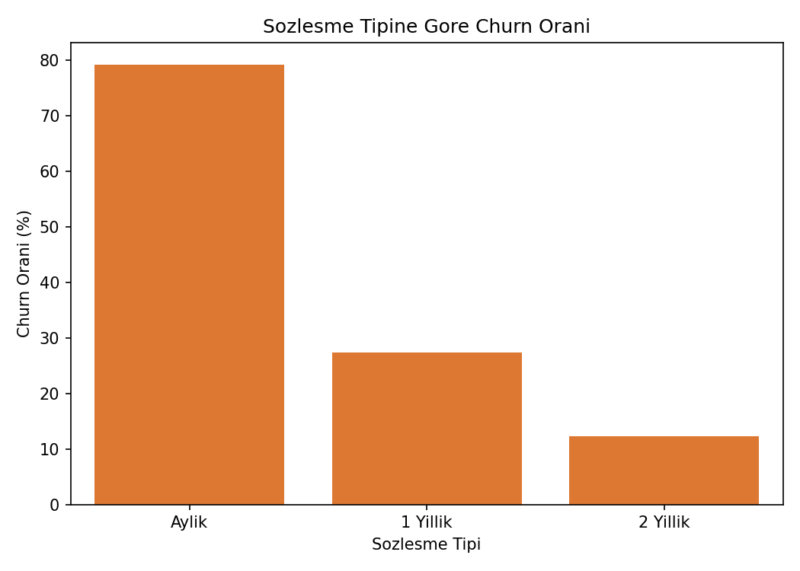

# Müşteri Kaybı (Churn) Tahmini — Logistic Regression

## 🎯 Projenin Amacı

Bir SaaS/telekom müşterisinin **önümüzdeki dönemde hizmeti bırakma (churn) olasılığını** tahmin etmek ve — asıl önemlisi — **hangi faktörlerin bu riski artırdığını/azalttığını** açıklayabilmek.

Bu tür modeller gerçek şirketlerde "customer success" (müşteri başarısı) ekipleri tarafından şöyle kullanılır: Model, riskli müşterileri erkenden işaretler; ekip bu müşterilere proaktif olarak ulaşır (indirim, destek çağrısı, ek hizmet önerisi vb.) ve kaybı önlemeye çalışır. Bu yüzden model sadece "kim gidecek" demekle kalmamalı, **"neden gidecek"** sorusuna da somut cevap vermelidir — bu da Logistic Regression'ın burada tercih edilme sebebidir: katsayılar doğrudan yorumlanabilir.

**Kısacası:** Bu proje bir "erken uyarı sistemi" + "kök neden analizi" kurma pratiğidir.

---

## ⚠️ Veri Hakkında Önemli Not

Gerçek bir şirket verisi kullanılmamıştır. Bunun yerine, sektörde bilinen gerçekçi churn dinamiklerini (kısa süreli sözleşme + düşük ürün kullanımı + yüksek destek talebi → yüksek churn riski) yansıtan **sentetik bir veri seti** script içinde otomatik üretilir.

---

## 📊 Veri Seti (Sentetik)

4.000 müşteri kaydı:

| Değişken | Açıklama |
|---|---|
| `tenure_months` | Müşterinin kaç aydır abone olduğu |
| `monthly_charges` | Aylık ödenen ücret |
| `contract` | Sözleşme tipi (Aylık / 1 Yıllık / 2 Yıllık) |
| `support_calls` | Destek hattına yapılan çağrı sayısı |
| `usage_score` | Ürün kullanım yoğunluğu skoru (0-100) |
| `has_addon` | Ek hizmet/paket satın almış mı (0/1) |
| `payment_delay_count` | Geciken ödeme sayısı |
| `churn` | Hedef değişken (0=kaldı, 1=ayrıldı) |

---

## 🚀 Çalıştırma

```bash
pip install -r requirements.txt
python churn_prediction.py
```

---

## 📈 Sonuçlar

| Metrik | Değer |
|---|---|
| Accuracy | ~%75 |
| ROC-AUC | ~0.80 |

### Confusion Matrix


### ROC Eğrisi


### Model Katsayıları (Açıklanabilirlik)


### İş İçgörüsü: Sözleşme Tipine Göre Churn Oranı


Bu son grafik, modelin ürettiği içgörünün doğrudan **iş kararına** dönüştürülebildiğini gösteriyor: örneğin aylık sözleşmeli müşterilerin churn oranı belirgin şekilde daha yüksekse, şirket bu segmente özel bir sadakat/indirim kampanyası tasarlayabilir.

---

## 🛠️ Kullanılan Teknolojiler

`Python` · `scikit-learn` · `pandas` · `matplotlib` · `seaborn`

---

<p align="center"><i>Açıklanabilir makine öğrenmesi ve müşteri analitiği pratiği amaçlı bir portföy projesidir.</i></p>
