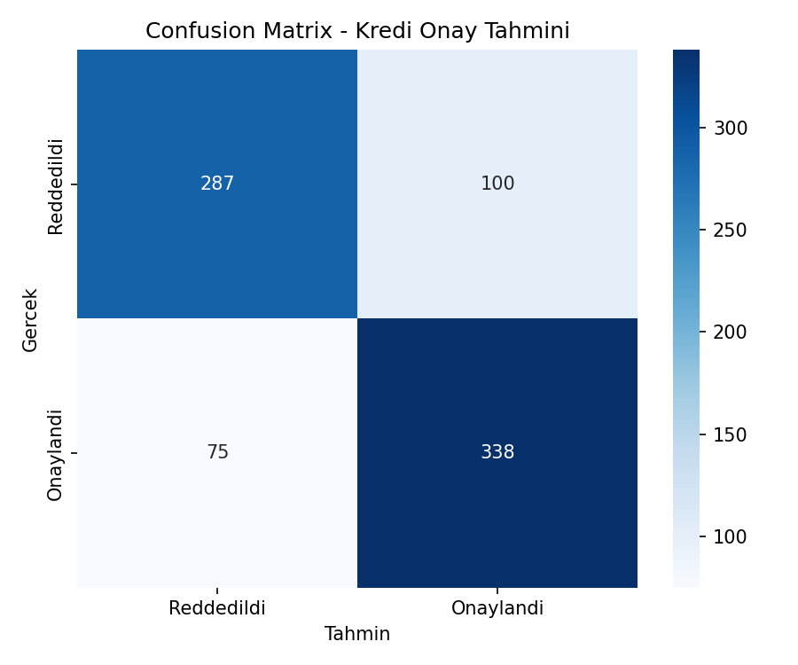
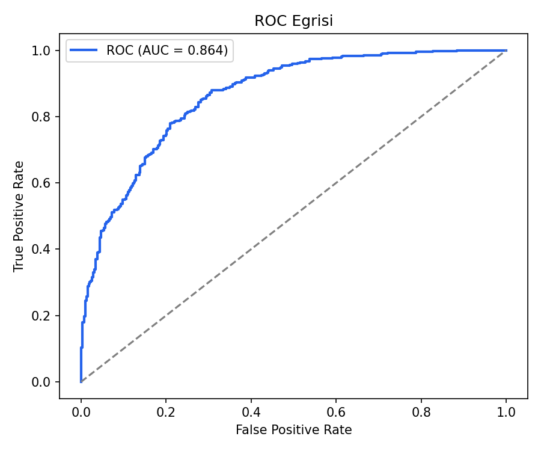
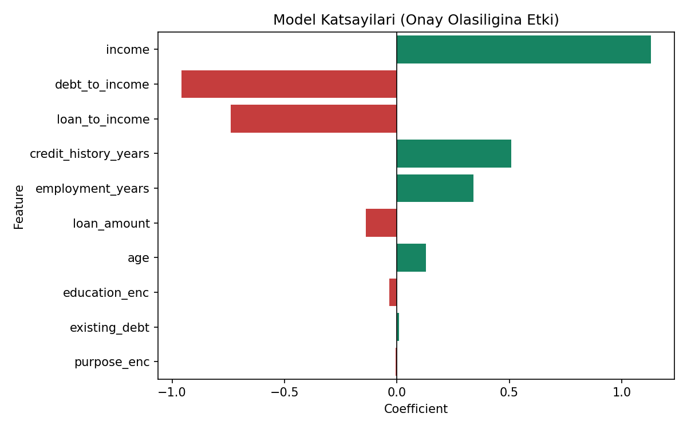

# Kredi Skorlama — Logistic Regression

## 🎯 Projenin Amacı

Bir kredi başvurusunun **onaylanıp onaylanmayacağını** tahmin etmek — ama asıl amaç bundan ibaret değil. Fintech ve bankacılık sektöründe kredi kararları düzenleyici zorunluluklar (Basel, SR 11-7 gibi) nedeniyle **açıklanabilir** olmak zorundadır: bir başvuru reddedildiğinde, bankanın "neden reddedildiğini" somut biçimde gösterebilmesi gerekir.

Bu yüzden bu projede karmaşık ama "kara kutu" olan modeller (XGBoost, sinir ağları) yerine bilinçli olarak **Logistic Regression** tercih edilmiştir — çünkü model katsayıları doğrudan yorumlanabilir: *"Borç/gelir oranı 1 birim arttığında onay olasılığı şu kadar azalıyor"* gibi net, savunulabilir açıklamalar üretilebilir.

**Kısacası:** Bu proje sadece bir tahmin modeli değil, **açıklanabilir bir karar destek sistemi** kurma pratiğidir.

---

## ⚠️ Veri Hakkında Önemli Not

Gerçek bir banka veri seti kullanılmamıştır (gizlilik/erişim kısıtları nedeniyle). Bunun yerine, gerçekçi istatistiksel ilişkiler içeren (gelir arttıkça onay olasılığı artar, borç/gelir oranı arttıkça azalır vb.) **sentetik bir veri seti** script içinde otomatik olarak üretilir. Bu, projeyi çalıştıran herkesin harici bir dosyaya ihtiyaç duymadan aynı sonuçları elde etmesini sağlar.

---

## 📊 Veri Seti (Sentetik)

4.000 kredi başvurusu, aşağıdaki değişkenlerle:

| Değişken | Açıklama |
|---|---|
| `age` | Başvuran yaşı |
| `income` | Yıllık gelir |
| `loan_amount` | Talep edilen kredi tutarı |
| `credit_history_years` | Kredi geçmişi (yıl) |
| `existing_debt` | Mevcut borç |
| `employment_years` | Çalışma süresi (yıl) |
| `education` | Eğitim seviyesi |
| `purpose` | Kredi amacı (konut/taşıt/eğitim/ihtiyaç) |
| `debt_to_income` | Borç/gelir oranı (türetilmiş) |
| `loan_to_income` | Kredi/gelir oranı (türetilmiş) |
| `approved` | Hedef değişken (0=reddedildi, 1=onaylandı) |

---

## 🚀 Çalıştırma

```bash
pip install -r requirements.txt
python credit_scoring.py
```

Çıktılar `figures/` klasörüne kaydedilir.

---

## 📈 Sonuçlar

**Model performansı:**

| Metrik | Değer |
|---|---|
| Accuracy | ~%78 |
| ROC-AUC | ~0.86 |

### Confusion Matrix


### ROC Eğrisi


### Model Katsayıları (Açıklanabilirlik)


Katsayı grafiği modelin **"neden"** bu kararı verdiğini gösterir: pozitif katsayılar onay olasılığını artıran, negatif katsayılar azaltan faktörlerdir. Bu, modelin bir "kara kutu" olmadığını, her kararın somut gerekçelerle açıklanabildiğini gösterir.

---

## 🛠️ Kullanılan Teknolojiler

`Python` · `scikit-learn` · `pandas` · `matplotlib` · `seaborn`

---

<p align="center"><i>Açıklanabilir (interpretable) makine öğrenmesi pratiği amaçlı bir portföy projesidir.</i></p>
