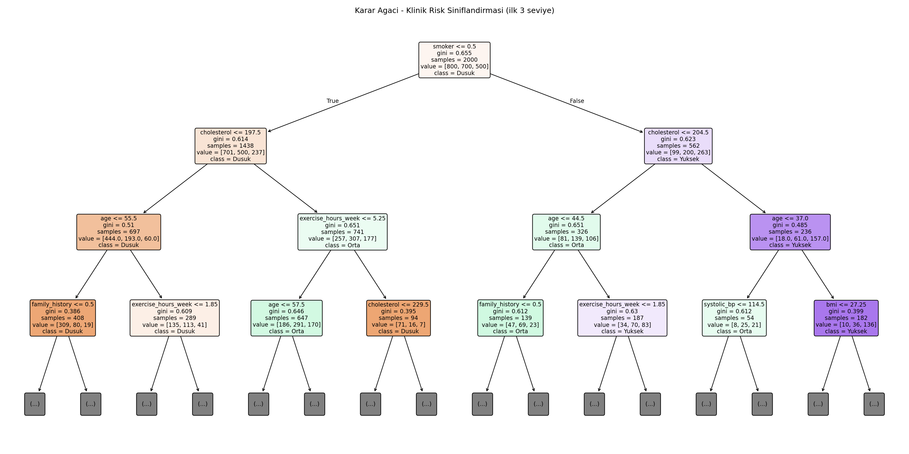
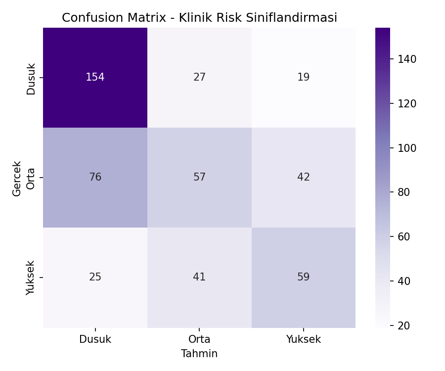
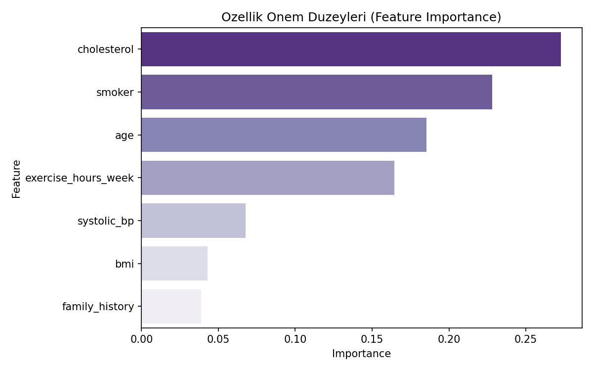

# Klinik Karar Kuralı Çıkarma — Decision Tree

## 🎯 Projenin Amacı

Bir hastanın risk seviyesini (Düşük / Orta / Yüksek) tahmin eden, ama daha da önemlisi bu tahmini **açık, takip edilebilir kurallara** dökebilen bir model kurmak.

Sağlık sektöründe hekimler "neden bu hasta yüksek riskli" sorusuna somut, if-else mantığında bir cevap ister — bir olasılık skoru değil, izlenebilir bir gerekçe. Bu yüzden bu projede bilinçli olarak Random Forest veya XGBoost yerine **tek bir Decision Tree** tercih edilmiştir. Ağaç derinliği kasıtlı olarak sınırlı tutulmuştur (max_depth=5) — amaç en yüksek doğruluğu yakalamak değil, **bir hekimin okuyup onaylayabileceği** kadar basit ve şeffaf bir karar yapısı üretmektir.

**Kısacası:** Bu proje bir "klinik karar destek sistemi" prototipidir — tahmin kadar, tahmine giden yolun izlenebilir olması da amacın parçasıdır.

## ⚠️ Veri Hakkında Önemli Not

Gerçek hasta verisi kullanılmamıştır (gizlilik ve erişim kısıtları nedeniyle). Bunun yerine, bilinen klinik risk faktörlerini (yaş, tansiyon, kolesterol, BMI, sigara kullanımı, aile öyküsü, egzersiz alışkanlığı) yansıtan **sentetik bir veri seti** script içinde otomatik üretilir.

## 📊 Veri Seti (Sentetik)

2.500 hasta kaydı:

| Değişken | Açıklama |
|---|---|
| `age` | Yaş |
| `systolic_bp` | Sistolik tansiyon |
| `cholesterol` | Kolesterol düzeyi |
| `bmi` | Vücut kitle indeksi |
| `smoker` | Sigara kullanımı (0/1) |
| `family_history` | Ailede kalp hastalığı öyküsü (0/1) |
| `exercise_hours_week` | Haftalık egzersiz süresi (saat) |
| `risk_level` | Hedef değişken (Düşük / Orta / Yüksek) |

## 🚀 Çalıştırma

```bash
pip install -r requirements.txt
python decision_tree_clinical.py
```

## 📈 Sonuçlar

| Metrik | Değer |
|---|---|
| Accuracy | ~%54 |

### Bu accuracy neden %54 ve bu mantıklı mı?

**1) Kıyas noktası %33'tür, %100 değil.** Bu 3 sınıflı bir problem (Düşük / Orta / Yüksek). Rastgele tahmin %33 doğruluk verir. %54, rastgeleden **%21 puan daha iyi** — model gerçek bir sinyal öğrenmiş, ama mükemmel değil. Bunu ikili (evet/hayır) bir sınıflandırma projesiyle karşılaştırmak yanlış olur; 3 sınıf, 2 sınıftan doğası gereği daha zordur.

**2) Bu tavan, ağaç derinliğinden değil, veri setinin kendisinden kaynaklanıyor.** Bunu doğrulamak için aynı veri üzerinde farklı ağaç derinlikleriyle test yapıldı:

| Ağaç Derinliği | Accuracy |
|---|---|
| max_depth=5 (bu projede kullanılan) | %53.4 |
| max_depth=8 | %57.4 |
| max_depth=12 | %53.6 |
| Sınırsız (tam büyümüş ağaç) | %53.0 |

Görüldüğü gibi, ağacı istediğin kadar derinleştir, sonuç **%53-57 bandında bir tavana çarpıyor** — derinlik artışı neredeyse hiçbir ek doğruluk kazandırmıyor (hatta aşırı derin ağaçlarda overfitting nedeniyle test setinde düşüş bile var).

**Bunun sebebi:** Veri üretilirken risk skoruna bilinçli olarak gerçekçi bir **gürültü (noise) terimi** eklendi (`np.random.normal(0, 1.8, n)`) — gerçek klinik verilerde de yaş/tansiyon/kolesterol gibi faktörler riski tam belirlemez, açıklanamayan bireysel varyasyon her zaman vardır. Bu proje o gerçekliği taklit ediyor.

**Sonuç olarak — asıl mesaj bu projenin lehine:** Ağaç derinliğini yorumlanabilirlik için 5'te sınırlamanın **bedeli neredeyse sıfır** (en fazla %3-4 puan potansiyel kayıp, o da overfitting nedeniyle bazı derinliklerde zaten yok). Yani "açıklanabilir mi, doğru mu" ikilemi bu veri setinde aslında pek var olmuyor — sınırlı ağaç, sınırsız ağaçla neredeyse aynı performansı veriyor ama çok daha okunabilir bir kural seti sunuyor. Bu, projenin savunduğu "yorumlanabilirlikten performans feda etmeden ödün verme" argümanını doğrudan destekleyen bir bulgudur.

### Karar Ağacı Görselleştirmesi


### Confusion Matrix


### Özellik Önem Düzeyleri


### Çıkarılan Karar Kuralları
Ağacın tam metin hâli `figures/decision_rules.txt` dosyasında — bir hekimin veya klinik ekibin doğrudan okuyup değerlendirebileceği formatta (`if-else` mantığında).

## 🛠️ Kullanılan Teknolojiler

`Python` · `scikit-learn` · `pandas` · `matplotlib` · `seaborn`

<p align="center"><i>Yorumlanabilir (interpretable) makine öğrenmesi pratiği amaçlı bir portföy projesidir.</i></p>
