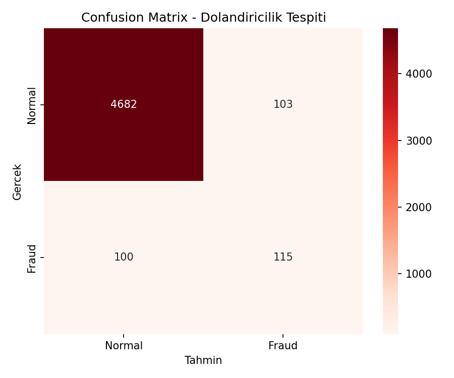
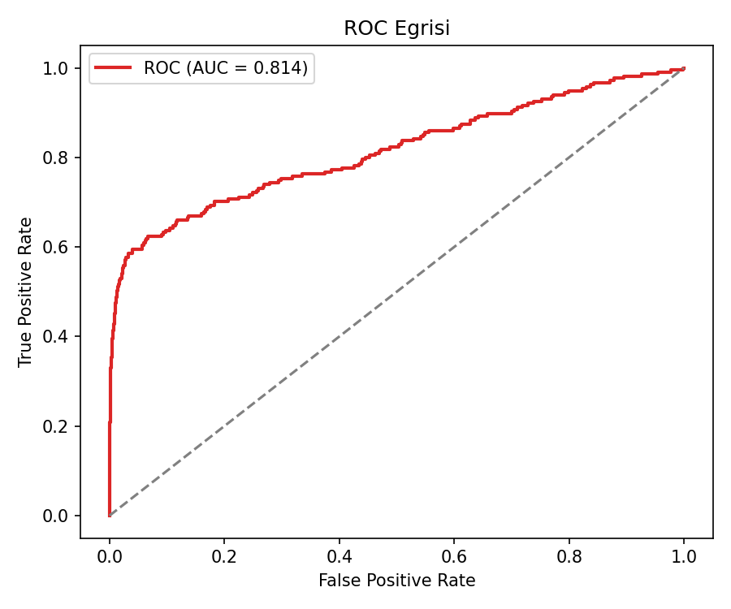
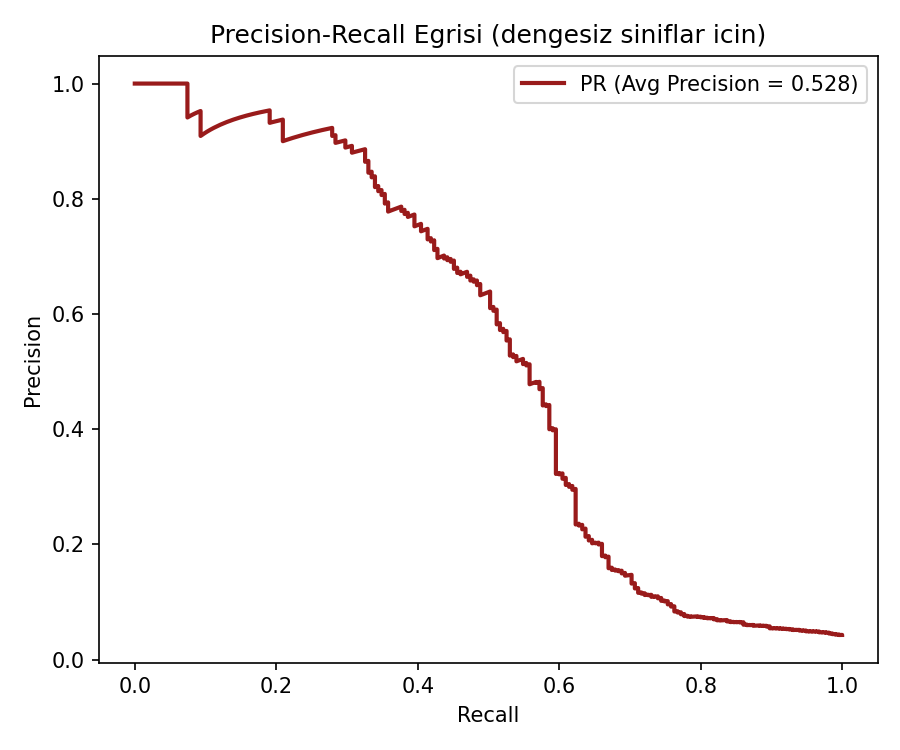
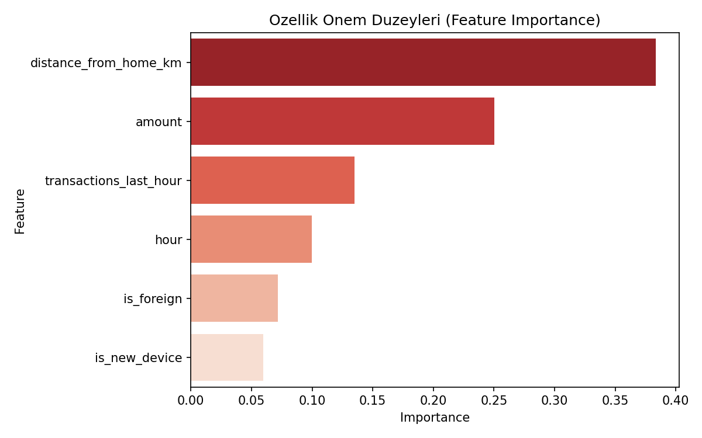

# Kredi Kartı Dolandırıcılık Tespiti — Random Forest

## 🎯 Projenin Amacı

Bir kredi kartı işleminin **sahte (fraud) olma olasılığını** tahmin etmek.

Random Forest bu alanda bilinçli olarak tercih edilmiştir çünkü: (1) XGBoost/LightGBM kadar hassas hiperparametre ayarı gerektirmeden yüksek doğruluk verir — bu da production ortamına hızlı devreye alınmasını kolaylaştırır, (2) overfitting'e karşı tek bir karar ağacından çok daha dayanıklıdır, (3) feature importance çıktısı risk ekiplerine "hangi davranış şüpheli" diye doğrudan aktarılabilir. Gerçek ödeme sistemlerinde (Visa, Mastercard, PayPal gibi) Random Forest hâlâ "hızlı ilk katman filtre" olarak yaygın kullanılır.

**Kısacası:** Bu proje, hızlı devreye alınabilir ve yorumlanabilir bir ilk-katman dolandırıcılık filtresi kurma pratiğidir.

## ⚠️ Veri Hakkında Önemli Not

Gerçek bir banka/ödeme verisi kullanılmamıştır (gizlilik ve erişim kısıtları nedeniyle). Bunun yerine, bilinen dolandırıcılık örüntülerini (yüksek tutar, gece saati, yeni cihaz, yurtdışı işlem, evden uzaklık, kısa sürede çok işlem) yansıtan **sentetik bir veri seti** üretilir. Gerçek dolandırıcılık verilerinde olduğu gibi:
- **Sınıflar dengesizdir** (fraud oranı ~%4 — gerçek hayatta genelde %1-5 aralığındadır)
- **Örüntüler kesin değil, olasılıksaldır** — modele kasıtlı olarak bir miktar etiket gürültüsü (label noise) eklenmiştir, çünkü gerçek hayatta hiçbir dolandırıcılık göstergesi %100 kesin değildir

---

## 📊 Veri Seti (Sentetik)

20.000 işlem kaydı:

| Değişken | Açıklama |
|---|---|
| `amount` | İşlem tutarı |
| `hour` | İşlem saati (0-23) |
| `is_new_device` | Daha önce görülmemiş cihazdan mı (0/1) |
| `is_foreign` | Yurtdışı işlem mi (0/1) |
| `distance_from_home_km` | Kayıtlı adresten uzaklık (km) |
| `transactions_last_hour` | Son 1 saatteki işlem sayısı |
| `is_fraud` | Hedef değişken (0=normal, 1=dolandırıcılık) |

---

## 🚀 Çalıştırma

```bash
pip install -r requirements.txt
python fraud_detection_rf.py
```

---

## 📈 Sonuçlar

| Metrik | Değer | Neden bu metrik önemli |
|---|---|---|
| Accuracy | %95.9 | Dengesiz sınıflarda **tek başına yanıltıcı** — %96 normal işlem olduğu için "hep normal de" bile %96 accuracy verir |
| ROC-AUC | 0.81 | Modelin genel ayırt etme gücü |
| PR-AUC (Average Precision) | 0.53 | Dengesiz sınıflarda ROC'tan **daha güvenilir** metrik |
| Fraud sınıfı Precision/Recall | %53 / %53 | Gerçek zorluk seviyesi — kaçırılan ve yanlış alarm sayısı dengeli |

**Neden accuracy yerine PR-AUC'a bakılmalı:** Bu projede sınıflar dengesiz (fraud ~%4). Böyle durumlarda yüksek accuracy yanıltıcıdır — modelin "hiç fraud yok" desin bile accuracy zaten yüksek çıkar. Bu yüzden dolandırıcılık tespiti gibi dengesiz problemlerde gerçek sektör pratiği, **Precision-Recall eğrisine ve PR-AUC'a** bakmaktır — bu proje de bunu bilinçli olarak öne çıkarır.

### Confusion Matrix


### ROC Eğrisi


### Precision-Recall Eğrisi (dengesiz sınıflar için asıl bakılması gereken grafik)


### Özellik Önem Düzeyleri


---

## 🛠️ Kullanılan Teknolojiler

`Python` · `scikit-learn` · `pandas` · `matplotlib` · `seaborn`

---

<p align="center"><i>Dengesiz sınıflandırma ve risk analitiği pratiği amaçlı bir portföy projesidir.</i></p>
