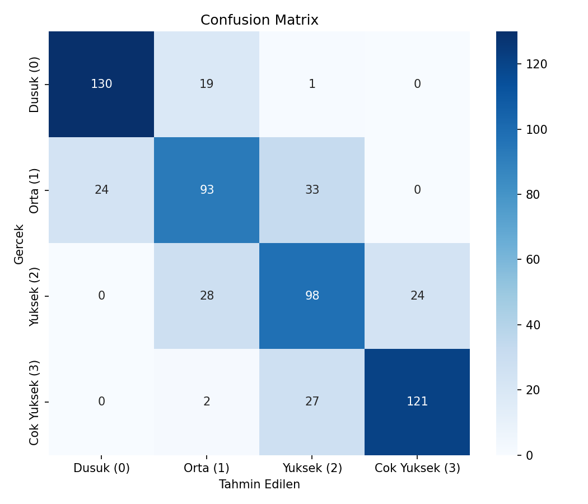
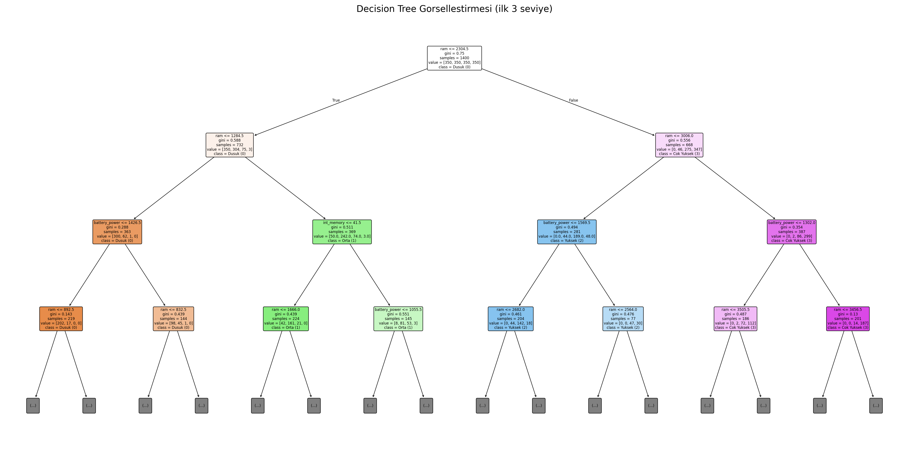
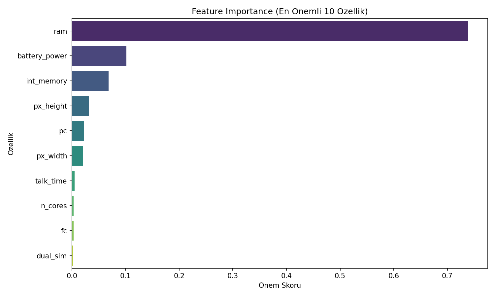
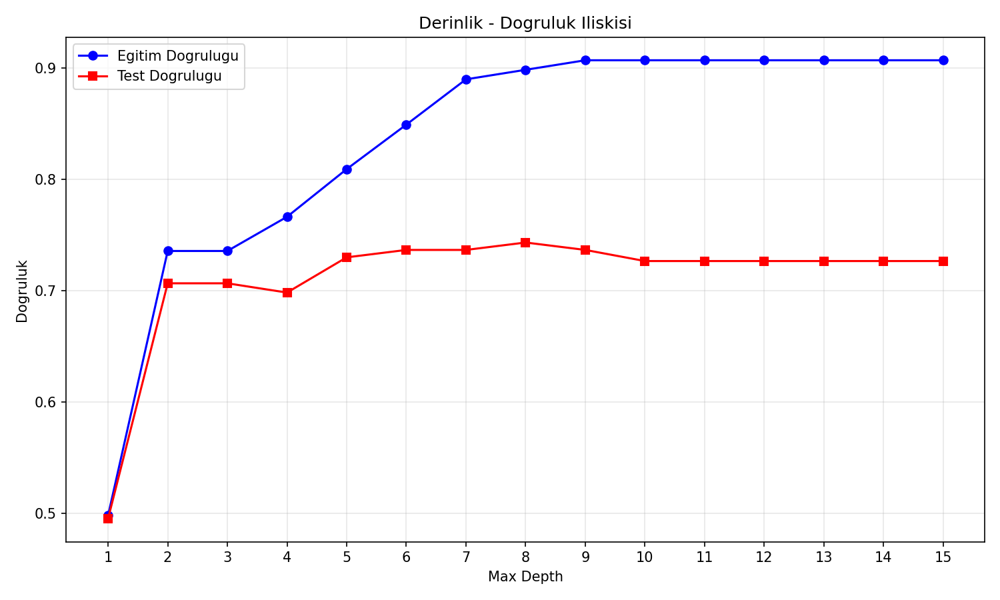

# Mobil Cihaz Fiyat Sınıflandırması — Decision Tree

## 🎯 Projenin Amacı

Mobil cihazların teknik donanım özelliklerine (RAM, batarya, kamera, ekran çözünürlüğü, dahili hafıza vb.) bakarak hangi fiyat segmentinde (**Düşük, Orta, Yüksek, Çok Yüksek**) yer alacağını tahmin etmek.

Decision Tree bilinçli olarak tercih edilmiştir çünkü sonucu **"hangi özellik hangi eşik değerine göre karar verildiğini"** açıkça gösterir — örneğin "RAM ≤ 1500 ise ve batarya ≤ 1200 ise Düşük segment" gibi somut, takip edilebilir kurallar üretir. Bu, bir e-ticaret/perakende ekibinin fiyatlandırma mantığını doğrulamak için kullanabileceği türde bir çıktıdır.

## ⚠️ Veri Hakkında Önemli Not

Orijinal not defteri Kaggle'ın ünlü **"Mobile Price Classification"** veri setini (`train.csv`, 2.000 telefon, 20 özellik) kullanıyordu. Bu dosya bu ortamda bulunmadığı için, aynı kolon yapısını ve gerçekçi özellik-fiyat ilişkilerini (yüksek RAM/batarya/kamera → yüksek fiyat) yansıtan **sentetik bir veri seti** üretilir. Üretim mantığı, gerçek veri setinde de bilinen "RAM'in fiyatı en çok etkileyen özellik olması" örüntüsünü bilinçli olarak yansıtır.

## 📊 Veri Seti (Sentetik, 20 özellik)

| Değişken | Açıklama |
|---|---|
| `battery_power` | Batarya kapasitesi (mAh) |
| `ram` | RAM (MB) |
| `int_memory` | Dahili hafıza (GB) |
| `px_height`, `px_width` | Ekran çözünürlüğü |
| `pc`, `fc` | Arka/ön kamera megapiksel |
| `n_cores` | İşlemci çekirdek sayısı |
| `mobile_wt` | Cihaz ağırlığı |
| `talk_time` | Konuşma süresi (saat) |
| `blue`, `wifi`, `three_g`, `four_g`, `dual_sim`, `touch_screen` | İkili (0/1) özellikler |
| `price_range` | Hedef değişken (0=Düşük, 1=Orta, 2=Yüksek, 3=Çok Yüksek) |

## 🚀 Çalıştırma

```bash
pip install -r requirements.txt
python mobile_price_decision_tree.py
```

## 📈 Sonuçlar

| Metrik | Değer |
|---|---|
| Test Accuracy | %73.67 |
| Eğitim Accuracy | %84.93 |

**Overfitting kontrolü:** Eğitim-test farkı %11.3 — hafif bir overfitting sinyali var (script bunu otomatik tespit edip uyarı basıyor). Derinlik-doğruluk grafiği bu dengeyi görselleştiriyor.

### Confusion Matrix


Model en çok **Orta** ve **Yüksek** sınıflarını birbirine karıştırıyor (beklenen bir durum — bu iki segment arasındaki donanım farkı, Düşük/Çok Yüksek uçlarına göre daha az belirgin).

### Karar Ağacı Görselleştirmesi


### Özellik Önem Sıralaması


`ram` tek başına önem skorunun **%74'ünü** taşıyor — gerçek "Mobile Price Classification" veri setinde de RAM'in en baskın değişken olduğu bilinir, bu tutarlılık kasıtlı olarak korunmuştur.

### Derinlik - Doğruluk İlişkisi


Test doğruluğu derinlik 8'de zirve yapıyor (%74.3), sonrasında ezberleme (overfitting) nedeniyle test performansı iyileşmiyor.

### Çıkarılan Karar Kuralları
Ağacın tam metin hâli `figures/decision_rules.txt` dosyasında.

## 🛠️ Kullanılan Teknolojiler

`Python` · `scikit-learn` · `pandas` · `matplotlib` · `seaborn`

<p align="center"><i>Yorumlanabilir sınıflandırma ve model derinliği analizi pratiği amaçlı bir portföy projesidir.</i></p>
