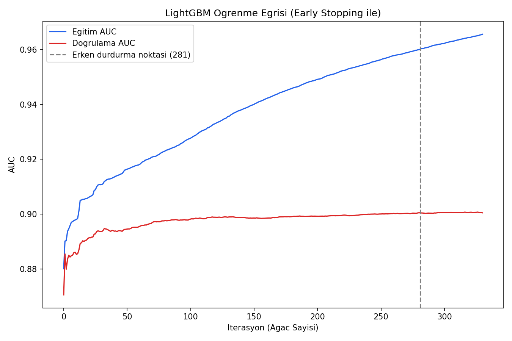
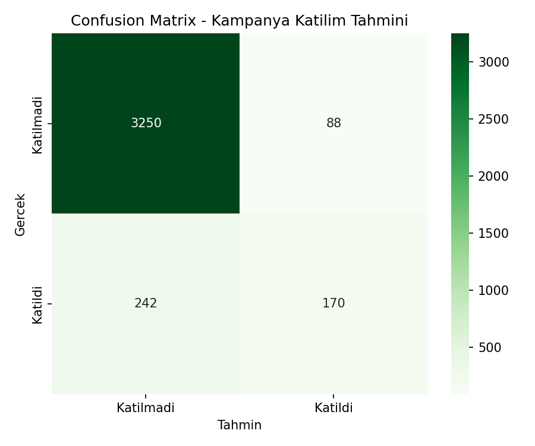
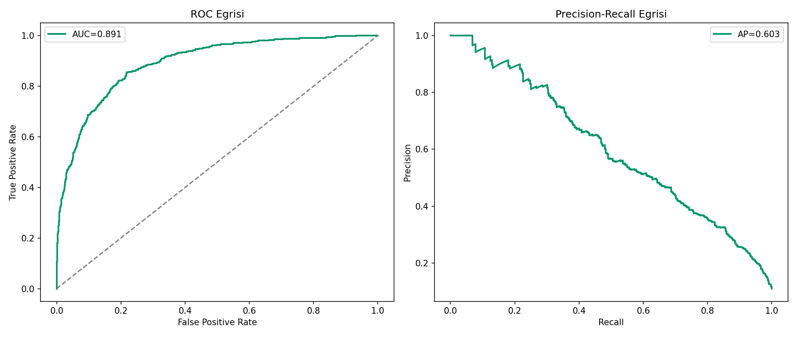
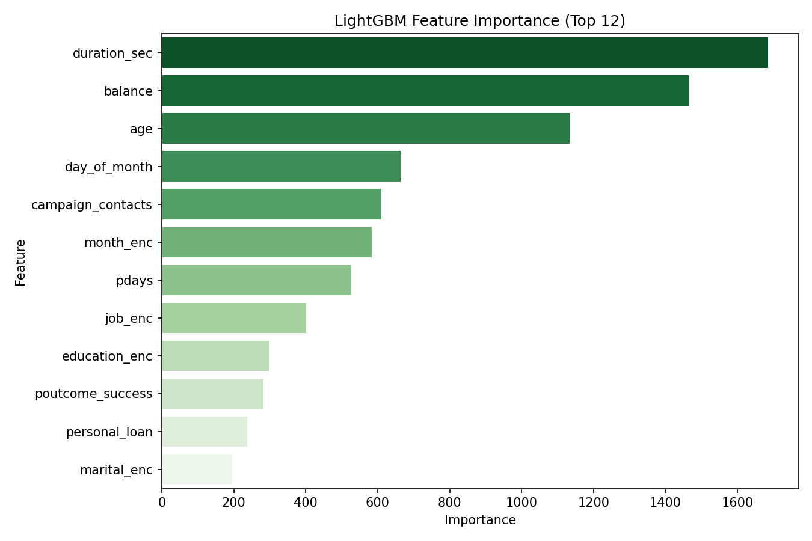

# Banka Kampanyası Katılım Tahmini — LightGBM

## 🎯 Projenin Amacı

Bir bankanın telefonla yürüttüğü vadeli mevduat kampanyasında, bir müşterinin **kampanyaya katılıp katılmayacağını** yüksek doğrulukla tahmin etmek. Bu problem, **UCI Bank Marketing** veri setine dayanan, veri bilimi camiasında yaygın bilinen, rekabetçi bir kıyaslama (benchmark) problemidir.

Önceki projelerden farklı olarak bu proje **iki kütüphaneyi kıyaslamıyor** — LightGBM'i **tek başına, doğruluğu maksimize etmeye odaklı** kullanır: `early stopping` ile aşırı öğrenmeyi otomatik durdurma, öğrenme eğrisi takibi, ve düzenlileştirme (`reg_alpha`, `reg_lambda`) gibi gerçek rekabetçi ML pratiklerini gösterir.

## ⚠️ Veri Hakkında Önemli Not

Gerçek UCI Bank Marketing veri seti bu ortamda bulunmadığı için, aynı kolon yapısını ve gerçekçi kampanya davranış örüntülerini (uzun görüşme süresi + önceki başarılı kampanya + uygun yaş aralığı → yüksek katılım olasılığı) yansıtan **sentetik bir veri seti** üretilir. Gerçek veri setinde olduğu gibi sınıflar dengesizdir — katılım oranı %11 (gerçek dünyada telefon kampanyalarında katılım oranı tipik olarak %10-15 aralığındadır).

## 📊 Veri Seti (Sentetik)

25.000 müşteri kaydı, 15 özellik: yaş, meslek, medeni durum, eğitim, bakiye, konut/bireysel kredi durumu, iletişim türü, görüşme tarihi/ayı, **görüşme süresi**, kampanya sırasında kaç kez arandığı, önceki kampanyadan bu yana geçen gün sayısı, önceki temas sayısı, önceki kampanya başarı durumu → hedef: `subscribed` (0/1).

## 🚀 Çalıştırma

```bash
pip install -r requirements.txt
python bank_campaign_lightgbm.py
```

## 📈 Sonuçlar

| Metrik | Değer |
|---|---|
| Test Accuracy | **%91.20** |
| Test ROC-AUC | **0.8914** |
| Test PR-AUC | 0.6032 |
| Erken durdurma noktası | 281. iterasyon (1000 üst sınırından otomatik seçildi) |

**Neden PR-AUC de raporlanıyor, sadece Accuracy değil:** Sınıflar dengesiz (katılım oranı %11) olduğu için yüksek accuracy tek başına yanıltıcı olabilir — model "hep katılmadı" dese bile %89 accuracy alır. PR-AUC (0.60), gerçek sınıflandırma zorluğunu çok daha dürüst yansıtıyor.

### Öğrenme Eğrisi (Early Stopping)


Eğitim AUC'si sürekli artarken doğrulama AUC'si belirli bir noktadan sonra platoya giriyor — early stopping mekanizması bu noktayı (281. iterasyon) otomatik tespit edip modeli orada durduruyor, gereksiz ezberlemeyi (overfitting) engelliyor.

### Confusion Matrix


### ROC ve Precision-Recall Eğrileri


### Feature Importance


En belirleyici 3 özellik: **görüşme süresi** (`duration_sec`), **bakiye** (`balance`) ve **yaş** (`age`) — bu, gerçek Bank Marketing literatüründe de bilinen bir bulguyla örtüşüyor: uzun süren görüşmeler genelde daha ilgili/olası müşterilerle yapılıyor.

## 🛠️ Kullanılan Teknolojiler

`Python` · `LightGBM` · `scikit-learn` · `pandas` · `matplotlib` · `seaborn`

<p align="center"><i>Yüksek doğruluk odaklı, rekabetçi tabular ML pratiği amaçlı bir portföy projesidir.</i></p>
