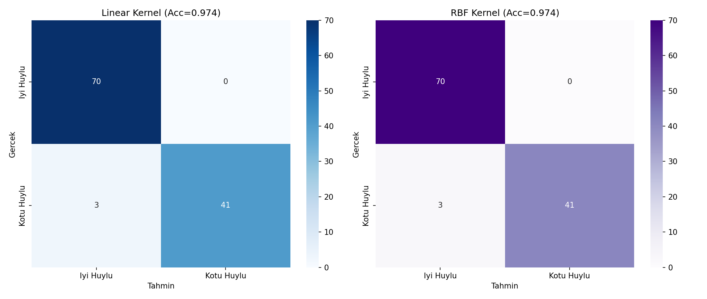
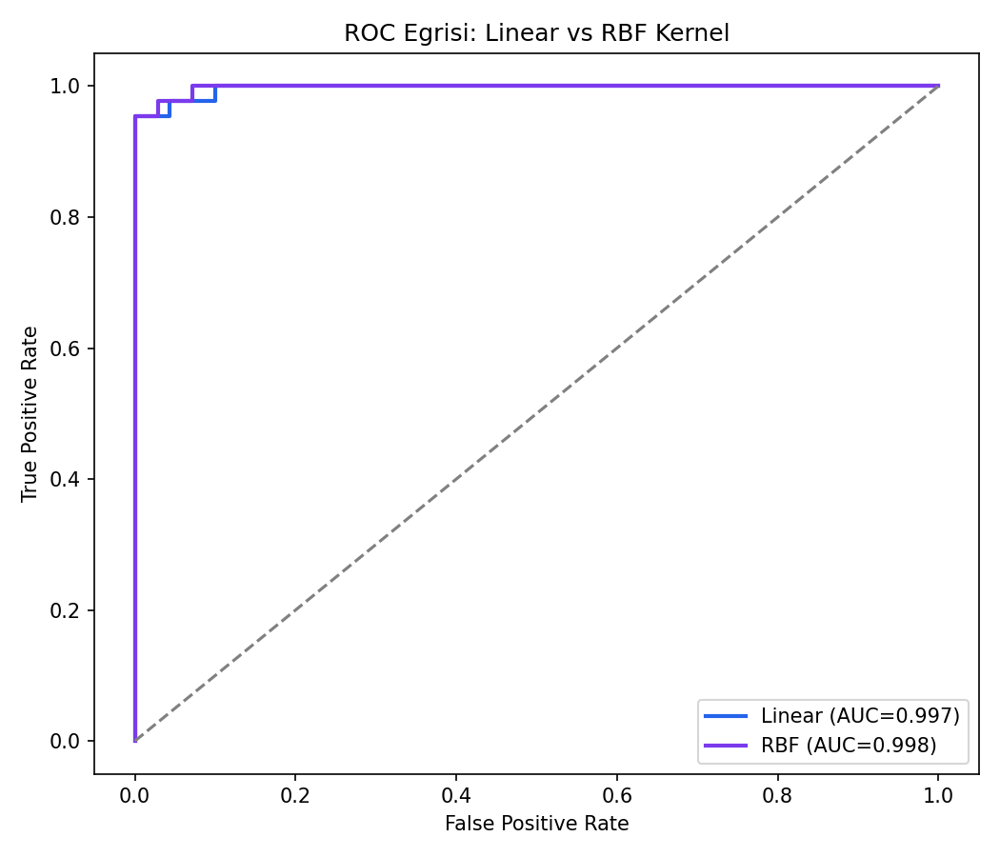
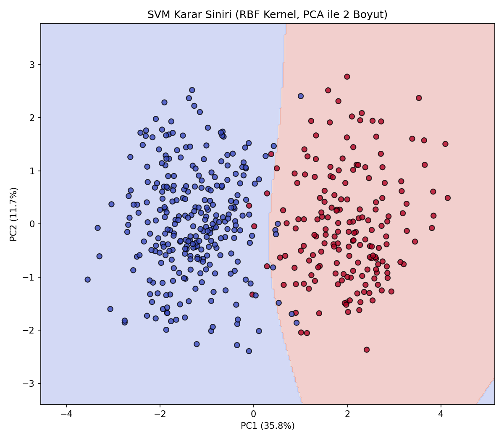

# Tümör Teşhisi — Support Vector Machine (SVM)

## 🎯 Projenin Amacı

Hücre görüntüsü ölçümlerinden (yarıçap, doku, çevre, alan, pürüzsüzlük, konkavlık vb.) bir tümörün **iyi huylu (Benign)** mu yoksa **kötü huylu (Malignant)** mu olduğunu sınıflandırmak.

SVM bilinçli olarak tercih edilmiştir çünkü yüksek boyutlu ve nispeten net ayrılabilir veride güçlü bir sınıflandırıcıdır — bu tür tıbbi teşhis problemleri (Wisconsin Breast Cancer veri seti üzerinden) literatürde SVM'in klasik başarı alanlarından biridir. Bu proje ayrıca **Linear** ve **RBF (doğrusal olmayan)** kernel'leri kıyaslayarak "karar sınırı düz bir çizgi mi, yoksa daha karmaşık bir eğri mi olmalı" sorusuna veriyle cevap arar.

## 🏢 İş/Sektör Bağlamı: Bu Model Gerçekte Nerede Kullanılır?

Bu tür modeller, **klinik karar destek sistemlerinin** (Clinical Decision Support Systems - CDSS) bir bileşeni olarak konumlandırılır — asla tek başına "teşhis koyan" bir sistem olarak değil, **radyologun/patoloğun ön değerlendirmesini hızlandıran ikinci bir göz** olarak kullanılır. Gerçek dünyadaki kullanım akışı şöyledir:

1. **Biyopsi/görüntüleme verisi** dijital ortama aktarılır, hücre ölçümleri (yarıçap, doku düzensizliği vb.) otomatik veya yarı-otomatik olarak çıkarılır.
2. Model bu ölçümlere bakarak bir **ön risk skoru** üretir — "kötü huylu olma olasılığı yüksek/düşük".
3. **Yüksek riskli olarak işaretlenen vakalar önceliklendirilir** — patoloğun inceleme sırası bu skora göre ayarlanabilir, kritik vakaların gözden kaçma riski azalır.
4. Nihai teşhis her zaman bir **uzman hekim tarafından** konur; model yalnızca triyaj ve önceliklendirme katmanında görev alır.

Bu, sağlık sektöründe "AI, doktorun yerini almaz, doktorun iş yükünü ve hata riskini azaltır" prensibinin somut bir örneğidir — FDA onaylı birçok görüntü tabanlı teşhis destek sistemi de benzer bir triyaj mantığıyla çalışır.

## ⚠️ Veri Hakkında Önemli Not

Gerçek **Wisconsin Breast Cancer Diagnostic** veri seti bu ortamda bulunmadığı için, aynı kolon yapısını ve gerçekçi hücre ölçüm ilişkilerini (büyük yarıçap + düzensiz şekil → kötü huylu olma olasılığı yüksek) yansıtan **sentetik bir veri seti** üretilir. Veri seti boyutu (569 kayıt) ve sınıf dağılımı gerçek veri setiyle aynı tutulmuştur.

## 📊 Veri Seti (Sentetik, 569 kayıt)

9 hücre ölçüm özelliği: `radius_mean`, `texture_mean`, `perimeter_mean`, `area_mean`, `smoothness_mean`, `compactness_mean`, `concavity_mean`, `symmetry_mean`, `fractal_dimension_mean` → hedef: `diagnosis` (B=İyi huylu, M=Kötü huylu).

## 🚀 Çalıştırma

```bash
pip install -r requirements.txt
python svm_tumor_diagnosis.py
```

## 📈 Sonuçlar ve Derinlemesine Yorum

| Kernel | Accuracy | ROC-AUC |
|---|---|---|
| **Linear** | **%97.37** | 0.9968 |
| RBF (doğrusal olmayan) | %97.37 | 0.9977 |

### Linear ve RBF neden bu kadar yakın çıktı — ve bu klinik açıdan ne anlama gelir?

İki kernel'in neredeyse birebir aynı performansı vermesi, verinin **doğrusal olarak büyük ölçüde ayrılabilir** olduğunu gösteriyor — yani kötü huylu ve iyi huylu hücrelerin ölçüm profilleri arasındaki fark, karmaşık/eğrisel bir sınıra ihtiyaç duymayacak kadar net. Bu bulgunun **pratik bir sonucu** var: Bir sağlık kuruluşu bu modeli üretime alırken, RBF gibi hesaplama açısından daha maliyetli bir kernel yerine **Linear kernel'i tercih edebilir** — çünkü ekstra karmaşıklık, ölçülebilir bir doğruluk kazancı getirmiyor. Sağlık sistemlerinde model açıklanabilirliği de bir gereklilik olduğu için (bir hekime "neden bu tahmin yapıldı" sorusuna cevap verilebilmesi gerekir), Linear kernel'in katsayı bazlı yorumlanabilirliği ekstra bir avantaj sağlar.

### Confusion Matrix'te Dikkat Edilmesi Gereken Nokta

Confusion matrix'e bakıldığında, modelin yaptığı 3 hata da **gerçek kötü huylu vakaları "iyi huylu" olarak** işaretlemiş (False Negative) — hiçbir iyi huylu vaka yanlışlıkla "kötü huylu" işaretlenmemiş. Tıbbi teşhiste bu **istenmeyen türde bir hata**dır: bir False Negative (kaçırılan kötü huylu vaka), bir False Positive'ten (gereksiz ek tetkik) çok daha ciddi sonuçlar doğurabilir. Gerçek bir üretim sisteminde bu, modelin karar eşiğinin (decision threshold) **Recall'ü önceliklendirecek şekilde** kaydırılması gerektiği anlamına gelir — varsayılan %50 eşiği yerine, "şüpheliyse ek tetkik iste" mantığıyla daha düşük bir eşik kullanılır.

### Confusion Matrix Kıyaslaması (Linear vs RBF)


### ROC Eğrisi Kıyaslaması


### Karar Sınırı Görselleştirmesi (PCA ile 2 Boyut)


9 boyutlu özellik uzayı PCA ile 2 boyuta indirgenip RBF kernel'in çizdiği karar sınırı görselleştirilmiştir — kırmızı/mavi bölgeler modelin "kötü huylu" ve "iyi huylu" olarak ayırdığı alanları gösterir. İki bölge arasındaki sınırın nispeten düz olması, Linear/RBF performans benzerliğini görsel olarak da doğruluyor.

## 🛠️ Kullanılan Teknolojiler

`Python` · `scikit-learn` · `pandas` · `matplotlib` · `seaborn`

<p align="center"><i>Tıbbi teşhis sınıflandırması, kernel yöntemleri ve klinik karar destek sistemleri pratiği amaçlı bir portföy projesidir.</i></p>
