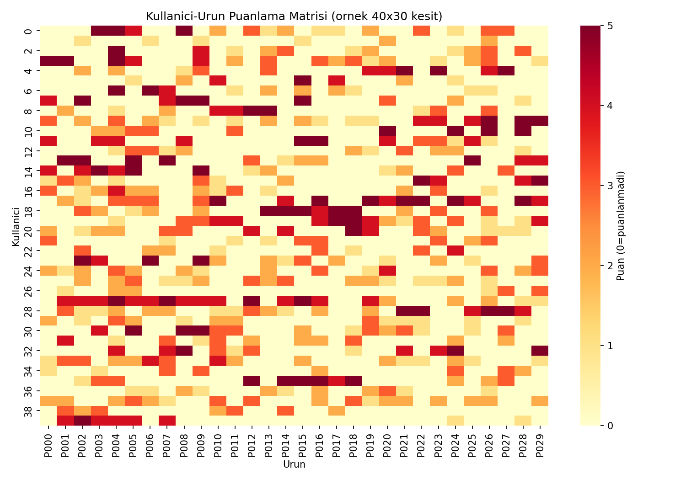
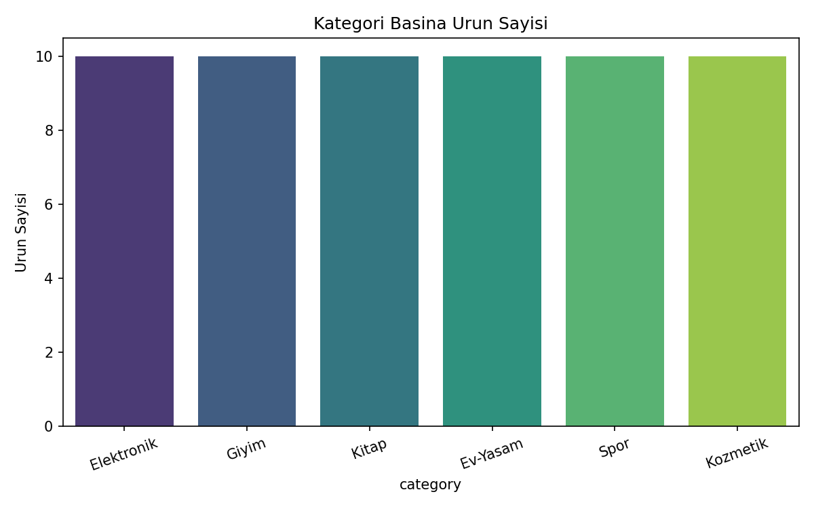
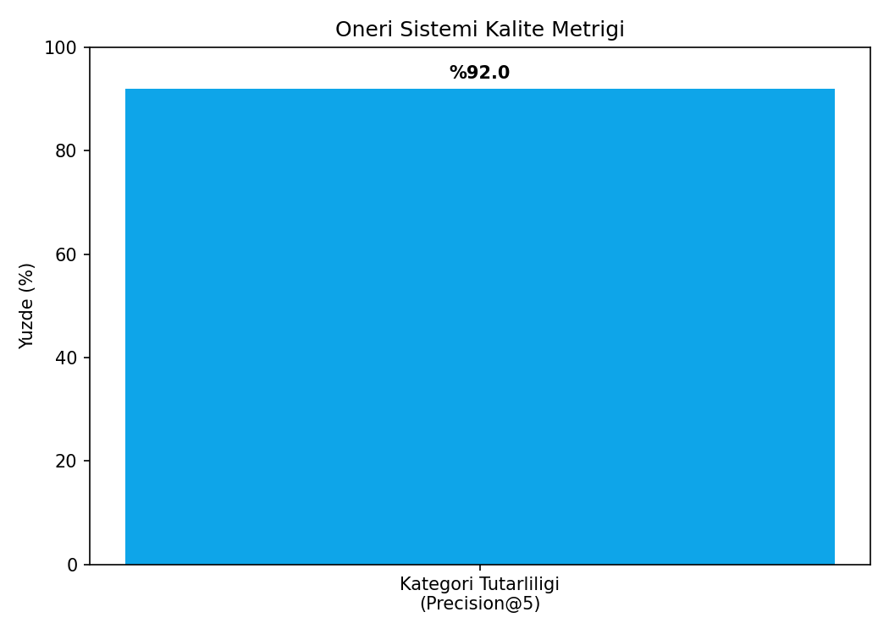

# Ürün Öneri Sistemi — K-Nearest Neighbors (Item-Based Collaborative Filtering)

## 🎯 Projenin Amacı

**"Bu ürünü beğenen kullanıcılar, şunları da beğendi"** mantığıyla çalışan bir öneri sistemi kurmak. Bu proje, Amazon/Netflix/Spotify tarzı "bunu alanlar şunu da aldı" veya "senin için önerilenler" bölümlerinin temelini oluşturan **item-based collaborative filtering** yöntemini KNN ile uygular.

Mantık: Ürünler arasındaki benzerlik, ürünlerin **içeriğinden değil kullanıcı davranışından** öğrenilir — iki ürüne benzer kullanıcılar benzer puanlar veriyorsa, bu iki ürün "benzer" kabul edilir. Model hiçbir zaman ürünlerin kategori bilgisini görmez; sadece puanlama davranışından öğrenir.

## 🏢 İş Bağlamı: Öneri Sistemleri Neden Bu Kadar Kritik?

Öneri sistemleri, dijital ekonominin görünmeyen ama en gelir-etkili bileşenlerinden biridir:

- **Amazon**, satışlarının önemli bir kısmının öneri motorundan geldiğini kamuya açık raporlarında belirtmiştir.
- **Netflix**, izlenen içeriğin büyük bölümünün öneri sisteminin yönlendirmesiyle keşfedildiğini rapor eder — bu da "içerik terk etme" (churn) oranını doğrudan azaltır.
- **Spotify**'ın "Discover Weekly" gibi özellikleri, kullanıcı bağlılığını artıran ana ürün farklılaştırıcılarından biridir.

Bu projede uygulanan **item-based collaborative filtering**, gerçek dünyada şu senaryolarda tercih edilir:

1. **Soğuk başlangıç (cold start) toleransı:** Yeni bir kullanıcı geldiğinde bile (kullanıcı geçmişi az olsa da), az sayıda etkileşimden yola çıkarak öneri üretilebilir — çünkü sistem "ürünler arası" benzerliği önceden hesaplamıştır, her kullanıcı için sıfırdan hesap yapmaz.
2. **Ölçeklenebilirlik:** Ürün sayısı kullanıcı sayısından çok daha yavaş değiştiği için (yeni ürün eklemek, yeni kullanıcı kazanmaktan daha nadir), item-item benzerlik matrisi daha az sıklıkla yeniden hesaplanır — bu da production maliyetini düşürür.
3. **Yorumlanabilirlik:** "Bu ürünü, X ürününü beğendiğin için önerdik" gibi bir açıklama kullanıcıya doğrudan sunulabilir — bu, kara kutu bir derin öğrenme öneri sisteminden daha şeffaftır.

## ⚠️ Veri Hakkında Önemli Not

Gerçek bir e-ticaret kullanıcı-ürün etkileşim verisi bu ortamda bulunmadığı için, gerçekçi kullanıcı tercih örüntülerini (her kullanıcının 1-2 favori kategorisi olması, favori kategorilere yüksek puan, diğerlerine düşük puan verilmesi) yansıtan **sentetik bir kullanıcı-ürün puanlama matrisi** üretilir.

## 📊 Veri Seti (Sentetik)

- 700 kullanıcı, 60 ürün, 6 kategori (Elektronik, Giyim, Kitap, Ev-Yaşam, Spor, Kozmetik)
- Her kullanıcının 15-35 arası ürün puanladığı (1-5 puan) bir etkileşim matrisi
- Her kullanıcının rastgele 1-2 favori kategorisi var; favori kategorideki ürünlere ortalama 4.6, diğerlerine ortalama 2.0 puan veriyor

## 🚀 Çalıştırma

```bash
pip install -r requirements.txt
python knn_recommender.py
```

## 📈 Sonuçlar ve Derinlemesine Yorum

| Metrik | Değer | Ne anlama geliyor |
|---|---|---|
| **Kategori Tutarlılığı (Precision@5)** | **%92.0** | Model, bir ürüne en benzer 5 ürünü önerdiğinde, bunların %92'si gerçekten aynı kategoriden çıkıyor |
| Puan Tahmini MAE (Kullanıcı bazlı KNN) | 1.02 (1-5 ölçeğinde) | Sistem, bir kullanıcının bir ürüne vereceği puanı ortalama ±1 puan sapmayla tahmin edebiliyor |

### %92 Kategori Tutarlılığı Neden Önemli — Kör Test Mantığı

Bu proje aslında bir **kör test (blind test)** kurgusu içeriyor: model, ürünlerin hangi kategoriye ait olduğunu hiçbir zaman görmedi — sadece "kim neyi kaç puan verdi" bilgisini gördü. Buna rağmen, en benzer bulduğu ürünlerin %92'si gerçekten aynı kategoriden çıktı. Bu, collaborative filtering'in temel iddiasını doğruluyor: **davranışsal veri, içerik verisi olmadan bile anlamlı yapıyı yakalayabilir.** İş açısından bu şu demek: bir e-ticaret şirketi, ürün açıklamalarını/etiketlerini detaylı biçimde kategorize etmemiş olsa bile (ki gerçek kataloglarda bu sıkça eksiktir), sadece kullanıcı davranışından iyi bir öneri sistemi kurabilir.

### Puan Tahmini Hatası (MAE 1.02) Ne Anlama Geliyor?

1-5 ölçeğinde ortalama ±1 puanlık bir hata, üretim standartlarına göre **orta seviye bir performans** — gerçek büyük ölçekli sistemler (Netflix Prize yarışmasındaki kazanan çözümler gibi) MAE'yi 0.7 civarına kadar indirebiliyor, ama bunlar matrix factorization gibi çok daha karmaşık yöntemler ve çok daha büyük veriyle çalışıyor. Bu projedeki basit KNN yaklaşımı için 1.02 **makul bir başlangıç noktası** — gerçek bir üretim sistemine geçişte, bu skorun matrix factorization (SVD) veya derin öğrenme tabanlı yöntemlerle iyileştirilmesi beklenir. Bu proje bilinçli olarak "basit ama yorumlanabilir" bir baseline sunuyor.

### Kullanıcı-Ürün Puanlama Matrisi (Örnek Kesit)


Matrisin büyük ölçüde boş (açık renk) olması tesadüf değil — gerçek e-ticaret verilerinde de kullanıcılar ürünlerin sadece küçük bir yüzdesini puanlar, bu "seyreklik" (sparsity) problemi collaborative filtering'in çözmesi gereken temel zorluktur.

### Kategori Dağılımı


### Öneri Sistemi Kalite Metriği


### Örnek Öneri Çıktısı
`figures/example_recommendations_P000.csv` — P000 ürününe en benzer 5 ürün ve benzerlik skorları.

## 🛠️ Kullanılan Teknolojiler

`Python` · `scikit-learn` · `pandas` · `matplotlib` · `seaborn`

<p align="center"><i>Öneri sistemleri (recommender systems) ve collaborative filtering pratiği amaçlı bir portföy projesidir.</i></p>
