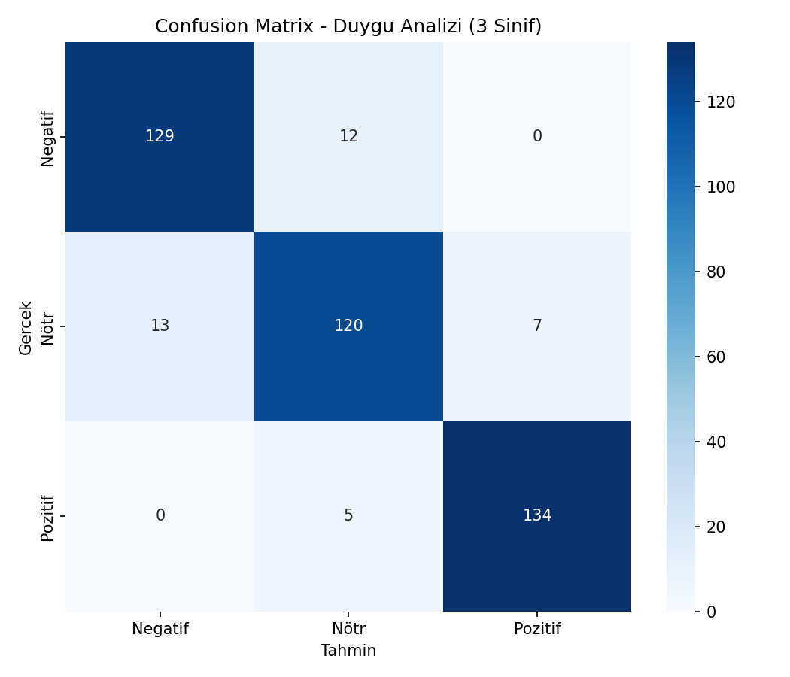
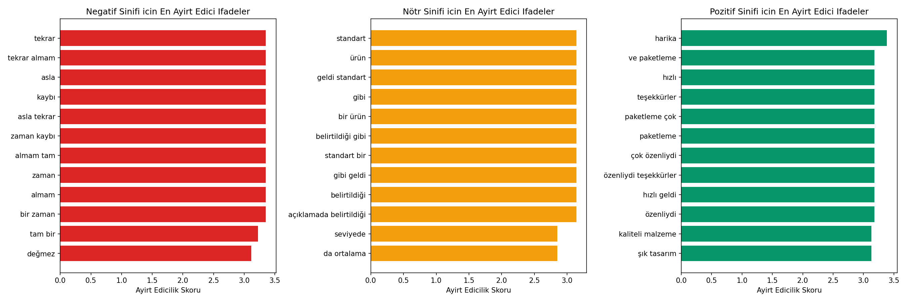

# Ürün Yorumu Duygu Analizi (3 Sınıf) — Multinomial Naive Bayes

## 🎯 Projenin Amacı

Bir e-ticaret ürün yorumunun **Pozitif, Nötr veya Negatif** olduğunu metin içinden otomatik tespit etmek.

Gerçek e-ticaret platformlarında (Trendyol, Hepsiburada, Amazon, Etsy vb.) yorum analiz sistemleri genelde **ikili değil üç sınıflı** çalışır — çünkü "fena değil ama beklediğim kadar iyi de değildi" tarzı bir yorum, işletme açısından net bir "memnun" veya "şikayetçi" sinyali değildir; bu tür yorumlar tipik olarak **ürün geliştirme ekibine** ayrı bir kanaldan iletilir (ne kriz yönetimi gerektirir ne de pazarlamada referans olarak kullanılır). Bu yüzden bu proje bilinçli olarak 3 sınıflı kurulmuştur — 2 sınıfa indirgemek, işletme için önemli bir orta segmenti görünmez kılardı.

**Naive Bayes'in burada seçilme sebebi:** Metin sınıflandırmada, özellikle TF-IDF gibi yüksek boyutlu ve seyrek (sparse) özellik uzaylarında hâlâ endüstri standardı olan, hızlı ve az veriyle bile güçlü sonuç veren bir algoritmadır. Spam filtreleme (Gmail'in ilk nesil spam filtreleri Naive Bayes tabanlıydı), haber kategorileme ve duygu analizi gibi gerçek üretim sistemlerinde bugün de kullanılmaya devam eder — çünkü hem yorumlanabilir (`feature_log_prob_` ile "hangi kelime kararı ne yönde etkiledi" görülebilir) hem de milisaniyeler içinde tahmin üretebilecek kadar hafiftir.

## 🏢 İş Bağlamı: Bu Model Gerçekte Nasıl Kullanılır?

Bir e-ticaret şirketinde bu tür bir model şu akışa entegre edilir:

1. **Gerçek zamanlı moderasyon:** Yeni gelen her yorum bu modelden geçer, sonuç ürün sayfasındaki "ortalama memnuniyet" göstergesine anlık yansır.
2. **Negatif yorum önceliklendirmesi:** Negatif olarak işaretlenen yorumlar müşteri hizmetleri ekibine otomatik yönlendirilir — bu, "önce en kızgın müşteriye ulaş" mantığıyla churn'ü (müşteri kaybını) azaltmaya yöneliktir.
3. **Nötr yorumlar ürün ekibine sinyal olarak gider:** "Fena değil ama..." türü yorumlar, doğrudan kriz değildir ama bir iyileştirme fırsatı taşır — bu segment genelde haftalık/aylık ürün geliştirme raporlarına dahil edilir.
4. **Pozitif yorumlar pazarlamaya beslenir:** Yüksek güvenilirlikle pozitif işaretlenen yorumlar, ürün sayfasında öne çıkarılacak "öne çıkan yorumlar" bölümüne aday olur.

Yani bu model tek bir "doğru/yanlış" sınıflandırıcı değil, **üç farklı iş sürecini tetikleyen bir yönlendirme sistemi**dir.

## ⚠️ Veri Hakkında Önemli Not

Gerçek bir e-ticaret yorum veri seti bu ortamda bulunmadığı için, pozitif/nötr/negatif kelime havuzları ve cümle şablonları birleştirilerek gerçekçi **Türkçe ürün yorumları sentetik olarak üretilir**. Ayrıca gerçek yorum etiketleme süreçlerinde (insan etiketleyiciler arasında) sınıflar arası, özellikle **komşu sınıflar arasında (Pozitif↔Nötr, Negatif↔Nötr)** anlaşmazlık/belirsizlik yaşanması bilinen bir olgudur — bu proje bunu simüle etmek için verinin %15'ine bilinçli bir **sınır belirsizliği (boundary noise)** ekler. Bu olmadan model %100 accuracy veriyordu, ki bu gerçekçi değildi (aşağıda açıklanmıştır).

## 📊 Veri Seti (Sentetik)

2.100 ürün yorumu (10 farklı ürün kategorisi), dengeli dağılım (~700 Pozitif, ~700 Nötr, ~700 Negatif).

## 🚀 Çalıştırma

```bash
pip install -r requirements.txt
python sentiment_naive_bayes.py
```

## 📈 Sonuçlar ve Derinlemesine Yorum

| Sınıf | Precision | Recall | F1-score |
|---|---|---|---|
| Negatif | 0.91 | 0.91 | 0.91 |
| **Nötr** | **0.88** | **0.86** | **0.87** |
| Pozitif | 0.95 | 0.96 | 0.96 |

**Genel Test Accuracy: %91.19**

### Neden Nötr sınıfı en düşük performansı veriyor — ve bu neden önemli bir bulgu?

Nötr sınıf, hem Pozitif hem Negatif ile kelime dağarcığı açısından örtüşür ("fena değil ama...", "ortalama", "idare eder" gibi ifadeler duygusal olarak belirsizdir). Bu, **modelin bir kusuru değil, dilin doğasında var olan bir zorluk**tur — insan etiketleyiciler arasında bile bu tür yorumlarda görüş ayrılığı yaşanır (literatürde buna "inter-annotator disagreement" denir). Gerçek bir müşteri deneyimi ekibi için bu bulgunun pratik sonucu şudur: **Nötr olarak işaretlenen yorumlara otomatik aksiyon yerine, örnekleme yoluyla insan gözden geçirmesi eklenmelidir** — model burada "kesin karar verici" değil, "önceliklendirme asistanı" rolünde kullanılmalıdır.

### Model %100 Doğru Olsaydı Ne Anlama Gelirdi? (Metodolojik Not)

İlk denemede (etiket belirsizliği eklenmeden) model **%100 accuracy** verdi. Bu, gerçek dünyada bir veri bilimcinin **kutlamak yerine şüphelenmesi gereken** bir sonuçtır — çünkü gerçek insan dili bu kadar net ayrışmaz. Bu proje bilinçli olarak veriye gerçekçi belirsizlik ekleyerek, "çok yüksek accuracy her zaman iyi haber değildir, bazen veri sızıntısı veya aşırı basitleştirilmiş bir problem işaretidir" mesajını da gösteriyor.

### Confusion Matrix (3 Sınıf)


En çok karışıklık, beklendiği gibi **Nötr ile komşu sınıflar arasında** yaşanıyor; Pozitif-Negatif arası doğrudan karışıklık (yani modelin bir uçtan diğerine tamamen yanılması) neredeyse hiç yok — bu da modelin en azından "yönü" hiç şaşırmadığını, sadece "şiddeti" konusunda bazen tereddüt ettiğini gösteriyor.

### Her Sınıf İçin En Ayırt Edici Kelime/İfadeler


- **Negatif** sınıfını en çok "asla tekrar", "zaman kaybı" gibi kesin/güçlü olumsuzlama ifadeleri belirliyor.
- **Nötr** sınıfını "belirtildiği gibi", "standart bir ürün" gibi tanımlayıcı/olgusal ifadeler belirliyor — duygu içermeyen, betimleyici dil.
- **Pozitif** sınıfını "harika", "hızlı geldi", "özenliydi" gibi güçlü onay ifadeleri belirliyor.

Bu örüntü, modelin gerçekten dilin duygusal/olgusal yükünü ayırt edebildiğini, rastgele kelime eşleşmelerine değil anlamlı dil kalıplarına dayandığını gösteriyor.

Tam kelime listeleri: `figures/top_words_pozitif.csv`, `figures/top_words_notr.csv`, `figures/top_words_negatif.csv`

## 🛠️ Kullanılan Teknolojiler

`Python` · `scikit-learn` · `TF-IDF` · `pandas` · `matplotlib` · `seaborn`

<p align="center"><i>Doğal dil işleme (NLP), çok sınıflı duygu analizi ve müşteri geri bildirimi yönlendirme sistemleri pratiği amaçlı bir portföy projesidir.</i></p>
