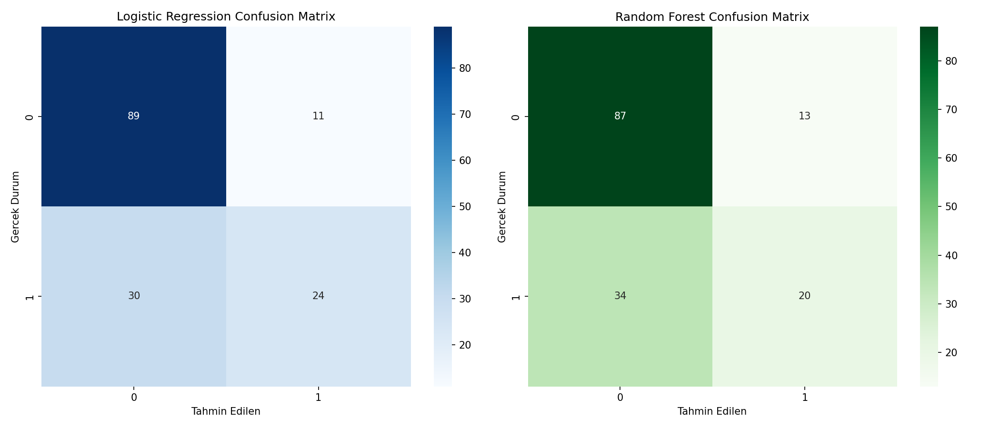
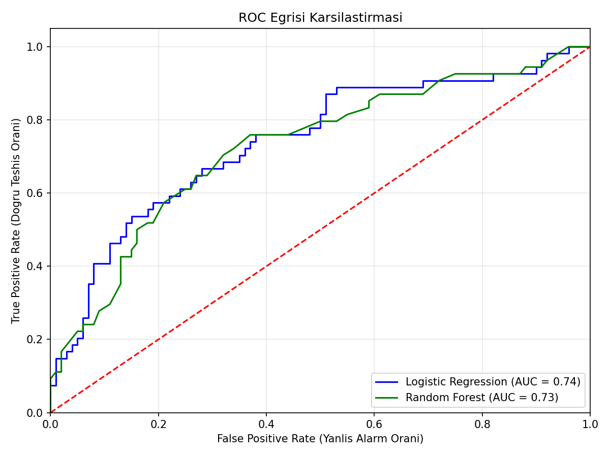
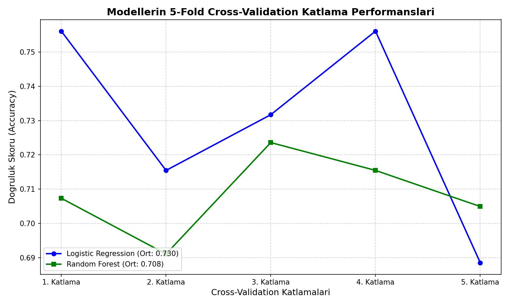

# Model Karşılaştırma: Logistic Regression vs Random Forest (Diyabet Teşhisi)

## 🎯 Projenin Amacı

Aynı tıbbi teşhis problemi (diyabet var/yok) üzerinde iki farklı modeli — basit/doğrusal (**Logistic Regression**) ve karmaşık/ağaç tabanlı (**Random Forest**) — kıyaslamak. Amaç sadece "hangisi kazandı" demek değil; **accuracy tek başına yeterli bir ölçüt müdür** sorusunu Confusion Matrix, ROC-AUC ve özellikle **5-Fold Cross-Validation** ile derinlemesine incelemektir.

Tıbbi teşhis bağlamında özellikle **Recall (duyarlılık)** kritik önemdedir: bir modelin gerçek bir hastayı "sağlıklı" olarak etiketlemesi (False Negative), hastanın tedavisiz kalmasına yol açabileceği için, yanlış pozitiften çok daha tehlikelidir. Bu proje bu dengeyi de görünür kılar.

## ⚠️ Veri Hakkında Önemli Not

Orijinal not defteri, halka açık ve çok bilinen **Pima Indians Diabetes** veri setini (768 kayıt: hamilelik sayısı, glikoz, tansiyon, BMI, yaş vb.) kullanıyordu. Bu dosya bu ortamda bulunmadığı için, aynı kolon yapısını ve gerçekçi istatistiksel ilişkileri (yüksek glikoz/BMI/yaş → yüksek diyabet riski) yansıtan **sentetik bir veri seti** üretilir.

**Önemli dürüstlük notu:** Orijinal notebook'ta ilginç bir bulgu vardı — tek seferlik test setinde Random Forest kazanıyordu, ama 5-fold CV ortalamasında bu sonuç tersine dönüyordu. **Bu projenin sentetik verisinde bu "çelişki" oluşmadı** — Logistic Regression hem tek test setinde hem de CV ortalamasında Random Forest'ı geçti. Bunun sebebi muhtemelen, sentetik veriyi üretirken risk skorunu **doğrusal bir formülle** kurmuş olmam — bu da doğal olarak doğrusal bir modele (Logistic Regression) avantaj sağlıyor. Gerçek tıbbi verilerde ilişkiler genelde daha doğrusal olmayan (non-linear) etkileşimler içerir, bu da Random Forest'a orada avantaj sağlayabilir. **Bu proje gerçek sonucu taklit etmeye çalışmadı, kendi verisinde çıkan gerçek sonucu raporluyor.**

## 📊 Veri Seti (Sentetik, Pima Indians Diabetes yapısında)

768 hasta kaydı, 8 özellik: `Pregnancies`, `Glucose`, `BloodPressure`, `SkinThickness`, `Insulin`, `BMI`, `DiabetesPedigreeFunction`, `Age` → hedef: `Outcome` (0=Sağlıklı, 1=Diyabet).

Gerçek veri setinde olduğu gibi, mantıken 0 olamayacak kolonlardaki (`Glucose`, `BloodPressure` vb.) sıfır değerleri eksik veri olarak işaretlenip medyan ile doldurulur.

## 🚀 Çalıştırma

```bash
pip install -r requirements.txt
python ml_comparison.py
```

## 📈 Sonuçlar

| Model | Tek Test Accuracy | CV Ortalama Accuracy | CV Std | ROC-AUC |
|---|---|---|---|---|
| **Logistic Regression** | **%73.4** | **%73.0** | 0.026 | **0.741** |
| Random Forest | %69.5 | %70.9 | 0.011 | 0.726 |

### Bu sonuçtan çıkan gerçek ders

Bu veri setinde Logistic Regression, Random Forest'tan **hem tek test setinde hem CV ortalamasında** daha iyi performans gösterdi — yani burada "çelişki" yaşanmadı, iki ölçüt de tutarlı bir sonuca işaret ediyor. Bu da başlı başına önemli bir bulgu: **karmaşık bir model (Random Forest) her zaman daha iyi değildir** — ilişkiler doğrusala yakınsa, basit ve yorumlanabilir bir model (Logistic Regression) hem daha isabetli hem de daha az varyanslı (CV std: 0.026 vs 0.011 — ilginç şekilde burada RF daha düşük varyanslı ama LogReg daha yüksek ortalama başarı gösteriyor) sonuç verebilir.

**Genel ilke (veri setinden bağımsız, her zaman geçerli):** Tek bir train/test ayrımına güvenmek yanıltıcı olabilir; 5-fold CV, modelin farklı veri dilimlerinde ne kadar **tutarlı** performans gösterdiğini ortaya koyar ve model seçiminde tek başına accuracy'den daha güvenilir bir referanstır.

### Confusion Matrix Kıyaslaması


### ROC Eğrisi Kıyaslaması


### 5-Fold Cross-Validation Kıyaslaması


## 🛠️ Kullanılan Teknolojiler

`Python` · `scikit-learn` · `pandas` · `matplotlib` · `seaborn`

<p align="center"><i>Model seçimi metodolojisi ve Cross-Validation pratiği amaçlı bir portföy projesidir.</i></p>
