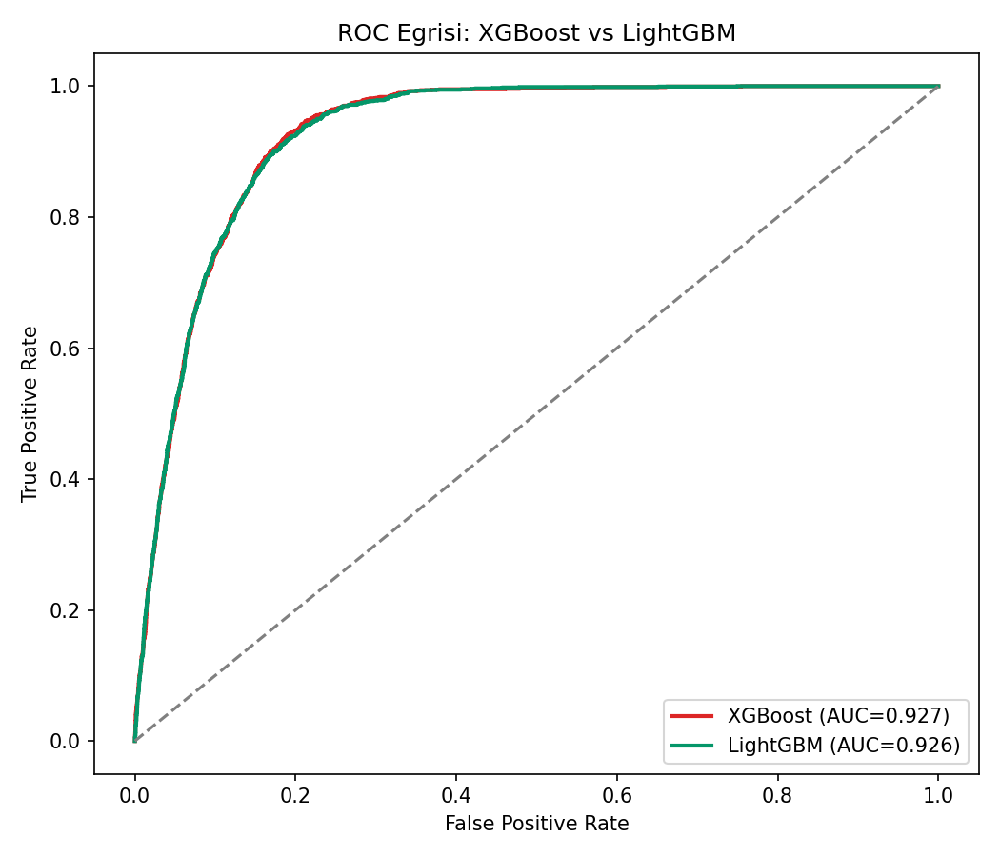
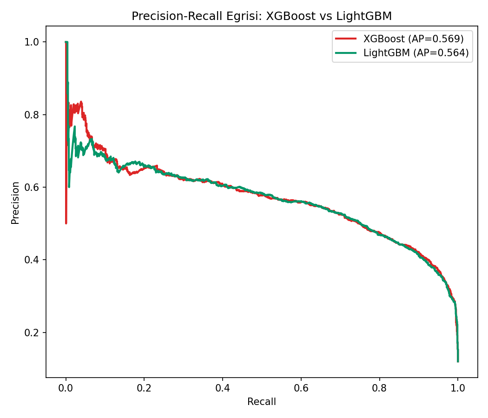
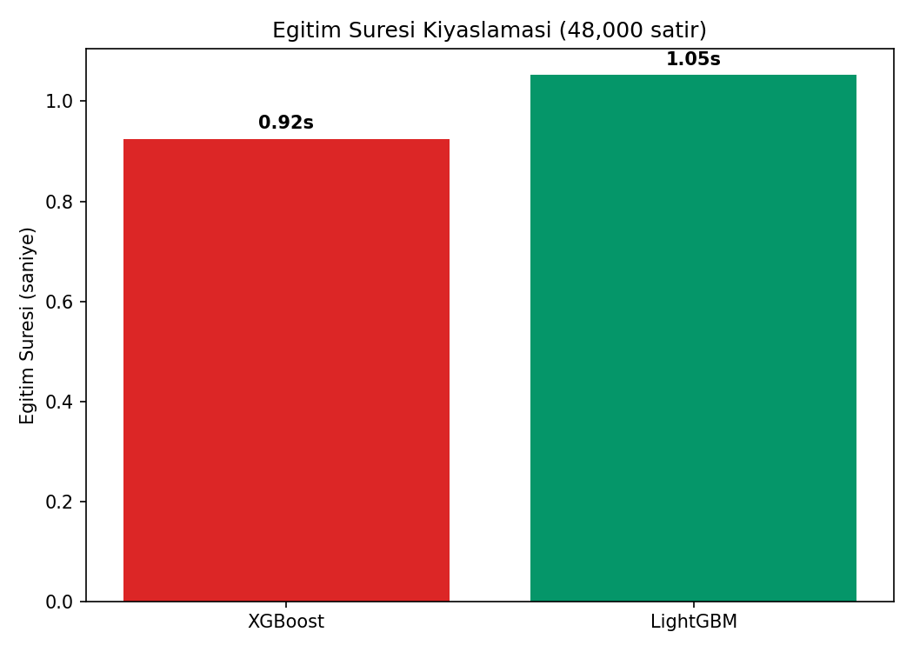
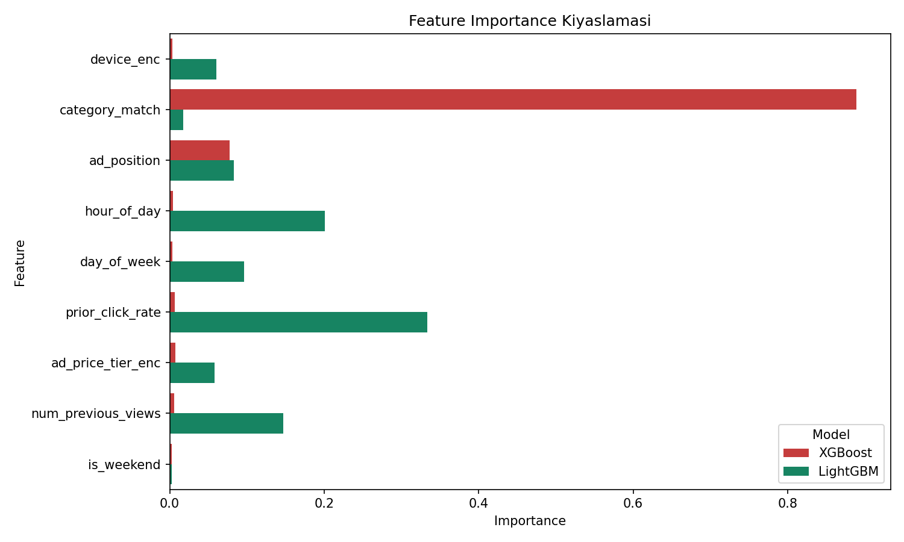

# Tıklanma Tahmini (CTR Prediction) — XGBoost vs LightGBM

## 🎯 Projenin Amacı

Bir kullanıcının bir reklama/ürüne **tıklayıp tıklamayacağını** (Click-Through Rate — CTR) tahmin etmek. Bu, Google Ads, Meta, Amazon gibi her büyük reklam/e-ticaret platformunun arka planda sürekli çalıştırdığı, gerçek dünyada en yüksek kullanım hacmine sahip makine öğrenmesi problemlerinden biridir.

Bu projede tek bir kütüphane seçilip diğerleri göz ardı edilmiyor — **XGBoost ve LightGBM aynı veride eğitilip hız ve doğruluk açısından doğrudan kıyaslanıyor.** Bu, sektörde gerçekten yapılan pratiği yansıtır: bir ML ekibi genelde ikisini de dener, kendi veri ölçeğinde ve production kısıtlarında hangisi daha uygunsa onu seçer.

## ⚠️ Veri Hakkında Önemli Not

Gerçek bir reklam platformu verisi kullanılmamıştır (gizlilik/erişim kısıtları). Bilinen CTR örüntülerini (ilgili kategori eşleşmesi + iyi reklam konumu + kullanıcının geçmiş tıklama eğilimi → yüksek tıklama olasılığı) yansıtan **sentetik bir veri seti** üretilir. Gerçek CTR verilerinde olduğu gibi **sınıflar dengesizdir** — tıklama oranı %12 (gerçek dünyada CTR genelde %1-15 aralığındadır).

## 📊 Veri Seti (Sentetik)

60.000 reklam gösterimi (impression):

| Değişken | Açıklama |
|---|---|
| `device` | Cihaz türü (mobile/desktop/tablet) |
| `category_match` | Reklam, kullanıcının ilgi alanıyla eşleşiyor mu (0/1) |
| `ad_position` | Reklamın sayfadaki konumu (1=en üst, 5=en alt) |
| `hour_of_day`, `day_of_week` | Zaman bilgisi |
| `prior_click_rate` | Kullanıcının geçmiş tıklama oranı |
| `ad_price_tier` | Reklamın fiyat katmanı (low/mid/high) |
| `num_previous_views` | Kullanıcının bu reklamı daha önce kaç kez gördüğü |
| `is_weekend` | Hafta sonu mu |
| `clicked` | Hedef değişken (0/1) |

## 🚀 Çalıştırma

```bash
pip install -r requirements.txt
python ctr_xgboost_vs_lightgbm.py
```

## 📈 Sonuçlar

| Model | Accuracy | ROC-AUC | PR-AUC | Eğitim Süresi |
|---|---|---|---|---|
| XGBoost | %89.69 | 0.9267 | 0.569 | **0.92 sn** |
| LightGBM | %89.70 | 0.9263 | 0.564 | 1.05 sn |

### Beklenmeyen ama dürüst bir bulgu: LightGBM burada daha hızlı çıkmadı

Literatürde LightGBM genelde "daha hızlı" olarak bilinir — ama bu proje o beklentiyi **bu veri ölçeğinde doğrulamadı**: XGBoost yaklaşık %12 daha hızlı eğitildi. Bunun makul açıklaması: LightGBM'in histogram tabanlı hız avantajı tipik olarak **çok büyük veri setlerinde** (milyonlarca satır, yüzlerce özellik) belirginleşir. Bu projedeki veri (48.000 eğitim satırı, 9 özellik) o eşiğin altında kalıyor — küçük/orta ölçekli verilerde iki kütüphane de birbirine çok yakın performans gösterebiliyor.

**Çıkarılan gerçek ders:** "LightGBM her zaman daha hızlıdır" gibi genellemeler, veri ölçeğine bağlı olarak doğrulanmayabilir — bu yüzden gerçek bir ML ekibi asla kütüphane seçimini yalnızca literatüre güvenerek yapmaz, **kendi verisinde test eder.** Bu proje tam olarak bunu gösteriyor.

Doğruluk metrikleri (Accuracy, ROC-AUC, PR-AUC) ise neredeyse birebir aynı — iki kütüphane de aynı gradient boosting mantığını farklı optimizasyonlarla uyguladığı için bu şaşırtıcı değil.

### ROC Eğrisi Kıyaslaması


### Precision-Recall Eğrisi (dengesiz sınıflar için)


### Eğitim Süresi Kıyaslaması


### Feature Importance Kıyaslaması


İki model de `prior_click_rate` ve `category_match`'i en önemli değişkenler olarak işaretliyor — bu, iş tarafına aktarılabilecek net bir içgörü: kullanıcı geçmişi ve reklam-ilgi eşleşmesi, tıklanma olasılığının en güçlü belirleyicileri.

## 🛠️ Kullanılan Teknolojiler

`Python` · `XGBoost` · `LightGBM` · `scikit-learn` · `pandas` · `matplotlib` · `seaborn`

<p align="center"><i>Gradient boosting kütüphaneleri kıyaslaması ve CTR tahmini pratiği amaçlı bir portföy projesidir.</i></p>
