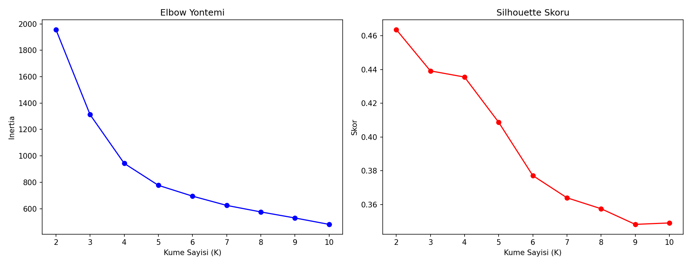
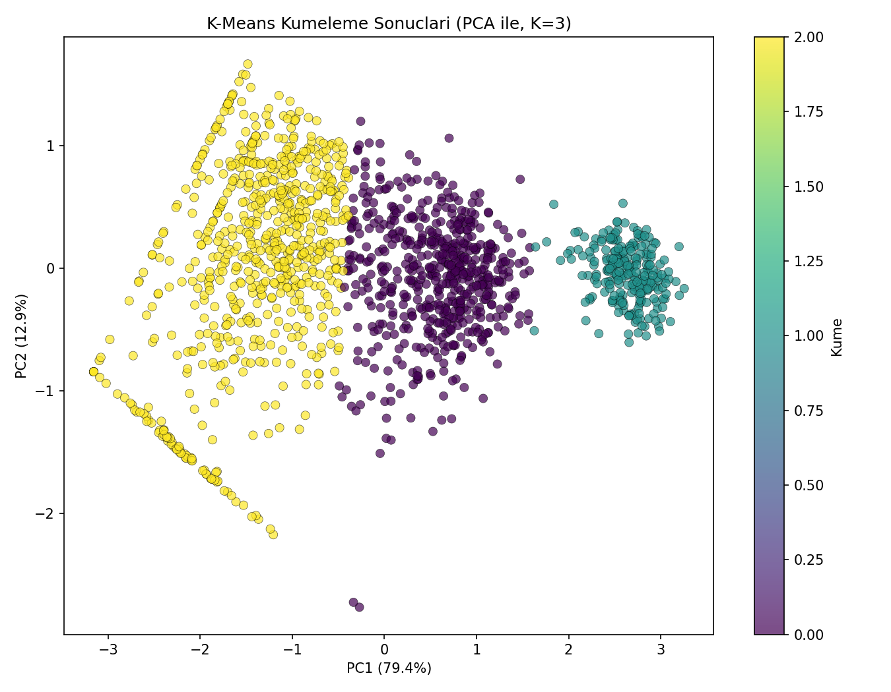
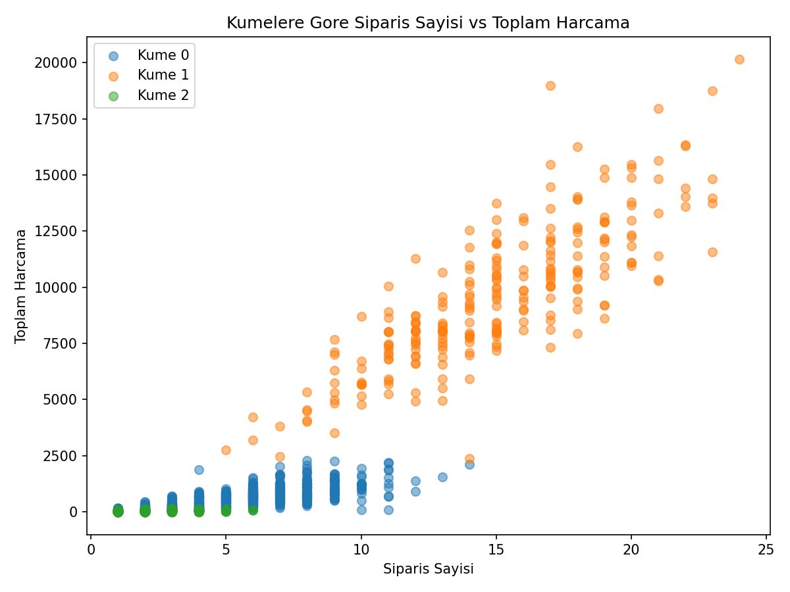

# E-ticaret Müşteri Segmentasyonu — K-Means + PCA

## 🎯 Projenin Amacı

Müşterileri satın alma davranışlarına (ortalama sipariş miktarı, ortalama birim fiyat, sipariş sıklığı) göre **anlamlı, pazarlama ekibinin aksiyon alabileceği segmentlere** ayırmak.

Optimal küme sayısı Elbow + Silhouette yöntemleriyle veriden analiz edilir — ancak bu projede **istatistiksel optimum ile iş kararının çakışmadığı** gerçek bir durum bilinçli olarak gösterilir (aşağıya bakınız).

## ⚠️ Veri Hakkında Önemli Not

Orijinal not defteri `kagglehub` üzerinden gerçek bir e-ticaret veri seti (`carrie1/ecommerce-data`) indiriyordu. Bu, çalıştırmak için Kaggle API credential'ı gerektirdiği ve ortam dışına bağımlılık yarattığı için, benzer istatistiksel özellikte **sentetik bir müşteri veri seti** üretilir (1.500 müşteri, 3 gizli davranış arketipi karıştırılarak).

## 🧠 Önemli Metodolojik Karar: Neden K=2 Değil K=3?

Silhouette skoru istatistiksel olarak **K=2**'yi önerir (skor: 0.46). Ancak K=2 sadece kaba bir **"az harcayan / çok harcayan"** ayrımı üretir — pazarlama ekibi için pek aksiyon alınabilir değildir.

Bu projede bilinçli olarak **K=3** seçilmiştir (skor: 0.44, istatistiksel olarak neredeyse aynı derecede iyi) çünkü iş bağlamında düşük/orta/VIP şeklinde **3 katmanlı bir segmentasyon**, pazarlama ekibinin farklı kampanyalar tasarlayabileceği çok daha kullanılabilir bir çıktı sunar.

**Bu, veri bilimindeki gerçek bir pratiği yansıtır:** İstatistiksel metrik her zaman son sözü söylemez; iş ihtiyacı, metriğe yakın alternatifler arasında karar vericidir. Kod bu kararı ve gerekçesini açıkça loglar.

## 📊 Veri Seti (Sentetik)

| Değişken | Açıklama |
|---|---|
| `CustomerID` | Müşteri kimliği |
| `Avg_Quantity` | Ortalama sipariş miktarı |
| `Avg_UnitPrice` | Ortalama birim fiyat |
| `Order_Count` | Toplam sipariş sayısı |
| `Total_Spent` | Toplam harcama (türetilmiş, kümelemeye dahil edilmez — bkz. not) |

**Not:** `Total_Spent`, diğer 3 değişkenin çarpımı olduğu için kümeleme özelliklerine dahil edilmemiştir — dahil edilseydi, aşırı çarpık bu tek değişken mesafe hesabına hakim olup kümeleme yapısını bozardı. Yalnızca küme profillerini betimlemek için kullanılır.

## 🚀 Çalıştırma

```bash
pip install -r requirements.txt
python ecommerce_segmentation.py
```

## 📈 Sonuçlar

| Küme | Müşteri Sayısı | Ort. Miktar | Ort. Birim Fiyat | Ort. Sipariş | Ort. Toplam Harcama |
|---|---|---|---|---|---|
| 0 — Orta Segment | 568 | 7.8 | 14.7 | 5.8 | 672 |
| 1 — VIP | 244 | 18.1 | 35.1 | 14.9 | 9.563 |
| 2 — Düşük Segment | 688 | 3.1 | 7.7 | 1.9 | 39 |

Silhouette Skoru (K=3): 0.44

### Elbow ve Silhouette Analizi


### K-Means Kümeleme Sonuçları (PCA ile 2 Boyut)


PCA'nın 2 bileşeni, verideki varyansın **%92**'sini açıklıyor — yani 2 boyutlu görselleştirme verinin yapısını büyük ölçüde koruyor.

### Sipariş Sayısı vs Toplam Harcama (Kümelere Göre)


## 🛠️ Kullanılan Teknolojiler

`Python` · `scikit-learn` · `pandas` · `matplotlib` · `seaborn`

<p align="center"><i>Müşteri segmentasyonu ve kümeleme metodolojisi pratiği amaçlı bir portföy projesidir.</i></p>
