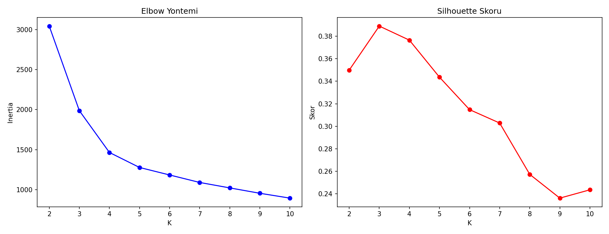
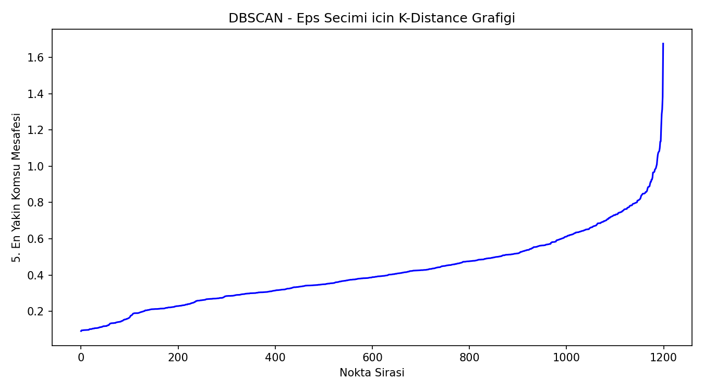
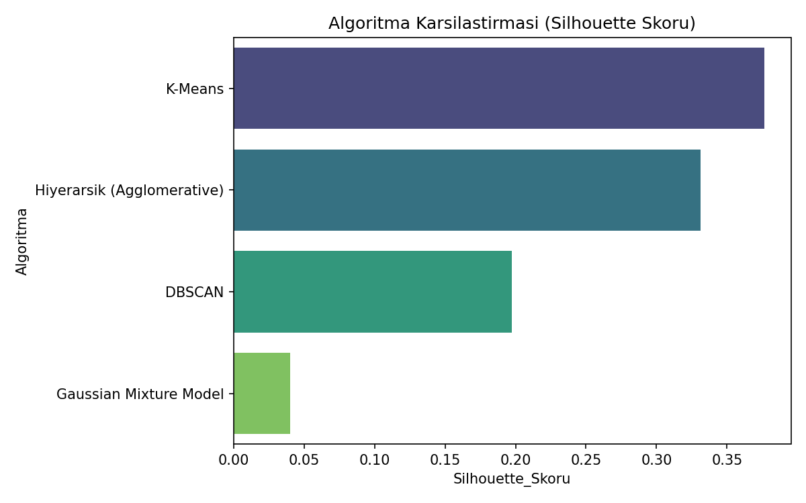
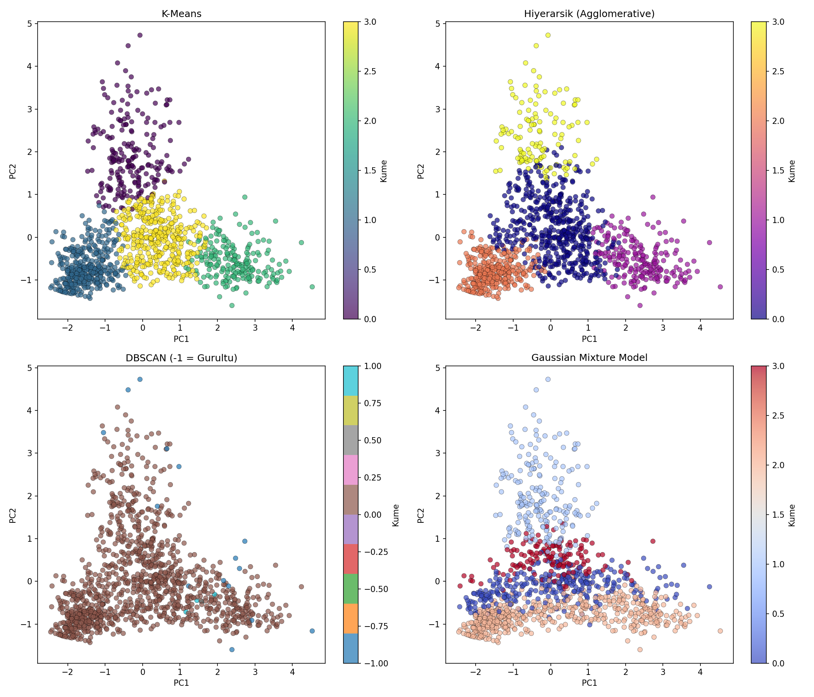

# Sigorta Pazar Segmentasyonu — 4 Kümeleme Algoritması Kıyaslaması

## 🎯 Projenin Amacı

Sigorta müşterilerini yaş, gelir, hasar talebi sayısı ve poliçe sayısına göre segmentlere ayırmak — ama bunu **tek bir algoritmayla değil, 4 farklı kümeleme algoritmasıyla** yapıp sonuçları kıyaslamak: **K-Means, Hiyerarşik (Agglomerative) Kümeleme, DBSCAN, Gaussian Mixture Model (GMM)**.

Her algoritmanın farklı bir varsayımı vardır:
- **K-Means** küresel/dairesel kümeler bekler
- **Hiyerarşik Kümeleme** iç içe geçmiş bir küme hiyerarşisi kurar
- **DBSCAN** yoğunluk bazlı çalışır, küme sayısını kendisi bulur, gürültüyü (outlier) ayrı tanır
- **GMM** olasılıksal/yumuşak kümeleme yapar — bir noktanın birden fazla kümeye "kısmen ait" olabileceğini varsayar

Bu proje **"hangi algoritma bu veri için en uygun"** sorusuna, tek bir algoritmayı seçip diğerlerini görmezden gelmek yerine, dört algoritmayı da çalıştırıp **Silhouette skoruyla karşılaştırarak** cevap arar.

## ⚠️ Veri Hakkında Önemli Not

Orijinal not defteri `kagglehub` üzerinden gerçek bir sigorta pazar segmentasyonu veri seti indiriyordu. Bu, Kaggle API credential'ı gerektirdiği için, benzer istatistiksel özellikte **sentetik bir sigorta müşteri veri seti** üretilir (4 gizli müşteri arketipi: genç-düşük risk, orta yaş-aile, yüksek gelir-düşük talep, yüksek risk). Gerçek veri setlerinde olduğu gibi, gelir değişkeninde kasıtlı olarak bir miktar eksik değer (%3) bırakılmıştır.

## 📊 Veri Seti (Sentetik)

1.200 sigorta müşterisi:

| Değişken | Açıklama |
|---|---|
| `CustomerID` | Poliçe/müşteri kimliği |
| `Age` | Yaş |
| `Annual_Income` | Yıllık gelir (36 kayıtta eksik değer var, medyan ile dolduruldu) |
| `Claims_Filed` | Açılan hasar talebi sayısı |
| `Policy_Count` | Sahip olunan poliçe sayısı |

## 🚀 Çalıştırma

```bash
pip install -r requirements.txt
python insurance_segmentation.py
```

## 📈 Sonuçlar — Algoritma Karşılaştırması

| Algoritma | Silhouette Skoru | Küme Sayısı |
|---|---|---|
| **K-Means** | **0.377** (en iyi) | 4 |
| Hiyerarşik (Agglomerative) | 0.331 | 4 |
| DBSCAN | 0.197 | 2 (+ 15 gürültü noktası) |
| Gaussian Mixture Model | 0.040 (en zayıf) | 4 |

### Neden bu sonuçlar mantıklı?

- **K-Means kazandı** çünkü veri, tasarım gereği yaklaşık küresel/kompakt 4 segment içeriyor — K-Means'in temel varsayımıyla örtüşüyor.
- **DBSCAN farklı bir sayı (2) buldu** — bu bir hata değil, DBSCAN'ın yoğunluk temelli doğasının sonucu: iki segment birbirine yoğunluk açısından yakın olduğu için tek küme olarak birleştirdi, ayrıca 15 noktayı "gürültü" (hiçbir kümeye net ait olmayan uç değerler) olarak işaretledi. Bu, DBSCAN'ın gerçek dünyada aykırı değer tespiti için neden tercih edildiğini gösteren bir örnek.
- **GMM en düşük skoru verdi** çünkü olasılıksal/yumuşak kümeleme yapısı, kümeler net sınırlarla ayrılmadığında (burada olduğu gibi kısmi örtüşme var) Silhouette gibi "sert" kümeleme metrikleriyle daha düşük skorlanır — bu GMM'in bir zayıflığı değil, farklı bir kümeleme felsefesinin doğal sonucu.

**Sonuç:** Bu veri seti için pratik öneri K-Means'tir, ama DBSCAN'ın bulduğu "gürültü" noktaları ayrıca incelenmeye değerdir — bunlar potansiyel olarak sıra dışı (anomali) müşteri profilleri olabilir.

### Elbow ve Silhouette Analizi (K-Means)


### DBSCAN — Eps Parametresi Seçimi (K-Distance Grafiği)


### Algoritma Karşılaştırması


### 4 Algoritmanın Yan Yana Görselleştirmesi (PCA)


## 🛠️ Kullanılan Teknolojiler

`Python` · `scikit-learn` · `pandas` · `matplotlib` · `seaborn`

<p align="center"><i>Kümeleme algoritmaları karşılaştırması pratiği amaçlı bir portföy projesidir.</i></p>
