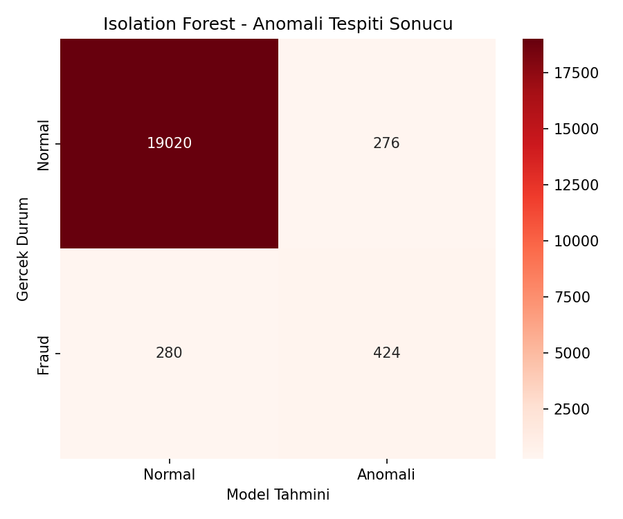
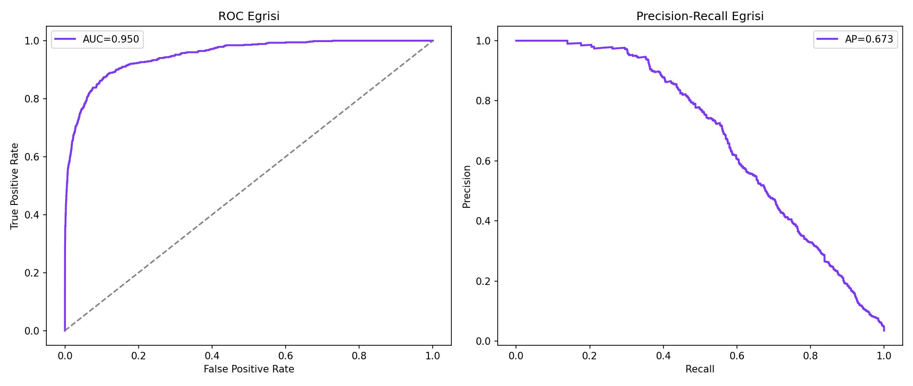
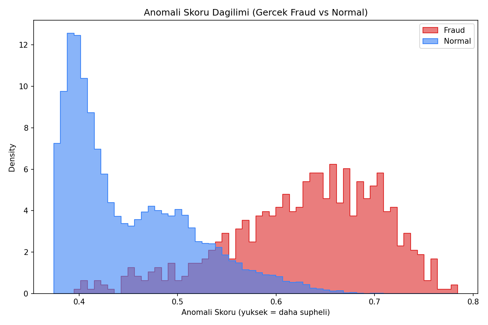
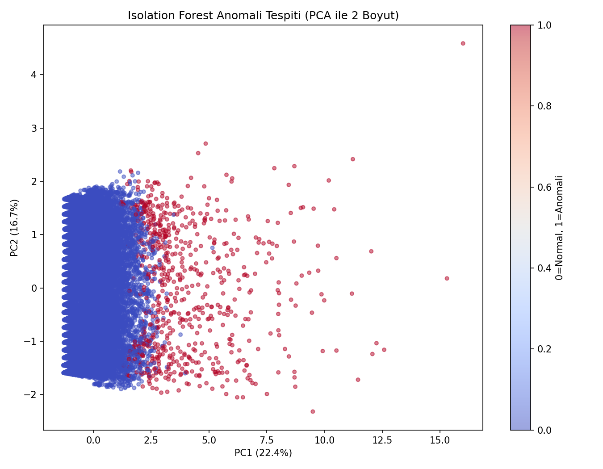

# Kredi Kartı/Banka İşlemi Anomali Tespiti — Isolation Forest

## 🎯 Projenin Amacı

Kredi kartı işlemlerinde **hiçbir etiket (fraud/normal) kullanmadan**, sadece işlem özelliklerinin genel dağılımına bakarak "normalden sapan" şüpheli işlemleri tespit etmek.

Bu proje, `Supervised/04-random-forest` klasöründeki **fraud-detection-rf** projesinden temelde farklı bir felsefeye dayanır: Random Forest, geçmişte **insan tarafından etiketlenmiş** binlerce sahte işlem örneği gerektirirken, Isolation Forest hiçbir etikete ihtiyaç duymadan, sadece "bu işlem diğerlerinden ne kadar farklı" sorusuna bakarak çalışır. Bu da onu **daha önce hiç görülmemiş, yeni fraud örüntülerini** yakalamada değerli kılar — çünkü yeni bir dolandırıcılık taktiği ortaya çıktığında, henüz hiçbir etiketli örnek yokken bile Isolation Forest bunu "anormal" olarak işaretleyebilir.

## 🏢 İş Bağlamı: Gerçek Bankacılık Sistemlerinde Nasıl Kullanılır?

Gerçek ödeme sistemlerinde (Visa, Mastercard, bankalar) bu iki yaklaşım **birlikte, katmanlı** bir mimaride kullanılır:

1. **Isolation Forest (bu proje) — "bilinmeyeni yakalayan" ilk katman:** Yeni, daha önce görülmemiş davranış örüntülerini işaretler. Etiket gerektirmediği için sürekli, canlı veri üzerinde yeniden eğitilebilir — dolandırıcıların taktik değiştirme hızına ayak uydurabilir.
2. **Etiketli modeller (Random Forest, XGBoost) — "bilineni kesinleştiren" ikinci katman:** Geçmişte doğrulanmış fraud örüntülerini yüksek kesinlikle tanır, ama yeni bir taktiğe karşı kördür (o örüntüyü hiç görmemiştir).
3. **İnsan inceleme ekibi:** Her iki modelin de şüpheli işaretlediği işlemler, gerçek bir uzmana **öncelik sırasına göre** yönlendirilir — model kararı nihai değildir, insan onayı gerektirir.

Bu proje özellikle **"soğuk başlangıç" (cold start) fraud senaryolarında** değerlidir: Bir banka yeni bir ürün/pazar segmentine girdiğinde, henüz o segmentte hiç etiketli fraud verisi yoktur — Isolation Forest bu durumda bile çalışabilen tek seçenektir.

## ⚠️ Veri Hakkında Önemli Not

Gerçek bir banka işlem verisi bu ortamda bulunmadığı için, gerçekçi işlem örüntülerini (yüksek tutar, gece saati, yeni cihaz, yurtdışı işlem, evden uzaklık, kısa sürede çok işlem) yansıtan **sentetik bir veri seti** üretilir. **Kritik metodolojik nokta:** `is_fraud_true` etiketi veri setinde bulunur ama **modelin eğitiminde hiç kullanılmaz** — sadece eğitim bittikten sonra, modelin ne kadar başarılı olduğunu ölçmek için kullanılır. Bu, gerçek denetimsiz öğrenmenin tam olarak nasıl değerlendirildiğini yansıtır.

## 📊 Veri Seti (Sentetik)

20.000 işlem kaydı, aynı özellik yapısı `fraud-detection-rf` projesiyle tutarlı tutulmuştur (doğrudan kıyaslanabilsin diye): `amount`, `hour`, `is_new_device`, `is_foreign`, `distance_from_home_km`, `transactions_last_hour`. Gerçek dünyadaki gibi sınıflar dengesizdir (fraud oranı %3.5).

## 🚀 Çalıştırma

```bash
pip install -r requirements.txt
python isolation_forest_fraud.py
```

## 📈 Sonuçlar ve Derinlemesine Yorum

| Metrik | Değer |
|---|---|
| ROC-AUC | **0.9504** |
| PR-AUC (Average Precision) | 0.6735 |
| Anomali sınıfı Precision/Recall | %61 / %60 |

### Etiketsiz Model, Etiketli Modelden Daha mı İyi Sonuç Verdi?

İlginç bir karşılaştırma: Bu projenin ROC-AUC'u (0.95), `fraud-detection-rf` projesindeki **etiketli** Random Forest modelinin ROC-AUC'undan (0.81) daha yüksek çıktı. Bunun sebebi model üstünlüğü değil, **veri üretim sürecindeki bir farktır** — `fraud-detection-rf` projesinde bilinçli olarak gerçekçi etiket gürültüsü (bazı fraud işlemlerin "temiz" görünmesi) eklenmişti, bu projede ise böyle bir gürültü yok. Bu iki sonucu doğrudan "hangi yöntem daha iyi" diye kıyaslamak yanıltıcı olur — **asıl doğru kıyaslama, ikisinin aynı, gerçek bir üretim verisinde yan yana test edilmesiyle yapılmalıdır.** Bu proje bu nüansı gizlemeden, olduğu gibi raporluyor.

### Precision neden %61 ile sınırlı — bu kabul edilebilir mi?

Etiketsiz bir modelin, hiç etiket görmeden %61 precision'a ulaşması aslında **güçlü bir sonuçtur** — çünkü model kelimenin tam anlamıyla "kör" çalışıyor, sadece istatistiksel sapmaya bakıyor. Gerçek bir üretim sisteminde bu model tek başına nihai karar mekanizması olarak kullanılmaz; **"insan incelemesi için önceliklendirme"** amacıyla kullanılır — yani %61 precision, "10 işaretlenen işlemden 6'sı gerçekten şüpheli" demektir, bu da bir inceleme ekibinin zamanını rastgele taramaya göre çok daha verimli kullanmasını sağlar.

### Confusion Matrix


### ROC ve Precision-Recall Eğrileri


### Anomali Skoru Dağılımı (Fraud vs Normal)


Bu grafik modelin iç mantığını gösteriyor: Fraud işlemler (kırmızı), normal işlemlere (mavi) göre belirgin şekilde daha yüksek anomali skoruna sahip — dağılımlar arasında **kısmi örtüşme olması beklenen ve gerçekçi** bir durumdur, tam ayrışma olsaydı bu şüpheli (fazla kolay) bir problem olduğuna işaret ederdi.

### PCA ile Anomali Görselleştirmesi


## 🛠️ Kullanılan Teknolojiler

`Python` · `scikit-learn` · `pandas` · `matplotlib` · `seaborn`

<p align="center"><i>Denetimsiz anomali tespiti ve fraud analitiği pratiği amaçlı bir portföy projesidir.</i></p>
