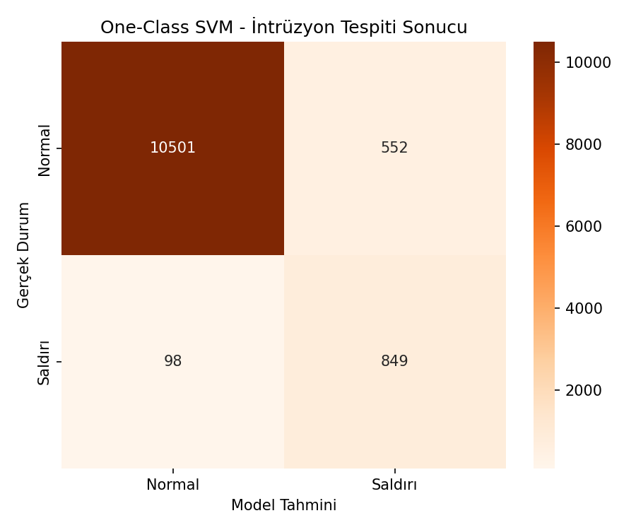
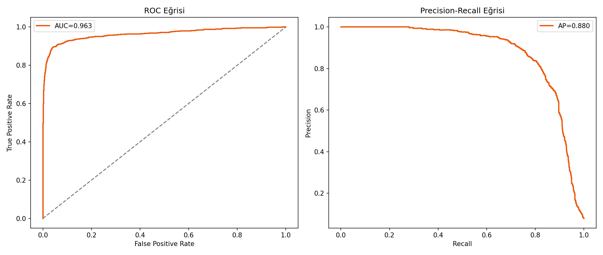
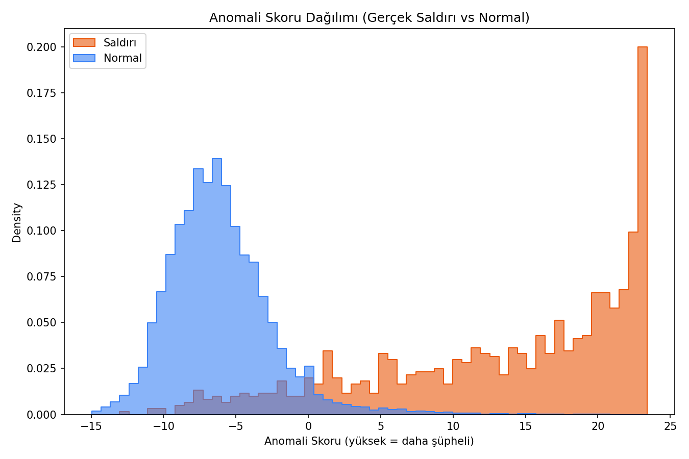
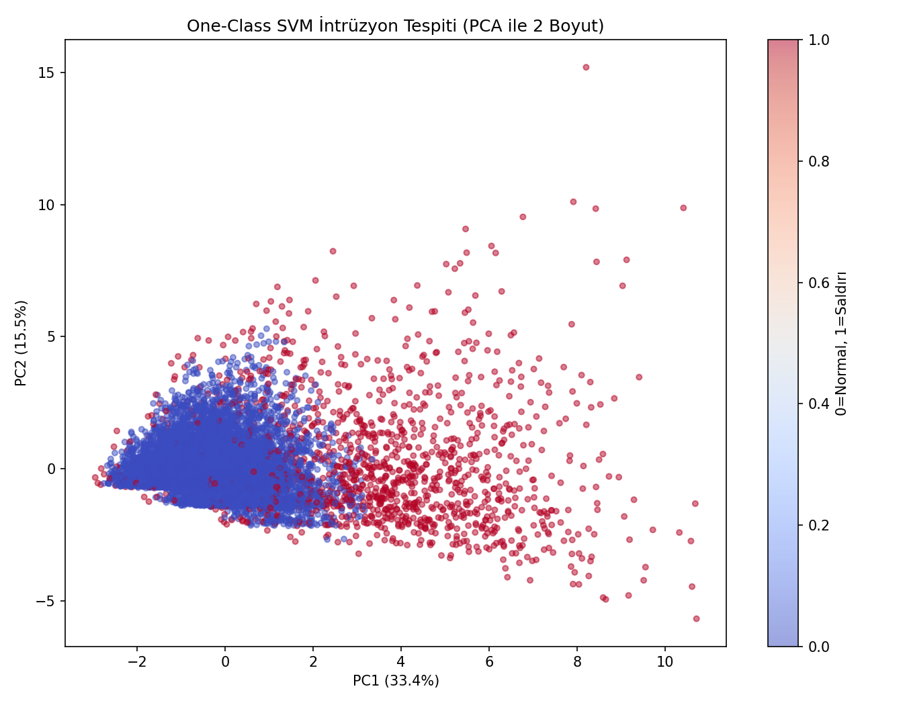

# Ağ Güvenliği — İntrüzyon (Saldırı) Tespiti — One-Class SVM

## 🎯 Projenin Amacı

Bir ağ bağlantısının **normal mi yoksa saldırı/intrüzyon mu** olduğunu, **sadece normal trafik örneklerinden öğrenerek** tespit etmek.

One-Class SVM'in temel mantığı çoğu sınıflandırma algoritmasından köklü biçimde farklıdır: model **iki sınıf arasındaki sınırı değil, tek bir sınıfın (normal trafik) kendi sınırını** öğrenir ve bu sınırın dışına çıkan her şeyi anomali olarak işaretler. Bu, siber güvenlikte kritik bir avantajdır çünkü **saldırı türleri sürekli değişir** — saldırı örnekleriyle eğitilen bir model yarın ortaya çıkacak yeni bir saldırı türünü hiç tanımayabilir, ama "normalin dışında olan her şey şüphelidir" mantığıyla çalışan bir model, hiç görmediği bir saldırı türünü bile yakalayabilir.

## 🏢 İş/Sektör Bağlamı: Bu Model Gerçekte Nerede Kullanılır?

Bu yaklaşım, gerçek **Ağ Saldırı Tespit Sistemlerinde (Intrusion Detection Systems - IDS)** yaygın bir mimari desenin temelidir:

1. **Kurumsal güvenlik duvarları ve SIEM sistemleri** (Security Information and Event Management), "bilinen imza" (signature-based) tespitinin yanında **anomali bazlı tespit** katmanı da çalıştırır — çünkü imza tabanlı sistemler sadece daha önce kataloglanmış saldırı türlerini yakalar, "sıfırıncı gün" (zero-day) saldırılara karşı kördür.
2. **One-Class SVM'in "sadece normali öğrenme" yaklaşımı**, yeni açılan bir sistemde/ağda henüz hiç saldırı örneği toplanmamışken bile devreye alınabilir — çünkü ihtiyaç duyduğu tek şey, "normal" trafiğin ne olduğuna dair yeterli örnektir, bu da her zaman mevcuttur.
3. **Gerçek SOC (Security Operations Center) ekiplerinde** bu tür modeller, güvenlik analistlerine gelen olay (alert) havuzunu önceliklendirir — model "şüpheli" dediği bağlantıları öne çıkarır, insan analist bunları teyit eder veya "yanlış alarm" (false positive) olarak işaretleyip modeli geri besler.

**BigData reposundaki `big-data-log-analytics` projesiyle tematik bağlantı:** O proje web sunucusu loglarını **tanımlayıcı istatistiklerle** analiz ediyordu (kaç istek, hangi ülkeden, hangi hata oranıyla). Bu proje ise aynı türde bir veriye (ağ/bağlantı logları) **anomali tespiti katmanı** ekleyerek "hangi bağlantılar tanımlayıcı istatistiklerin çok dışında kalıyor" sorusuna cevap arıyor — yani BigData projesi "ne oluyor"u, bu proje "neyin yanlış olabileceğini" gösteriyor.

## ⚠️ Veri Hakkında Önemli Not

Gerçek bir ağ trafiği veri seti (örn. NSL-KDD, CICIDS gibi akademik standart veri setleri) bu ortamda bulunmadığı için, gerçekçi ağ bağlantı örüntülerini yansıtan **sentetik bir veri seti** üretilir. **Kritik metodolojik nokta:** One-Class SVM, klasik kullanım biçimine sadık kalınarak **sadece normal trafik örnekleriyle eğitilmiştir** — saldırı etiketi modelin hiçbir aşamasında eğitime dahil edilmez, yalnızca eğitim sonrası performansı ölçmek için kullanılır.

## 📊 Veri Seti (Sentetik)

12.000 ağ bağlantı kaydı: `duration_sec` (bağlantı süresi), `packet_size_avg` (ortalama paket boyutu), `num_failed_logins` (başarısız giriş denemesi), `connection_count_per_min` (dakikadaki bağlantı sayısı), `bytes_sent`, `unique_ports_accessed` (erişilen farklı port sayısı) → hedef (sadece değerlendirme için): `is_attack_true`. Saldırı oranı %7.89 — gerçek ağ trafiğinde olduğu gibi dengesiz.

## 🚀 Çalıştırma

```bash
pip install -r requirements.txt
python ocsvm_intrusion_detection.py
```

## 📈 Sonuçlar ve Derinlemesine Yorum

| Metrik | Değer |
|---|---|
| ROC-AUC | **0.9626** |
| PR-AUC (Average Precision) | 0.8798 |
| Saldırı sınıfı Precision/Recall | %61 / %90 |

### Yüksek Recall (%90), Düşük Precision (%61) — Bu Neden İyi Bir Denge?

Bu proje bilinçli olarak **Recall'ü önceliklendiren** bir yapıda sonuç veriyor — modelin gerçek saldırıların %90'ını yakalaması, ama işaretlediklerinin sadece %61'inin gerçek saldırı çıkması anlamına geliyor. Siber güvenlikte bu **doğru tercihtir**: bir saldırıyı kaçırmanın (False Negative) maliyeti — veri sızıntısı, sistem ele geçirilmesi — yanlış alarm vermenin (False Positive) maliyetinden — bir analistin birkaç dakikasını harcaması — kıyaslanamayacak kadar yüksektir. Gerçek bir SOC ekibi, "az ama kaçırmadan yakala" yerine "çok yakala, insan eleyerek filtrelesin" stratejisini tercih eder — bu proje tam olarak bu stratejiyle uyumlu çalışıyor.

### Isolation Forest Projesiyle Metodolojik Farkı

Bu proje ile `isolation-forest-fraud` projesi arasında önemli bir yöntemsel fark var: Isolation Forest **tüm veriyle** (normal + anomali karışık) eğitilirken, One-Class SVM **sadece normal örneklerle** eğitilir. Bu, iki algoritmanın felsefesindeki temel ayrımı yansıtır — Isolation Forest "veri içindeki azınlık, muhtemelen anormaldir" varsayımıyla çalışırken, One-Class SVM "normalin net bir sınırı vardır, onu öğrenip dışına çıkanı işaretlerim" varsayımıyla çalışır. Hangisinin daha iyi olduğu probleme bağlıdır: **temiz "normal" örneklerine güvenle ulaşabiliyorsanız** (bu projedeki gibi) One-Class SVM; **verinin çoğunluğunun zaten normal olduğu ama net bir "sadece normal" alt küme ayıramadığınız** durumlarda Isolation Forest tercih edilir.

### Confusion Matrix


### ROC ve Precision-Recall Eğrileri


### Anomali Skoru Dağılımı (Saldırı vs Normal)


### PCA ile Saldırı Tespiti Görselleştirmesi


## 🛠️ Kullanılan Teknolojiler

`Python` · `scikit-learn` · `pandas` · `matplotlib` · `seaborn`

<p align="center"><i>Ağ güvenliği, intrüzyon tespiti ve tek-sınıflı anomali tespiti pratiği amaçlı bir portföy projesidir.</i></p>
