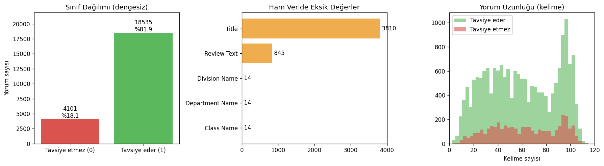
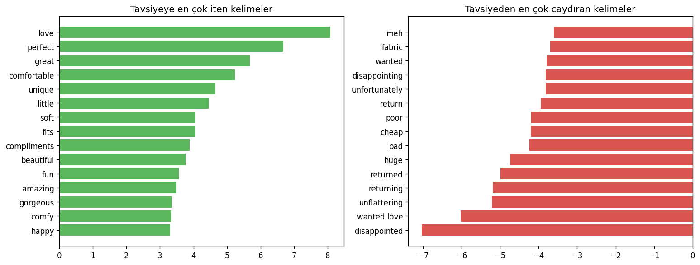
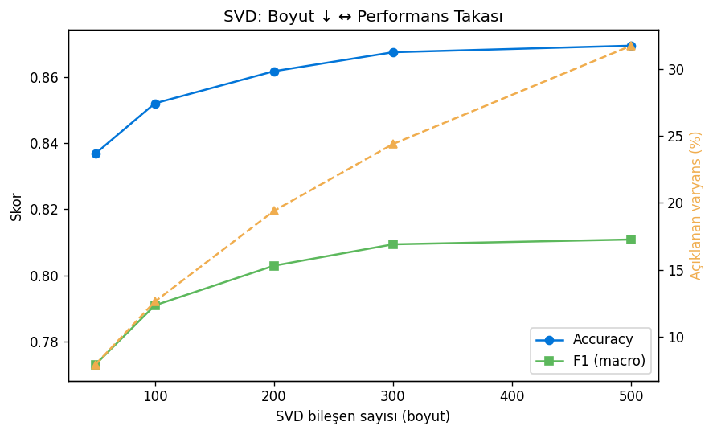
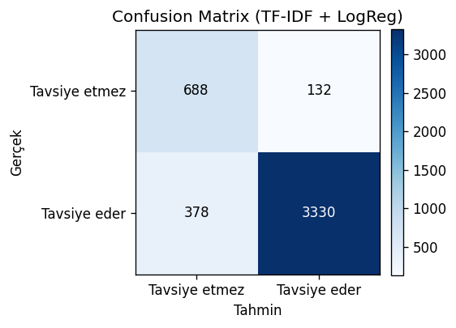

# Yorumdan Tavsiye Tahmini — TF-IDF + SVD

Kadın giyim e-ticaret yorumlarından, müşterinin ürünü **tavsiye edip etmeyeceğini** (Recommended IND: 1/0) tahmin eden uçtan uca bir metin sınıflandırma projesi. Tek bir Python dosyasında; veriyi Kaggle'dan çeker, eksik değerleri temizler, keşifsel görseller üretir, TF-IDF + Logistic Regression ile model kurar ve **TF-IDF'i SVD (LSA) ile sıkıştırmanın** performansa etkisini ölçer.

> Veri seti: [Women's E-Commerce Clothing Reviews](https://www.kaggle.com/datasets/nicapotato/womens-ecommerce-clothing-reviews) (Kaggle, 23.486 yorum)

## Proje Hakkında

E-ticaret sitelerinde her gün binlerce yorum yazılıyor ama hepsini elle okumak mümkün değil. Bu proje, bir yorumun metnine bakarak **o ürünün tavsiye edilip edilmeyeceğini otomatik tahmin eden** bir model kuruyor — yani "bu yorumu okumadan, olumlu mu olumsuz mu olduğunu anlayabilir miyiz?" sorusuna cevap arıyor.

Veri gerçek ve kirli (eksik yorumlar, mükerrer kayıtlar) olduğu için önce temizlik yapılıyor. Sonra metinler TF-IDF ile sayısala çevrilip bir sınıflandırıcıyla eğitiliyor. Son olarak, TF-IDF'in ürettiği binlerce boyutlu temsilin **SVD ile ne kadar küçültülebileceği**, doğruluktan ne kadar ödün vermek gerektiği ölçülüyor — yani sadece bir model değil, bir de "boyut indirgemenin maliyeti ne?" sorusunun cevabı var.

## Neden TF-IDF?

Yorumlar kısa ve kelime seçimi sonucu büyük ölçüde belirliyor ("love", "perfect" vs. "cheap", "returned"). Bu tür bir problemde TF-IDF + lineer model hem güçlü bir temel (baseline) hem de hızlı ve **yorumlanabilir** bir çözümdür.

## Sonuçlar

Temizlikten sonra 23.486 → **22.636** yorum kaldı (845 boş yorum, 5 mükerrer atıldı). Veri dengesiz: yorumların **%81.9'u** pozitif.

| Model | Boyut | Accuracy | F1 (macro) |
|-------|-------|----------|------------|
| TF-IDF + Logistic Regression | 18.573 | **0.887** | **0.829** |
| TF-IDF + SVD (300) + Logistic Regression | 300 | 0.868 | 0.809 |

**Çıkarım:** SVD ile öznitelik uzayı 18.573 → 300 boyuta indirildiğinde (**%98 sıkışma**) doğruluk yalnızca ~2 puan düşüyor.

## Görseller

**Keşifsel analiz** — sınıf dengesizliği, ham veride eksik değerler, yorum uzunluğu dağılımı:



**En etkili kelimeler** — modelin kararını yönlendiren terimler (TF-IDF + lineer modelin yorumlanabilirliği):



**SVD takası** — bileşen sayısı arttıkça doğruluk/F1 ve açıklanan varyans:



**Confusion matrix:**



## Kurulum ve Çalıştırma

```bash
git clone https://github.com/<kullanici-adi>/clothing-review-recommender.git
cd clothing-review-recommender
python -m venv .venv
source .venv/bin/activate        # Windows: .venv\Scripts\activate
pip install -r requirements.txt

python clothing_review_tfidf.py
```

Script çalıştığında: veriyi Kaggle'dan indirir (yoksa), temizlik raporu + metrikleri yazdırır, `figures/` altına grafikleri ve `models/` altına eğitilmiş modeli kaydeder.

> Veri setini indirme (Kaggle API kurulumu veya elle indirme): bkz. [`data/README.md`](data/README.md).

## Akış (tek dosya: `clothing_review_tfidf.py`)

1. **Kütüphaneler**
2. **Veriyi Kaggle'dan çekme** (`kaggle` API; yoksa elle indirme yönergesi)
3. **Temizlik** — gereksiz index sütunu, eksik yorum metni olan satırlar, mükerrerler
4. **Keşifsel görselleştirme** — sınıf dağılımı, eksik değerler, yorum uzunluğu
5. **TF-IDF** (İngilizce stop-word, 1–2 gram, `min_df=5`, `sublinear_tf`)
6. **Logistic Regression** (`class_weight="balanced"` ile dengesizlik ele alınır)
7. **Değerlendirme** — accuracy/precision/recall/F1, confusion matrix, en etkili kelimeler
8. **SVD analizi** — farklı bileşen sayıları için boyut/performans takası
9. **Örnek tahmin**

## Olası Geliştirmeler

Lemmatizasyon, farklı sınıflandırıcılarla (LinearSVC, Naive Bayes) karşılaştırma, hiperparametre araması (GridSearchCV), embedding tabanlı modellerle (Word2Vec, BERT) kıyas.

## Lisans

MIT
