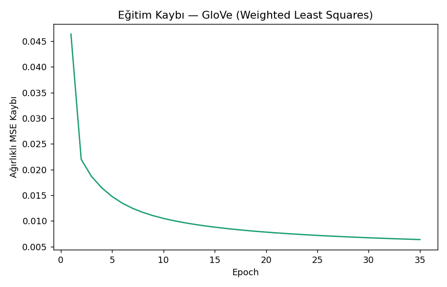
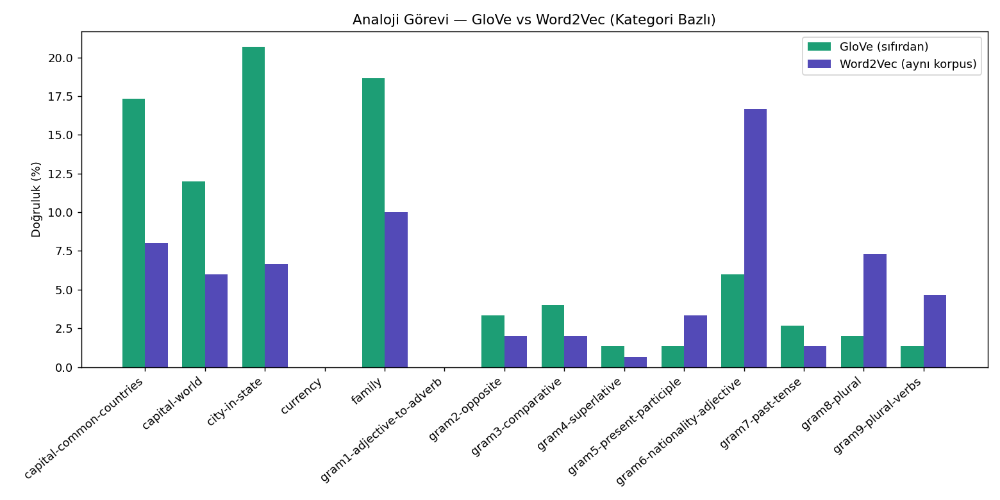
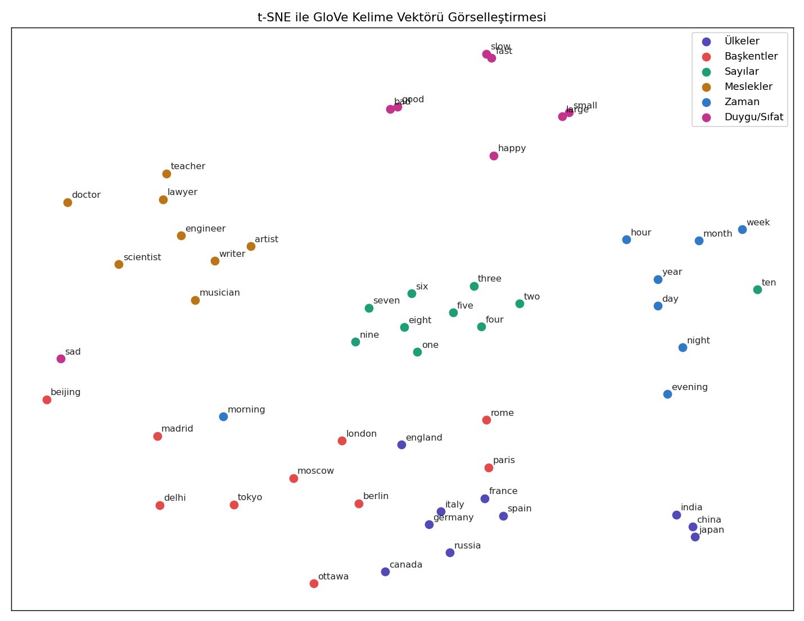
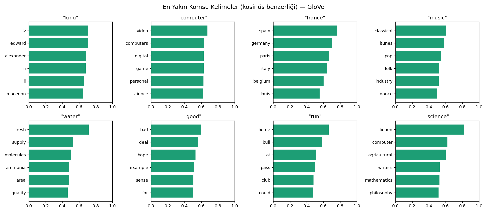

# GloVe — Global Vectors for Word Representation (Sıfırdan PyTorch İmplementasyonu)

Word2Vec'e alternatif klasik bir kelime vektörü yöntemi. Word2Vec metni pencere pencere gezip tahmin yaparken (prediction-based), GloVe tüm korpustaki kelime birlikte-geçme (co-occurrence) istatistiğini önce bir matrise toplar, sonra bu **global** matrisi çarpanlarına ayırır (count-based). Tek bir Python dosyasında; veriyi indirir, co-occurrence matrisini kurar, ağırlıklı en küçük kareler kaybını PyTorch'ta sıfırdan eğitir, sonuçları resmi analoji testiyle ve aynı korpusla eğitilmiş Word2Vec projemizle karşılaştırır.

> Veri seti: text8 (Word2Vec projesiyle **aynı** ~2M kelimelik alt küme — adil kıyas için) · Değerlendirme: [Google/Mikolov resmi analoji test seti](https://github.com/tmikolov/word2vec)

## Proje Hakkında

Pennington, Socher ve Manning'in Stanford'da 2014'te yayınladığı "GloVe: Global Vectors for Word Representation" makalesinin uygulaması. Temel fikir: iki kelimenin birlikte kaç kez geçtiğinin logaritması, o kelimelerin vektörlerinin iç çarpımıyla tahmin edilebilmeli.

```
Amaç:  w_i · w_j + b_i + b_j  ≈  log(X_ij)
       (X_ij = i ve j kelimelerinin ağırlıklı birlikte-geçme sayısı)
```

**Word2Vec'ten temel farkı:** Word2Vec yerel bağlamı örnek örnek öğrenir; GloVe önce tüm korpusun co-occurrence özet istatistiğini çıkarır, sonra tek bir optimizasyon problemi çözer. İkisi de benzer kalitede vektör üretir ama felsefeleri zıttır — biri "gezerek öğrenir", biri "özeti optimize eder".

## Yöntem

- **Co-occurrence matrisi:** Pencere içindeki her kelime çifti, aralarındaki mesafeye ters orantılı (`1/d`) ağırlıkla sayılır. ~5M sıfır-olmayan çift, seyrek (sparse) matris olarak vektörize üretilir.
- **Ağırlıklandırma fonksiyonu f(X):** Çok sık geçen çiftlerin (the-of gibi) modele aşırı baskın olmasını engeller — `f(x) = (x/x_max)^0.75` (x < x_max ise), yoksa 1.
- **Optimizer:** AdaGrad (orijinal makaledeki seçim).
- **Nihai vektör:** İki gömme katmanının toplamı (`w + w~`) — makalenin önerdiği yöntem, tek katmandan daha iyi sonuç verir.

## Sonuçlar

**En yakın komşular** — GloVe'un ürettiği vektörler oldukça temiz:

| Sorgu | En yakın komşular |
|---|---|
| king | edward, alexander, iii, ii, macedon |
| france | spain, germany, paris, italy, belgium |
| science | fiction, computer, agricultural, mathematics, philosophy |
| water | fresh, supply, molecules, ammonia, quality |
| computer | video, computers, digital, game, personal |

**Analoji görevi karşılaştırması (aynı korpus, aynı test):**

| Model | Doğruluk |
|---|---|
| GloVe (sıfırdan) | **%6.8** (136/2004) |
| Word2Vec (sıfırdan) | %5.1 (103/2004) |

Bu küçük korpus ölçeğinde GloVe, Word2Vec'i özellikle anlamsal (semantic) kategorilerde geride bırakıyor: başkent-ülke %17, şehir-eyalet %21, aile ilişkileri %19. Bu, GloVe'un global istatistiği doğrudan kullanmasının küçük veride avantaj sağladığını gösteriyor.

Görseller `figures/` klasöründe:









## Metodolojik Notlar

- **Aynı korpus/vocab kullanıldı** (Word2Vec projesiyle birebir) — sonuçların karşılaştırılabilir olması için kritik. `reference_word2vec_model.pt` mevcutsa çapraz kıyas otomatik yapılır; yoksa GloVe tek başına çalışır.
- **Neden hazır kütüphane kıyası yok?** GloVe'un Word2Vec'teki `gensim` gibi güncel/bakımlı bir Python kütüphanesi yok (Stanford'un orijinal C kodu ya da önceden-eğitilmiş vektörler kullanılır). Bu yüzden buradaki anlamlı kıyas, *aynı veriyle* eğitilmiş Word2Vec'imizle count-based vs prediction-based mimari karşılaştırmasıdır.
- **Korpus küçük tutuldu (~2M kelime):** amaç state-of-the-art skor değil, metodolojiyi doğru uygulayıp iki yöntemi adil kıyaslamaktır.

## Kurulum ve Çalıştırma

```bash
pip install -r requirements.txt
python glove_scratch.py
```

## Dosya Yapısı

```
├── glove_scratch.py       # Tüm proje — veri, co-occurrence, model, eğitim, değerlendirme
├── requirements.txt
├── data/                  # İndirilen veri + eğitilmiş model (otomatik oluşur)
└── figures/                # Üretilen görseller (otomatik oluşur)
```
