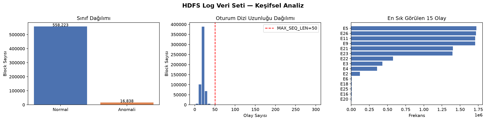
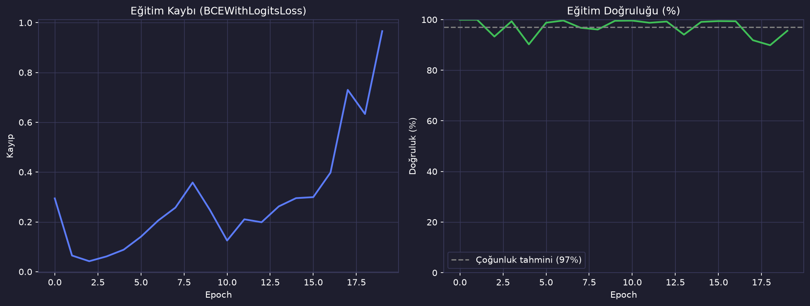
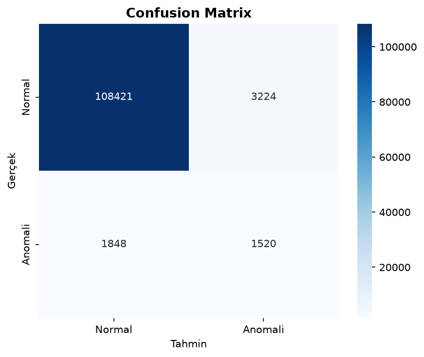
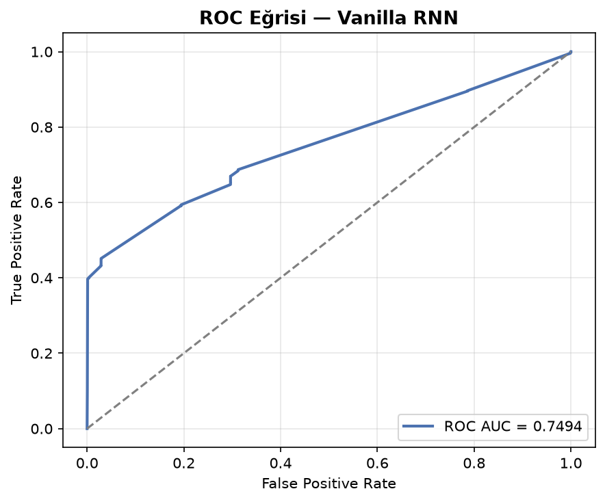

# HDFS Log Anomali Tespiti — Vanilla RNN

HDFS sistem loglarından, bir oturumun (block) **anomali içerip içermediğini** tespit eden uçtan uca bir dizi sınıflandırma projesi. Tek bir Python dosyasında; veriyi yükler, olay dizilerini kodlar, keşifsel görseller üretir, **Vanilla RNN** ile model eğitir ve test sonuçlarını raporlar.

> Veri seti: [LogHub — HDFS_v1](https://github.com/logpai/loghub) · 575.061 block · %2.9 anomali

## Proje Hakkında

Dağıtık sistemler her saniye binlerce log satırı üretir; bunları elle incelemek imkânsızdır. Bu proje, her HDFS blok oturumundaki olay sırasına bakarak **o oturumun anormal bir davranış içerip içermediğini otomatik olarak sınıflandıran** bir model kuruyor.

Veri, 200'den fazla Amazon EC2 düğümünde çalıştırılan MapReduce iş yüklerinden toplanmış; her block'a bağlı log satırları bir dizi (`E5 E22 E11 ...`) hâline getirilmiş ve uzman etiketleriyle işaretlenmiştir. Model bu dizileri girdi olarak alıp gizli durumunu adım adım güncelleyerek son durumdan Normal/Anomali kararı üretir.

## Neden Vanilla RNN?

Bu proje, temel RNN mimarisinin sekans modellemesini nasıl yaptığını göstermek üzerine kurulu. Olay dizileri kısa (~19 olay/block ortalama), yani HDFS bu görev için vanillada iyi çalışan nadir durumlardan biri. `nn.RNN` — `tanh` aktivasyonu, tek katman, embedding + tam bağlı çıkış — başka hiçbir şey yok.

## Sonuçlar

> Not: Aşağıdaki metrikler scripti çalıştırdıktan sonra dolacaktır.

| Metrik | Değer |
|--------|-------|
| Accuracy | 0.9559 |
| F1 (macro) | 0.6759 |
| F1 (anomali) | 0.3748 |
| ROC AUC | 0.7494 |

## Görseller

**Keşifsel analiz** — sınıf dağılımı, dizi uzunluğu, olay frekansı:



**Eğitim süreci** — epoch bazında kayıp ve doğrulama F1'i:



**Confusion matrix:**



**ROC eğrisi:**



## Kurulum ve Çalıştırma

```bash
git clone https://github.com/<kullanici-adi>/rnn-log-anomaly.git
cd rnn-log-anomaly
python -m venv .venv
source .venv/bin/activate        # Windows: .venv\Scripts\activate
pip install -r requirements.txt
```

Veri dosyalarını `data/` klasörüne koy (bkz. [`data/README.md`](data/README.md)):

```
data/
├── Event_traces.csv
└── anomaly_label.csv
```

Sonra çalıştır:

```bash
python rnn_log_anomaly.py
```

Script çalıştığında: veriyi yükler, EDA görsellerini üretir, modeli eğitir ve tüm grafikleri `figures/` altına kaydeder.

### Google Colab

```python
from google.colab import drive
drive.mount('/content/drive')

# Veriyi Drive'a yüklediysen:
import os
os.makedirs("data", exist_ok=True)
# Drive'dan kopyala:
# !cp /content/drive/MyDrive/hdfs_data/Event_traces.csv data/
# !cp /content/drive/MyDrive/hdfs_data/anomaly_label.csv data/

!pip install -r requirements.txt
!python rnn_log_anomaly.py
```

Hızlı test için `rnn_log_anomaly.py` içindeki `SAMPLE_FRAC = 1.0` satırını `0.1` yap.

## Akış (tek dosya: `rnn_log_anomaly.py`)

1. **Ayarlar** — seed, hiperparametreler, cihaz seçimi
2. **Veri yükleme** — `Event_traces.csv` + `anomaly_label.csv` birleştirme
3. **Sözlük oluşturma** — olay adlarını tamsayıya eşleme, padding
4. **EDA** — sınıf dağılımı, dizi uzunluğu, olay frekansı
5. **Dataset / DataLoader** — stratified train/test split (%80/%20)
6. **Vanilla RNN modeli** — Embedding → `nn.RNN` → Linear
7. **Eğitim** — `BCEWithLogitsLoss` (pos_weight ile dengesizlik ele alınır), gradient clipping
8. **Değerlendirme** — accuracy, F1, confusion matrix, ROC AUC
9. **Görseller** — 4 PNG `figures/` altına kaydedilir
10. **Örnek tahminler** — 5 rastgele block için gerçek vs tahmin

## Olası Geliştirmeler

Çift yönlü RNN (`bidirectional=True`), daha derin yığılmış RNN katmanları, farklı sekans uzunluğu denemeleri, attention mekanizması ekleme, LSTM/GRU ile kıyaslama (ayrı projeler olarak).

## Veri Seti Kaynağı

Wei Xu, Ling Huang, Armando Fox, David Patterson, Michael Jordan. *Detecting Large-Scale System Problems by Mining Console Logs*, SOSP 2009.

Jieming Zhu et al. *Loghub: A Large Collection of System Log Datasets for AI-driven Log Analytics*, ISSRE 2023.

## Lisans

MIT
