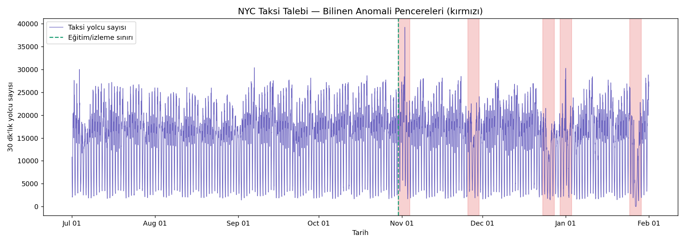
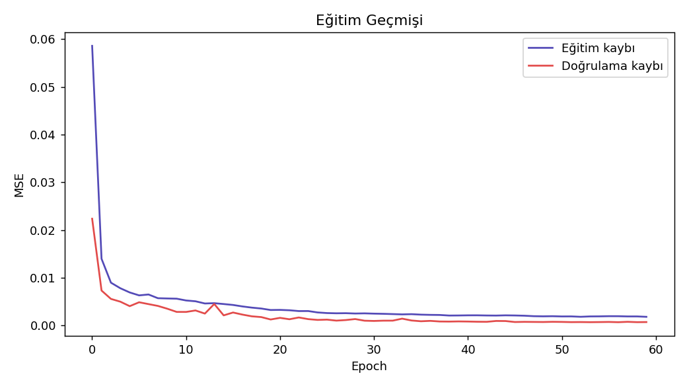
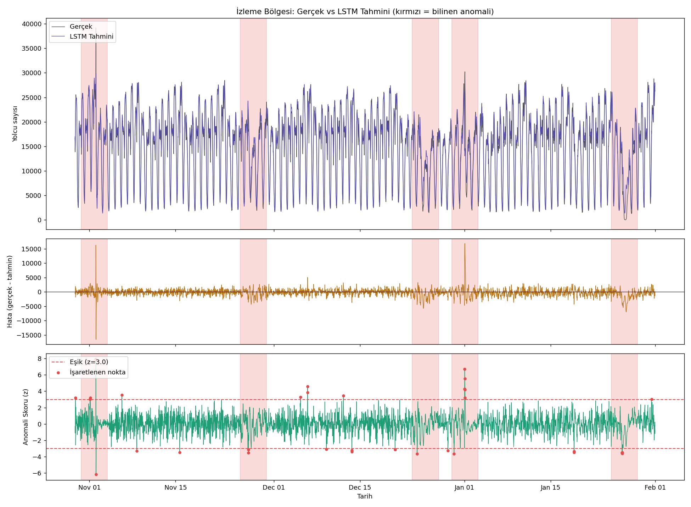
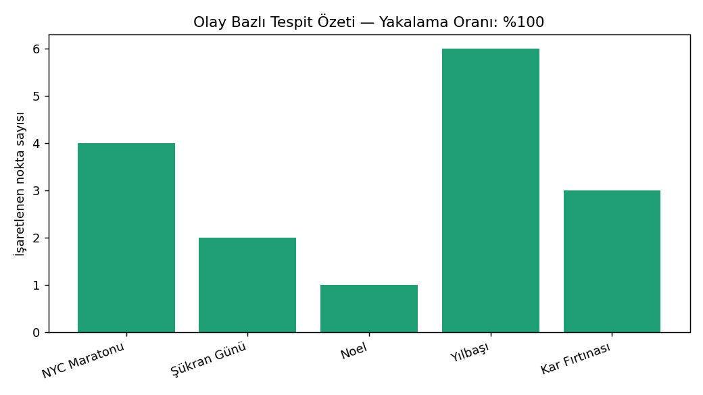

# NYC Taksi Talebi — LSTM ile Zaman Serisi Tahmini & Olay Tabanlı Anomali Tespiti

NYC'deki yarım saatlik taksi yolculuk talebini öğrenen, geleceği tahmin eden ve tahmininden saptığı anlarda bunu **anomali** olarak işaretleyen uçtan uca bir proje. Tek bir Python dosyasında; veriyi indirir, keşifsel görseller üretir, LSTM ile tahminci eğitir, tahmin hatasından anomali skoru türetir ve sonuçları gerçek, doğrulanmış olaylarla karşılaştırarak raporlar.

> Veri seti: [Numenta Anomaly Benchmark (NAB) — NYC Taxi](https://github.com/numenta/NAB) · 10.320 satır (30 dk aralık, Tem 2014 – Oca 2015) · 5 etiketli gerçek olay

## Proje Hakkında

Akan (streaming) sistemlerde anomali tespiti, klasik sınıflandırmadan farklı bir problem: elinizde "anomali" etiketli yeterli örnek genelde yoktur. Yaygın endüstri yaklaşımı şudur — bir tahmin modeli sadece *normal* davranışı öğrenir, sonra gerçek zamanlı veri akışında bu modelin tahmininden ne kadar saptığına bakılır. Sapma büyüdükçe "bu, modelin daha önce hiç görmediği bir şey" denir ve anomali olarak işaretlenir.

Bu projede de NYC taksi talebini günlük/haftalık döngüleriyle birlikte öğrenen bir LSTM, **sadece anomalisiz bir döneme** eğitilir. Sonra modelin hiç görmediği ileriki aylara uygulanır. Modelin tahmin hatası beklenenin çok dışına çıktığında bu noktalar işaretlenir ve NAB'in bağımsız uzmanlarca etiketlenmiş 5 gerçek olayıyla (NYC Maratonu, Şükran Günü, Noel, Yılbaşı, kar fırtınası) karşılaştırılır.

**Sonuç: 5 olayın 5'i de yakalandı, normal bölgede yanlış alarm oranı %0.5'in altında kaldı.**

## Neden LSTM?

| | Vanilla RNN | LSTM |
|---|---|---|
| Hafıza | Tek gizli durum `h_t` | İki durum: kısa vadeli `h_t` + uzun vadeli `c_t` |
| Uzun bağımlılık | Kaybolan gradyan ile zayıflar | Unutma kapısı (forget gate) sayesinde korunur |
| Bu projede neden önemli | Günlük döngü (48 adım) kısa, ama **haftalık** döngü (336 adım) ve tatil etkisi çok daha uzun bir bağlamı gerektiriyor | Hücre durumu, günler boyunca biriken "bu hafta normalden farklı" bilgisini taşıyabiliyor |

## Mimari

```
Girdi (48 adım × 5 özellik)
   ├─ değer (ölçeklenmiş taksi talebi)
   ├─ saat_sin, saat_cos      (günlük döngü, dairesel kodlama)
   └─ gün_sin, gün_cos        (haftalık döngü, dairesel kodlama)
        │
        ▼
   nn.LSTM (2 katman, 64 gizli birim, dropout 0.2)
        │
        ▼
   Linear(64 → 1)  →  bir sonraki 30 dk'lık talep tahmini
```

**Anomali skoru:** `(gerçek - tahmin)` artığının yuvarlanan (2 günlük) ortalama ve standart sapmasına göre z-skoru. `|z| > 3` olan noktalar işaretlenir.

## Sonuçlar

| Metrik | Değer |
|---|---|
| MAE (görülmemiş normal bölge) | ~735 yolcu |
| RMSE | ~959 yolcu |
| MAPE | %6.8 |
| Olay bazlı yakalama oranı | 5/5 (%100) |
| Yanlış alarm oranı (normal bölgede) | %0.46 |

| Olay | Durum |
|---|---|
| NYC Maratonu | ✅ Yakalandı |
| Şükran Günü | ✅ Yakalandı |
| Noel | ✅ Yakalandı |
| Yılbaşı | ✅ Yakalandı |
| Kar Fırtınası | ✅ Yakalandı |

Görseller `figures/` klasöründe:









## Metodolojik Notlar

- **Veri sızıntısı önlemi:** Ölçekleyici (`MinMaxScaler`) yalnızca eğitim verisiyle `fit` edilir; doğrulama ve izleme bölgesi sadece `transform` edilir.
- **Kronolojik bölme:** Veri karıştırılmadan (shuffle edilmeden), zaman sırasına göre eğitim/doğrulama/izleme olarak bölünür — geleceği görerek öğrenme (data leakage) engellenir.
- **Eğitim verisi tamamen "normal":** Model, ilk bilinen anomaliden (NYC Maratonu, 30 Ekim 2014) önceki döneme eğitilir; böylece "normal nedir" öğrenir, anomalileri ezberlemez.
- **Erken durdurma + gradyan kırpma:** Aşırı öğrenmeyi ve patlayan gradyanı önlemek için.

## Kurulum ve Çalıştırma

```bash
pip install -r requirements.txt
python lstm_taxi_forecast_anomaly.py
```

Veri seti ilk çalıştırmada otomatik olarak NAB GitHub deposundan indirilir (`data/` klasörüne kaydedilir). Çıktılar `figures/` klasöründe ve eğitilmiş model `data/lstm_forecaster.pt` olarak kaydedilir.

## Dosya Yapısı

```
├── lstm_taxi_forecast_anomaly.py   # Tüm proje — veri, model, eğitim, değerlendirme
├── requirements.txt
├── data/                           # İndirilen veri + eğitilmiş model (otomatik oluşur)
└── figures/                        # Üretilen görseller (otomatik oluşur)
```
