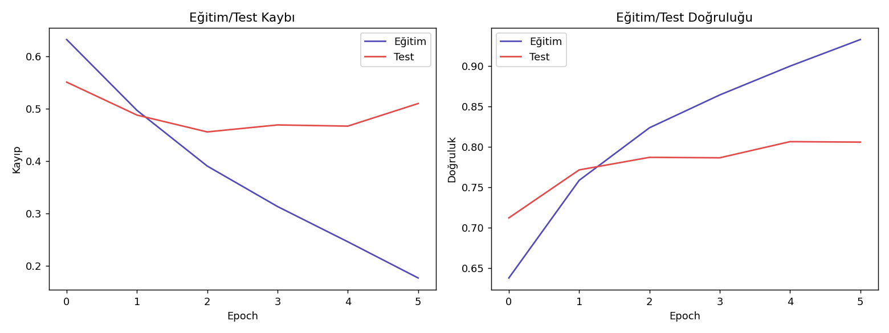
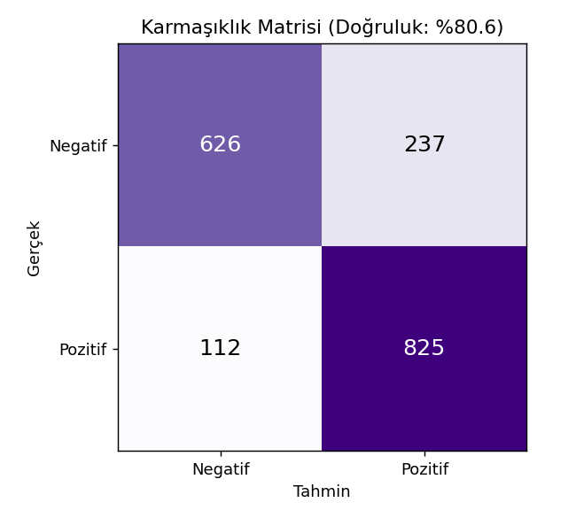
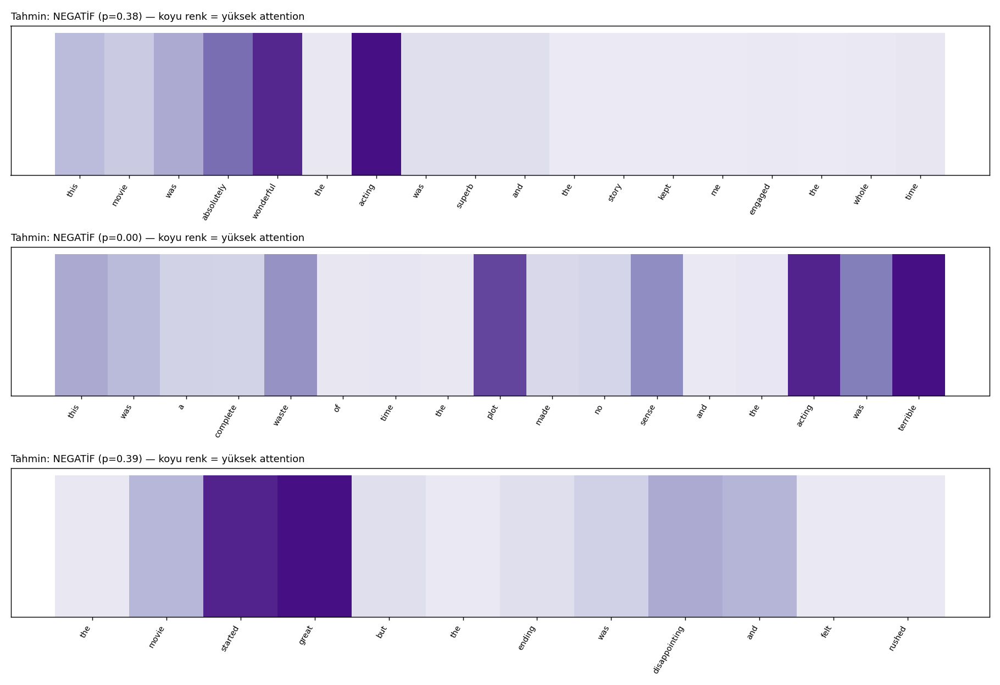

# Attention Mekanizması — BiLSTM + Bahdanau Attention ile IMDB Duygu Analizi

RNN/LSTM projelerinin çözemediği bir soruna çözüm: bir cümle uzadıkça, tüm anlamı tek bir sabit boyutlu vektöre sıkıştırmak bilgi kaybettiriyor. Attention mekanizması, modelin karar verirken cümledeki HER kelimeye geri dönüp bakabilmesini ve hangisine ne kadar önem vereceğine kendi karar vermesini sağlıyor. Tek bir Python dosyasında; IMDB film yorumlarını indirir, BiLSTM + Bahdanau Attention modelini PyTorch'ta sıfırdan eğitir ve **modelin hangi kelimelere dikkat ettiğini görselleştirir**.

> Veri seti: [IMDB Movie Reviews](https://github.com/Ankit152/IMDB-sentiment-analysis) (50.000 yorum, dengeli pozitif/negatif, bu projede 12.000'lik alt küme kullanıldı)

## Proje Hakkında

Bahdanau, Cho ve Bengio'nun 2014'te yayınladığı "Neural Machine Translation by Jointly Learning to Align and Translate" makalesiyle tanıtılan additive (toplamsal) attention mekanizmasının uygulaması. Orijinal makale çeviri için tasarlanmış olsa da, aynı fikir metin sınıflandırmada da güçlü çalışıyor — hem doğruluk hem de **yorumlanabilirlik** (interpretability) kazandırıyor.

```
Klasik BiLSTM:  [kelime1, kelime2, ..., kelimeN] → SADECE SON gizli durum → sınıflandırma
                (cümle tek bir vektöre sıkıştırılır, hangi kelime önemliydi bilinmez)

BiLSTM + Attention: [kelime1, kelime2, ..., kelimeN] → HER kelimenin gizli durumu tutulur
                     → önem skorları öğrenilir → ağırlıklı toplam → sınıflandırma
                     (model "şu kelimeye %30, buna %5 baktım" diyebilir)
```

## Yöntem

```
score_t = v^T · tanh(W · h_t)        (her zaman adımı için bir "önem skoru")
weight_t = softmax(score_t)           (skorlar toplamı 1 olacak şekilde normalize edilir)
context = Σ_t weight_t · h_t          (ağırlıklı toplam = "bağlam vektörü")
```

- **Mimari:** Embedding → BiLSTM (çift yönlü, hem geçmişe hem geleceğe bakar) → Bahdanau Attention → Dropout → Linear sınıflandırıcı.
- **Maskeleme:** Farklı uzunluktaki cümleler aynı tensöre sığdırılırken eklenen dolgu (padding) pozisyonları, attention skorlarından `-inf` ile dışlanıyor — model asla "boş" bir pozisyona dikkat etmiyor.

## Sonuçlar

**Test doğruluğu: %80.6 | F1: 0.825**

**Asıl gösteri — model kararını verirken hangi kelimelere baktı?**

| Yorum | Tahmin | En çok dikkat edilen kelimeler |
|---|---|---|
| "This was a complete waste of time, the plot made no sense..." | NEGATİF (p=0.00) | terrible, acting, plot, sense |
| "The movie started great but the ending was disappointing..." | NEGATİF (p=0.39) | great, started, disappointing |

Model, insan sezgisiyle örtüşen kelimelere odaklanıyor — bu, "kara kutu" bir sınıflandırıcıdan çok daha fazlasını, kararın *nedenini* gösteriyor.







## Metodolojik Notlar

- **Alt küme kullanıldı (12.000 yorum):** Tek CPU çekirdekli ortamda makul sürede eğitim için. `N_SAMPLES` değeri artırılarak tüm 50.000 yorumla daha yüksek doğruluk elde edilebilir.
- **Maskeleme kritik:** Attention ağırlıklarının dolgu (pad) pozisyonlarına sızmaması için `masked_fill(-1e9)` kullanıldı; bu adım atlanırsa kısa cümlelerde attention yanlış kelimelere kayar.
- **Gradyan kırpma (gradient clipping):** BiLSTM + attention birlikte eğitilirken patlayan gradyanı önlemek için `clip_grad_norm_` kullanıldı.

## Kurulum ve Çalıştırma

```bash
pip install -r requirements.txt
python attention_sentiment.py
```

## Dosya Yapısı

```
├── attention_sentiment.py   # Tüm proje — veri, model, eğitim, değerlendirme, attention görselleştirme
├── requirements.txt
├── data/                    # İndirilen veri + eğitilmiş model (otomatik oluşur)
└── figures/                  # Üretilen görseller (otomatik oluşur)
```
