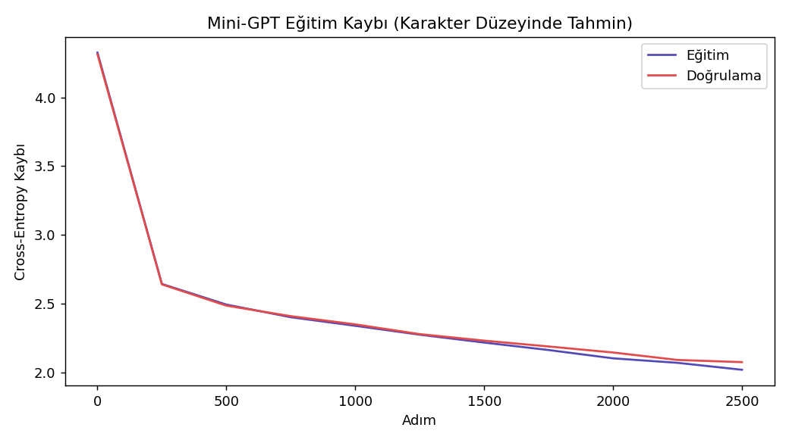
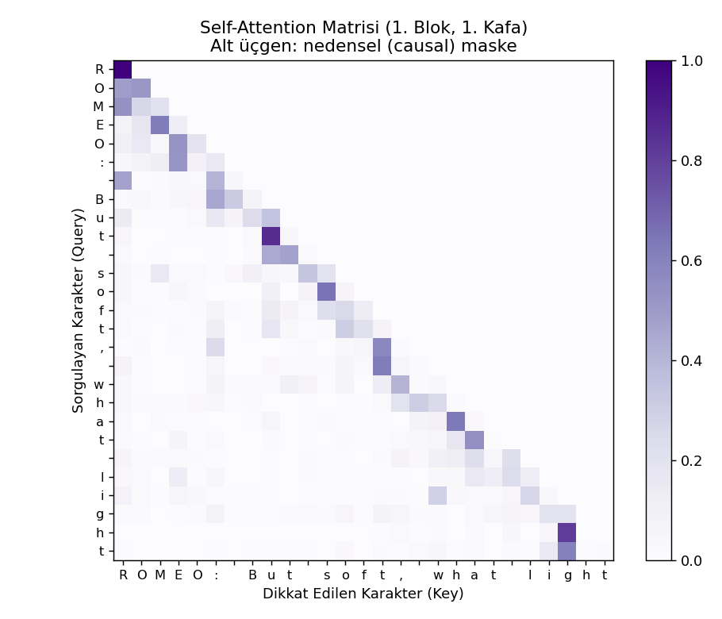

# Self-Attention / Transformer — Karakter Düzeyinde Mini-GPT

"Attention Is All You Need" (Vaswani ve ark., 2017) makalesinin ana iddiasının kanıtı: bir dil modeli kurmak için hiç tekrarlayan (recurrent) katmana ihtiyaç yok — sadece self-attention yeterli. Bu proje, GPT ailesinin temelini oluşturan decoder-only Transformer mimarisini PyTorch'ta sıfırdan kurup Shakespeare metinleri üzerinde eğitiyor ve yeni metin üretiyor.

> Veri seti: [Tiny Shakespeare](https://github.com/karpathy/char-rnn) (Andrej Karpathy'nin char-rnn/nanoGPT projelerinde kullandığı ünlü veri seti, ~1.1M karakter)

## Proje Hakkında

RNN/LSTM/Attention-BiLSTM projelerinin hepsinde bir **tekrarlama (recurrence)** vardı — model diziyi adım adım, sırayla işliyordu. Transformer bunu tamamen terk ediyor: tüm dizi **paralel** olarak işlenir, sıra bilgisi ayrı bir "positional encoding" ile enjekte edilir, ve her pozisyon diğer tüm pozisyonlara doğrudan (self-attention ile) bakabilir. Bu hem çok daha hızlı eğitimi (paralelleştirme) hem de çok daha uzun bağımlılıkları öğrenmeyi mümkün kılıyor — bugünün büyük dil modellerinin (GPT, Claude, vb.) temel taşı budur.

## Mimari

```
Karakter dizisi girişi
        │
        ▼
  Token Embedding + Positional Embedding   (sıra bilgisi ayrıca eklenir!)
        │
        ▼
  ┌─────────────────────────────┐
  │   Transformer Bloğu × 3      │
  │   ┌─────────────────────┐   │
  │   │ Multi-Head           │   │   ← 4 paralel self-attention kafası
  │   │ Self-Attention        │   │      (causal mask: gelecek görülemez)
  │   │  + residual bağlantı  │   │
  │   ├─────────────────────┤   │
  │   │ Feed-Forward          │   │
  │   │  + residual bağlantı  │   │
  │   └─────────────────────┘   │
  └─────────────────────────────┘
        │
        ▼
  Layer Norm → Linear → bir sonraki karakterin olasılık dağılımı
```

**Causal (nedensel) maske:** BERT gibi encoder modellerinden farkı budur — bir karakter, kendisinden SONRA gelen karakterlere asla bakamaz. Alt üçgen bir maske ile bu, attention skorları hesaplanırken `-inf` atanarak zorlanır. Bu sayede model, metin ÜRETMEK için kullanılabilir (otoregresif).

## Sonuçlar

**Eğitim: 2500 adım | Son eğitim kaybı: 2.02 | Son doğrulama kaybı: 2.07**



**Self-Attention Matrisi** — "ROMEO: But soft, what light" cümlesi üzerinde ilk katmanın ilk kafasının dikkat dağılımı. Alt üçgen yapı, causal maskenin çalıştığının görsel kanıtı:



**Üretilen metin örneği** ("ROMEO:" ile başlatılıp devam ettirildi):

```
ROMEO:
I ater hey promsty Rone.

MIOAMNES:
Meirze ffray diatty to gart, blove bors'ghs st gape am,
This themmen ableave the degroul me how ase guld swill seak oftie.
Hagad an 'lir sis mord:
Be have, nabe hame uffount shim, to be may sheat nove ar a of ln sticat.

DUCEMENCEYTE:
But a mo, mh the, is so he a
```

## Dürüst Değerlendirme

Model **Shakespeare'in yapısını** gerçekten öğrenmiş: karakter ismi + iki nokta + diyalog satırı formatını, büyük harfle başlayan konuşmacı isimlerini, satır sonlarını doğru üretiyor. Ama kelimeler henüz gerçek İngilizce değil. Bu beklenen bir sonuç — sadece 162K parametre ve 2500 adımlık eğitimle (nanoGPT'nin referans çalıştırmaları genelde milyonlarca parametre ve on binlerce adım kullanır). `N_EMBD`, `N_LAYER`, `MAX_ITERS` değerleri artırılarak (daha güçlü donanımda) çok daha tutarlı İngilizce üretilebilir — mimari doğru, sadece ölçek küçük tutuldu.

## Metodolojik Notlar

- **Neden hazır kütüphane (transformers, vb.) kullanılmadı?** Amaç, Transformer'ın kendisini anlamak — `nn.TransformerEncoder` gibi hazır bloklar yerine multi-head attention, positional embedding ve causal mask sıfırdan yazıldı.
- **Karakter düzeyinde tokenizasyon:** Kelime yerine karakter kullanmak, vocab'ı küçük tutar (65) ve tokenization karmaşıklığını (BPE gibi) ortadan kaldırır — mimariye odaklanmak için ideal.
- **Model ölçeği bilinçli olarak küçük tutuldu** (tek CPU çekirdeği, ~15 dakikalık eğitim bütçesi). `BLOCK_SIZE`, `N_EMBD`, `N_LAYER`, `MAX_ITERS` sabitleri dosyanın başında — daha güçlü donanımda büyütülebilir.

## Kurulum ve Çalıştırma

```bash
pip install -r requirements.txt
python minigpt_transformer.py
```

## Dosya Yapısı

```
├── minigpt_transformer.py   # Tüm proje — veri, model, eğitim, metin üretimi, attention görselleştirme
├── requirements.txt
├── data/                     # İndirilen veri + eğitilmiş model + üretilen metin (otomatik oluşur)
└── figures/                   # Üretilen görseller (otomatik oluşur)
```
