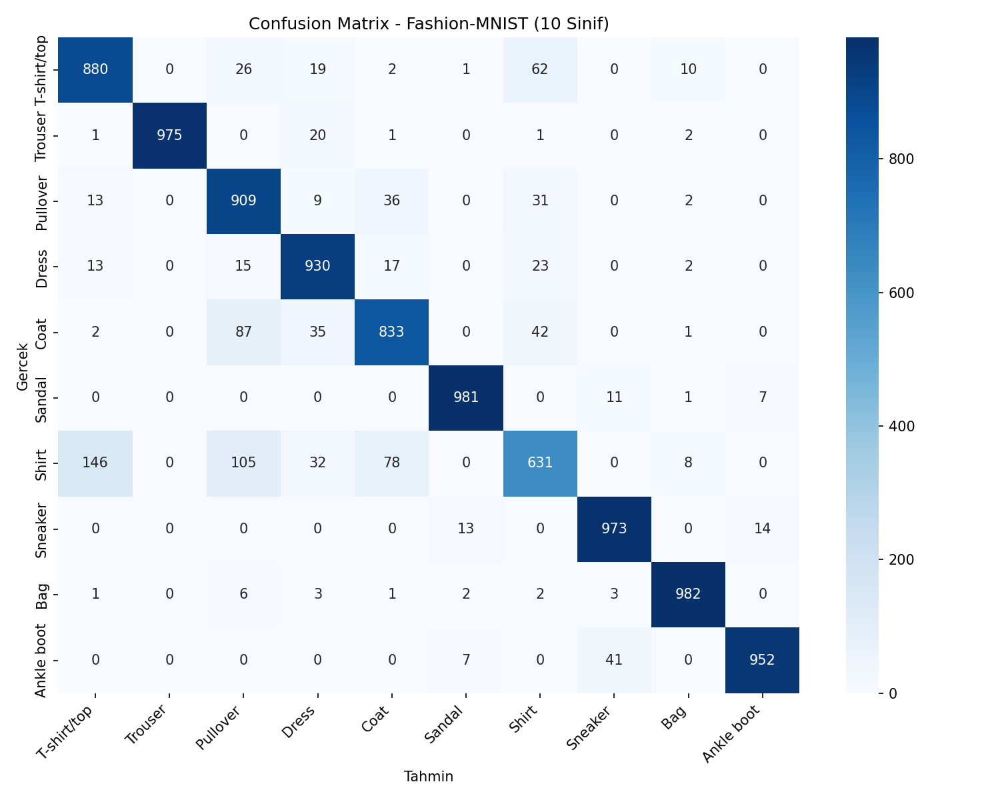
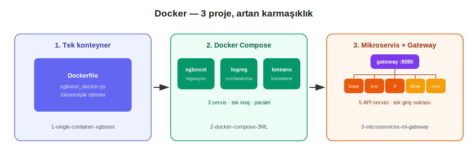

# Yapay Zeka Projeleri

Makine öğrenmesi, derin öğrenme ve doğal dil işleme alanlarında geliştirdiğim projelerin bulunduğu ana repo.

## Yapı

```
softito-yapay-zeka/
├── BigData/               # Büyük veri / dağıtık işleme projeleri
├── DeepLearning/          # Derin öğrenme projeleri
├── Docker/                # Docker & konteynerizasyon projeleri
├── EDA/                   # Keşifsel veri analizi projeleri
├── LLM/                   # Büyük dil modeli projeleri
├── MachineLearning/       # Makine öğrenmesi projeleri
├── NLP/                   # Doğal Dil İşleme projeleri
├── Python/                # Python projeleri
└── SLM/                   # Küçük dil modeli projeleri
```

---

## BigData

Büyük veri işleme ve dağıtık hesaplama üzerine geliştirdiğim projeler.

| # | Proje | Bu Projede Ne Yapıldı | Teknoloji |
|---|-------|----------|-----------|
| 01 | [big-data-log-analytics](BigData/big-data-log-analytics) | PySpark ile 5 milyon satırlık web sunucusu logu üretip HTTP durum kodu dağılımı, en çok istek alan URL'ler, ülke bazlı trafik, saatlik dağılım, yavaş URL'ler, hata oranları ve en aktif IP'ler gibi 10 farklı analiz yaptık | PySpark, Apache Spark SQL |

---

## DeepLearning

Görüntü ve zaman serisi olmak üzere iki farklı veri türünde derin öğrenme tekniklerini gösteren projeler. Biri mekansal (görüntüdeki komşu pikseller arası ilişki), diğeri zamansal (bir seride ardışık adımlar arası ilişki) yapıyı öğrenmeyi gerektiriyor.

| # | Proje | Bu Projede Ne Yapıldı | Teknoloji |
|---|-------|----------|-----------|
| 01 | [OpenCV](DeepLearning/CNN/03-opencv) | RGB/HSV/LAB renk uzayları, filtreleme, kenar tespiti, morfolojik işlemler ve kontur analizini plaka tanıma (ALPR) senaryosu üzerinden uyguladık | OpenCV |
| 02 | [Görüntü Ön İşleme](DeepLearning/CNN/02-goruntu-on-isleme) | Veri artırma (augmentation), PCA ile boyut indirgeme ve t-SNE ile özellik uzayı görselleştirme yaptık | Scikit-learn |
| 03 | [Fashion-MNIST CNN](DeepLearning/CNN/01-fashion-mnist-cnn) | Fashion-MNIST üzerinde uçtan uca CNN sınıflandırma yaptık (%90.46 test doğruluğu) | PyTorch |
| 04 | [GRU Zaman Serisi](DeepLearning/gru-zaman-serisi) | Sentetik ürün talebi serisinde geçmiş 14 güne bakarak bir sonraki günü tahmin eden GRU modeli kurduk (RMSE 2.44, MAE 1.93) | PyTorch |

**Öne çıkan görseller:**




---

## Docker

Tek konteynerden çok servisli mikroservis mimarisine kadar artan karmaşıklıkla ilerleyen Docker pratikleri.

| # | Proje | Bu Projede Ne Yapıldı | Teknoloji |
|---|-------|----------|-----------|
| 01 | [1-single-container-xgboost](Docker/1-single-container-xgboost) | Tek Dockerfile ile paketlenmiş, öğrencilerde GenAI kullanımının tükenmişlik riskine etkisini tahmin eden bir XGBoost sınıflandırma modeli kurduk | Docker, XGBoost |
| 02 | [2-docker-compose-3ML](Docker/2-docker-compose-3ML) | Sağlık sigortası verisiyle 3 farklı ML görevini (regresyon, sınıflandırma, kümeleme) tek imajdan Docker Compose ile paralel çalıştırdık | Docker Compose, XGBoost |
| 03 | [3-microservices-ml-gateway](Docker/3-microservices-ml-gateway) | Uçuş fiyatı verisiyle 5 bağımsız Flask ML servisi ve bunları tek noktadan yöneten bir API Gateway kurarak gerçek bir mikroservis mimarisi örneği oluşturduk | Flask, Docker Compose |



---

## EDA

Keşifsel veri analizi (EDA) projeleri — veri yükleme, temizleme, tek/çift değişkenli analiz ve feature engineering adımlarını adım adım ele alıyor.

| # | Proje | Bu Projede Ne Yapıldı | Teknoloji |
|---|-------|----------|-----------|
| 01 | [teen-mental-health](EDA/teen-mental-health) | Sosyal medya kullanımı ile gençlerin ruh sağlığı göstergeleri (stres, anksiyet, uyku, akademik performans) arasındaki ilişkileri; veri temizleme, tek/çift değişkenli analiz ve feature engineering adımlarıyla inceledik | Pandas, Seaborn, kagglehub |


---

## LLM

Büyük dil modelleri (LLM) ile ilgili temel kavramları ve teknikleri gösteren bağımsız demo projeleri.

| # | Proje | Bu Projede Ne Yapıldı | Teknoloji |
|---|-------|----------|-----------|
| 01 | [01-llm-karsilastirma](LLM/01-llm-karsilastirma) | BLEU, ROUGE ve Perplexity metrikleriyle farklı model/prompt çıktılarını objektif şekilde karşılaştırdık | distilgpt2 |
| 02 | [02-fine-tuning-lora](LLM/02-fine-tuning-lora) | distilgpt2 üzerinde LoRA adaptörleriyle kurumsal ton öğretimi (telekom asistanı) ve yapılandırılmış JSON çıkarımı (finans logları) olmak üzere iki ayrı görev gerçekleştirdik | PyTorch, LoRA |
| 03 | [03-langchain](LLM/03-langchain) | LangChain'in güncel `create_agent` API'siyle konuşma hafızasına sahip, ihtiyaç halinde araç çağıran bir destek triyaj botu kurduk | LangChain, Gemini |
| 04 | [04-rag](LLM/04-rag) | Türkçe Wikipedia makalelerini FAISS ile indeksleyip kaynak göstererek soru-cevap yapan bir RAG sistemi kurduk | FAISS, Gemini |
| 05 | [05-prompt-engineering](LLM/05-prompt-engineering) | Zero-shot, few-shot ve chain-of-thought stratejilerinin aynı görevdeki doğruluğunu sistematik olarak karşılaştırdık | distilgpt2 |
| 06 | [06-rlhf-dpo](LLM/06-rlhf-dpo) | `trl` kütüphanesiyle tercih çiftlerinden (chosen/rejected) davranış hizalaması yaparak modele kaba yerine kibar cevabı tercih etmeyi öğrettik | TRL, distilgpt2 |
| 07 | [07-quantization](LLM/07-quantization) | Aynı modelin FP32/FP16/INT8 hassasiyetlerinde boyut, hız ve çıktı kalitesini karşılaştırdık; GPT-2'nin Conv1D katmanlarından kaynaklanan bir kuantizasyon tuzağını tespit edip düzelttik | PyTorch |

**Kullanılan modeller:** Yerel/ücretsiz projelerde (01, 02, 05, 06, 07) `distilgpt2`; API tabanlı projelerde (03, 04) Google Gemini (`gemini-2.5-flash`, `gemini-embedding-001`) kullanıldı.

---

## MachineLearning

Klasik algoritmalardan rekabetçi modellere, denetimli ve denetimsiz öğrenmeyi kapsayan proje serisi.

### Supervised (Denetimli Öğrenme)

| # | Proje | Bu Projede Ne Yapıldı | Teknoloji |
|---|-------|----------|-----------|
| 01 | [linear-regresyon](MachineLearning/Supervised/01-linear-regresyon) | Bir şirkette cinsiyete dayalı açıklanamayan ücret farkını tespit ettik (ham fark %6.6 → kontrol edilmiş fark %6.1, R² 0.67); ayrı bir projede futbol takımı istatistiklerinden gol sayısı tahmin edip basit regresyonun (R² 0.75) çoklu regresyona (R² 0.83) göre ne kadar zayıf kaldığını gösterdik | Scikit-learn |
| 02 | [logistic-regresyon](MachineLearning/Supervised/02-logistic-regresyon) | Kredi başvurusu onay/red kararını katsayı bazında açıklanabilir hale getirdik (%78 doğruluk); SaaS müşteri kaybını (churn) tahmin edip riski en çok artıran faktörü çıkardık (%75 doğruluk) | Scikit-learn |
| 03 | [decision-tree](MachineLearning/Supervised/03-decision-tree) | Hasta risk seviyesini bir hekimin okuyup onaylayabileceği kadar sınırlı derinlikte bir karar ağacına döktük (%54, 3 sınıf); mobil cihaz donanımından fiyat segmenti tahmin edip derinlik arttıkça doğruluğun nerede platoya girdiğini ölçtük (%74, 4 sınıf) | Scikit-learn |
| 04 | [random-forest](MachineLearning/Supervised/04-random-forest) | Kredi kartı işlemlerinde dolandırıcılık tespiti yaptık; sınıflar dengesiz olduğu için accuracy yerine neden PR-AUC'a bakılması gerektiğini gösterdik (ROC-AUC 0.81, PR-AUC 0.53) | Scikit-learn |
| 05 | [lightgbm](MachineLearning/Supervised/05-lightgbm) | Banka telefon kampanyasına katılım tahmini yaptık; early stopping ile modelin kendi kendine en iyi noktayı (281. iterasyon) bulmasını sağladık (%91.2 doğruluk, ROC-AUC 0.891) | LightGBM |
| 06 | [svm](MachineLearning/Supervised/06-svm) | Hücre ölçümlerinden tümör teşhisi yaptık (%97.4 doğruluk); Linear ve RBF kernel'i kıyaslayıp verinin doğrusal ayrılabilir olduğunu kanıtladık | Scikit-learn |
| 07 | [knn](MachineLearning/Supervised/07-knn) | Kullanıcı davranışından yola çıkan bir ürün öneri sistemi kurduk; model ürün kategorisini hiç görmeden, en benzer bulduğu ürünlerin %92'sinin gerçekten aynı kategoriden çıktığını gösterdik | Scikit-learn |
| 08 | [naive-bayes](MachineLearning/Supervised/08-naive-bayes) | Ürün yorumlarını 3 sınıfa (Pozitif/Nötr/Negatif) ayırdık (%91.2 doğruluk); Nötr sınıfın neden her zaman en zor sınıf olduğunu gösterdik | TF-IDF, Scikit-learn |
| — | [Model Karşılaştırma](<MachineLearning/Supervised/Model Karşılaştırma>) | Logistic Regression'ı Random Forest ile, XGBoost'u LightGBM ile aynı veride yan yana çalıştırıp hangisinin ne zaman öne çıktığını 5-Fold Cross-Validation ile ölçtük | XGBoost, LightGBM |

### Unsupervised (Denetimsiz Öğrenme)

| # | Proje | Bu Projede Ne Yapıldı | Teknoloji |
|---|-------|----------|-----------|
| 01 | [kmeans](MachineLearning/Unsupervised/01-kmeans) | Müşterileri satın alma davranışına göre segmentledik; istatistiksel olarak en iyi K değeri (K=2) yerine iş açısından daha kullanışlı K=3'ü bilinçli seçip bu kararı gerekçelendirdik | Scikit-learn, PCA |
| 02 | [clustering-comparison](MachineLearning/Unsupervised/02-clustering-comparison) | Sigorta müşterilerini 4 farklı kümeleme algoritmasıyla (K-Means, Hierarchical, DBSCAN, GMM) ayrı ayrı segmentledik, Silhouette skoruyla kıyasladık | Scikit-learn |
| 03 | [isolation-forest](MachineLearning/Unsupervised/03-isolation-forest) | Kredi kartı işlemlerinde hiç etiket kullanmadan dolandırıcılık tespiti yaptık (ROC-AUC 0.95) | Scikit-learn |
| 04 | [one-class-svm](MachineLearning/Unsupervised/04-one-class-svm) | Ağ trafiğinde sadece normal örneklerle eğitilen bir modelle saldırı tespiti yaptık (ROC-AUC 0.96, Recall %90) | Scikit-learn |

---

## NLP

Doğal dil işlemede temsil yöntemlerini sıfırdan ele alan bir öğrenme yolculuğu. Her bölüm bir önceki yöntemin eksiğini gösterir ve bir sonrakinin neden ortaya çıktığını açıklar.

| # | Proje | Bu Projede Ne Yapıldı | Teknoloji |
|---|-------|----------|-----------|
| 01 | [TF-IDF](NLP/01-tf-idf) | Kadın giyim e-ticaret yorumlarından (23.486 yorum) ürün tavsiyesi tahmini yaptık (TF-IDF + Logistic Regression, %88.7 doğruluk); SVD ile boyutu 18.573'ten 300'e indirip (%98 sıkışma) doğruluktan sadece ~2 puan kaybettiğimizi gösterdik | Scikit-learn |
| 02 | [Kelime Vektörleri](NLP/02-word-embeddings) | Word2Vec, GloVe, FastText'i sıfırdan yazıp aynı korpusta eğittik; analoji testinde birbirleriyle kıyasladık, FastText'e OOV (görülmemiş kelime) testi yaptırdık | PyTorch |
| 03 | [RNN](NLP/03-rnn) | HDFS sistem loglarında anomali tespiti — bir log dizisinin normal mi anormal mi olduğunu sınıflandırdık | PyTorch |
| 04 | [LSTM](NLP/04-lstm) | NYC taksi talebini zaman serisi olarak tahmin ettik, tahmin hatasından anomali skoru türetip 5 gerçek olayı (maraton, bayramlar, kar fırtınası) yakaladık | PyTorch |
| 05 | [Attention](NLP/05-attention) | IMDB film yorumlarında duygu analizi yaptık (BiLSTM + Bahdanau Attention, %80.6 doğruluk) — modelin kararını verirken hangi kelimelere baktığını ısı haritasıyla gösterdik | PyTorch |
| 06 | [Transformer](NLP/06-self-attention-transformer) | Karakter düzeyinde bir mini-GPT kurup Shakespeare metinleriyle eğittik, modele yeni "Shakespeare tarzı" metin ürettirdik | PyTorch |

Proje serisi kronolojik ve kümülatif bir hikaye anlatıyor:

```
İstatistiksel temsil  →  Öğrenilmiş kelime vektörleri  →  Diziyi anlama  →  Uzun bağımlılık  →  Seçici odaklanma  →  Paralel, recurrence'sız mimari
     (TF-IDF)              (Word2Vec/GloVe/FastText)        (RNN)           (LSTM)            (Attention)          (Transformer)
```

---

## Python

Softito eğitim sürecinde geliştirdiğim Python çalışmalarını içeren klasör. Temel sözdiziminden nesne yönelimli programlamaya kadar katmanlı bir ilerlemeyle ilerliyor.

| Dosya | Konu | Seviye |
|-------|------|--------|
| `python_baslangic.py` | print, değişkenler, veri tipleri, koşullar, döngüler, listeler, fonksiyonlar | Başlangıç |
| `python_1_ders.py` | String işlemleri, liste metodları, math kütüphanesi, sözlükler, class'a giriş, kalıtım, kapsülleme, dunder metodlar | Temel |
| `temel_python.py` | Operatörler, f-string, list comprehension, dictionary, hata yönetimi, kapsamlı uygulama | Temel |
| `temel_python_2.py` | Tuple, set, enumerate, zip, lambda, recursive fonksiyon, dosya işlemleri | Orta |
| `python_class_sorular.py` | Class değişkenleri, @property, @classmethod, @staticmethod, iterator class, Mixin pattern, dunder metodlar | İleri |

---

## SLM

Küçük dil modelleri (Small Language Model) üzerine yaptığım çalışmalar.

| # | Proje | Bu Projede Ne Yapıldı | Teknoloji |
|---|-------|----------|-----------|
| 01 | [turkce-slm](SLM/turkce-slm) | Wikipedia'dan toplanan Türkçe bilim/teknoloji makaleleri (8 kategori, ~40 makale) üzerinde karakter seviyeli, decoder-only Transformer mimarisiyle küçük bir dil modeli eğittik; modele başlangıç metnine göre devam ürettirdik | PyTorch, Gradio |

---

## Teknolojiler


## Lisans

MIT
