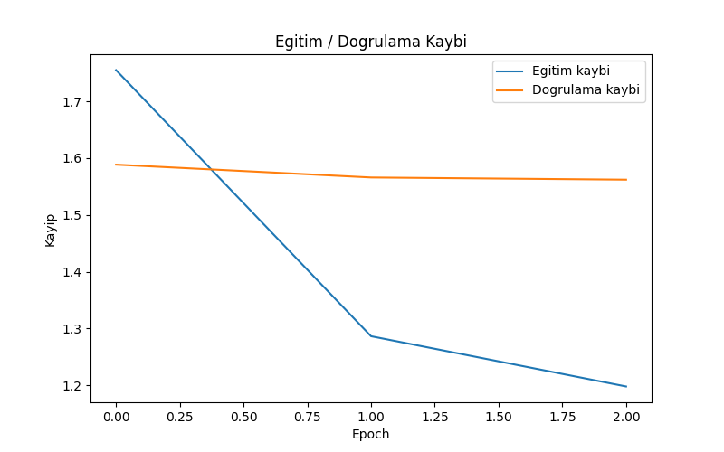

# Turkce Kucuk Dil Modeli (SLM)

Wikipedia'dan toplanan Turkce bilim/teknoloji makaleleri uzerinde egitilen,
karakter seviyeli, Transformer tabanli (decoder-only) bir kucuk dil modeli.
Model, verilen bir baslangic metnine gore devamini uretir (metin tamamlama).

## Egitim Sonuclari

Model, Google Colab uzerinde (T4/A100 GPU) 8 kategori altindaki ~40 Wikipedia
makalesi (toplam ~500.000 karakter) ile egitildi.



Egitim sirasinda 3. epoch'tan sonra dogrulama kaybinin yukselmeye baslayip
modelin ezberlemeye (overfitting) egilim gosterdigi gozlemlendi, bu yuzden
nihai model **3 epoch** ile egitilmistir; bu noktada egitim ve dogrulama
kaybi en dengeli seviyededir.

Ornek uretim (prompt: `"Yapay zeka"`):

```
Yapay zekan bir teorik ve karışım genetik uygulamalarında gereklikli bir
doğa nöron veya moleküler dizilerinin mutasyonları düzenlenebilir. Bu
yapısal işlevlere bağlı olan yanlışlığına bulunan bir molekülü olarak bir
kromozom için bir yapısı için parçaların birbirine neden oluşabilir...
```

Karakter seviyeli, ~500K karakterlik bir korpusla egitilen kucuk bir model
icin cikti, dogru Turkce bilimsel terminolojiyi (genetik, kromozom, molekul,
mutasyon) tutarli bicimde kullanabiliyor; tam anlamda akici, hatasiz cumleler
kurmasa da modelin konu bagini ogrendigini gosteriyor.

## Proje Yapisi

```
turkce-slm/
├── configs/config.yaml       Tum hiperparametreler ve ayarlar
├── data/                     Ham ve islenmis veri (git'e dahil degil)
├── src/                      Kaynak kod
│   ├── data_collection.py    Wikipedia'dan veri cekme
│   ├── preprocessing.py      Temizleme + tokenizer
│   ├── dataset.py            PyTorch Dataset/DataLoader
│   ├── models/transformer.py  Decoder-only Transformer mimarisi
│   ├── train.py               Egitim script'i
│   └── generate.py            Metin uretim script'i
├── demo/app.py                Gradio arayuzu
├── tests/                     Unit testler
├── figures/                   Egitim grafikleri
└── checkpoints/                Egitilmis model dosyalari
```

## Kurulum

```bash
git clone <repo-url>
cd turkce-slm

# (opsiyonel ama onerilir) sanal ortam
python -m venv venv
venv\Scripts\activate          # Windows
# source venv/bin/activate     # macOS/Linux

pip install -r requirements.txt
```

## Kullanim

Not: `train.py` ve `generate.py`, `src` paketinin icini kullandigi icin
`python -m src.train` / `python -m src.generate` seklinde, yani **modul
olarak** calistirilmalidir. `data_collection.py` ve `preprocessing.py` ise
direkt `python src/<dosya_adi>.py` ile calistirilabilir.

```bash
# 1) Wikipedia'dan veri cek
python src/data_collection.py --config configs/config.yaml

# 2) Veriyi temizle, tokenizer olustur
python src/preprocessing.py --config configs/config.yaml

# 3) Modeli egit (Colab/GPU onerilir, CPU'da daha uzun surer)
python -m src.train --config configs/config.yaml

# 4) Metin uret
python -m src.generate --prompt "Yapay zeka" --uzunluk 300
```

### Google Colab ile Egitim

Kendi bilgisayarinda GPU yoksa proje klasorunu zip'leyip Colab'a yukleyerek
ayni komutlarla (basinda `!` ile) calistirabilirsin:

```python
!unzip -q turkce-slm.zip
%cd turkce-slm
!pip install -r requirements.txt
!python src/data_collection.py --config configs/config.yaml
!python src/preprocessing.py --config configs/config.yaml
!python -m src.train --config configs/config.yaml
```

### Demo Arayuzu

```bash
python demo/app.py
```

Tarayicida acilan link (orn. `http://127.0.0.1:7860`) uzerinden bir
baslangic metni girip modelin devamini uretmesini izleyebilirsin.

## Model Mimarisi

Decoder-only, GPT tarzi bir Transformer kullanilir: multi-head self-attention
+ feed-forward bloklari, karakter seviyeli embedding ve pozisyon embedding'i
ile. Katman sayisi, embedding boyutu ve attention head sayisi `config.yaml`
icinde `model` bolumunden ayarlanir.

## Veri Kaynagi

Veri, Wikipedia'nin resmi API'si (`wikipedia-api` kutuphanesi) ile toplanir,
HTML kazima (scraping) yapilmaz. `configs/config.yaml` icindeki kategori/makale
listesi degistirilerek farkli konu alanlarina genisletilebilir. Su an 8
kategori altinda ~40 makale (bilim, teknoloji, matematik, fizik, biyoloji,
uzay, kimya, muhendislik) tanimlidir.

## Testler

```bash
pytest tests/
```

`test_tokenizer.py`: karakter tokenizer'in encode/decode dogrulugunu ve
Turkce karakter destegini test eder.

## Gelistirme Fikirleri

- Karakter seviyesi yerine BPE/subword tokenizer
- Daha genis Wikipedia korpusu (40 makale -> 500+)
- Erken durdurma (early stopping) ile overfitting'i otomatik onleme
- Instruction-tuning ile daha dogal metin uretimi

## Lisans

MIT
